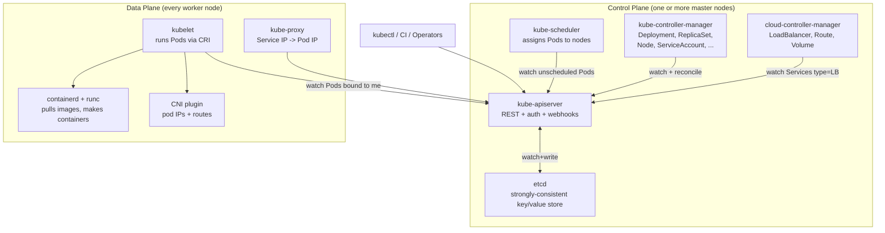
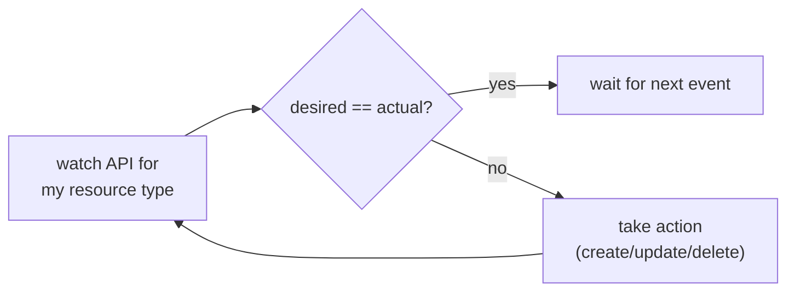
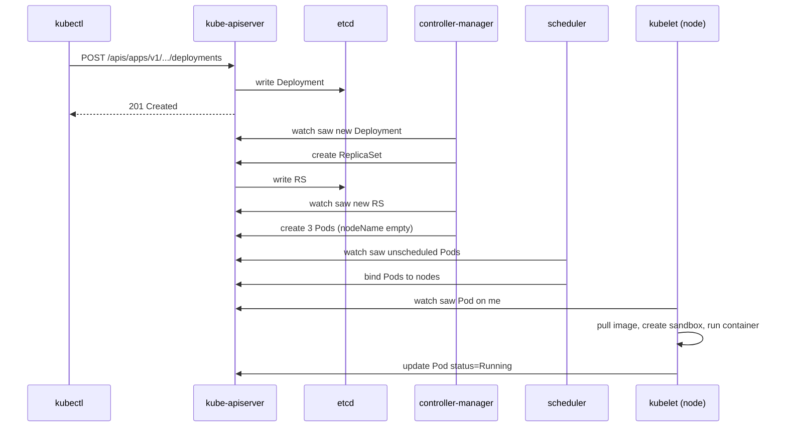

# Day 42-6: Cluster Architecture — Control Plane vs Data Plane

> **Goal**: Tie the foundations together. See every K8s component and what it does.
> **Prereqs**: Days 42-1 through 42-5.

## 1. Scenario & Why It Matters

Each foundations day zoomed in on one layer. This day zooms back out so you can place every component on the same map. When you read "the scheduler picked a node" or "the controller manager recreated a replica", you will know the exact process, the exact API calls, and what it talks to.

## 2. Concept Deep-Dive

A cluster splits into two planes:

- **Control plane** — the brain. Stateless processes on dedicated nodes that decide *what should happen*. Centered on `etcd` (the only stateful piece) and the API server.
- **Data plane** — the body. Worker nodes that *do the work* (run Pods, route packets, mount volumes).



### Control plane components, one paragraph each

**`etcd`** — a distributed key/value store (Raft consensus). The single source of truth. Every K8s object (Pod, Service, Secret) is a JSON blob under `/registry/<resource>/<ns>/<name>`. Lose etcd, lose the cluster.

**`kube-apiserver`** — the only thing that talks to etcd. Authenticates, authorizes (RBAC), validates, mutates (admission webhooks), and persists. Every other component only sees the world through API server **watches**.

**`kube-scheduler`** — watches for Pods with `spec.nodeName == ""`. Runs a two-phase algorithm: (1) filter nodes that can fit this Pod (resources, taints, selectors, volumes), (2) score them (spread, affinity, preferred nodes). Writes back the chosen node via a Bind call.

**`kube-controller-manager`** — hosts dozens of built-in controllers. Each one watches one resource and reconciles towards desired state: DeploymentController manages ReplicaSets, ReplicaSetController manages Pods, NodeController detects dead nodes, ServiceAccountController provisions tokens, etc.

**`cloud-controller-manager`** — separated out because it depends on your cloud. Creates AWS ELBs when you create a `type: LoadBalancer` Service, attaches EBS volumes when a PVC binds, updates node addresses from EC2 metadata.

### Data plane components

**`kubelet`** — the node agent. Watches the API server for Pods assigned to its node. Talks CRI to the container runtime to start/stop containers. Probes health, reports status, collects stats.

**`kube-proxy`** — programs iptables/IPVS/nftables rules that translate Service ClusterIPs to Pod IPs (see [Day 42-5](day42-5_cni-and-kube-proxy.md)).

**Container runtime** — `containerd` + `runc` under the hood. See [Day 42-3](day42-3_container-runtime.md).

**CNI plugin** — runs as a DaemonSet (in most setups) and sets up Pod networking (see [Day 42-5](day42-5_cni-and-kube-proxy.md)).

### The reconciliation loop (the one pattern to rule them all)

Every controller is a loop:



A Deployment controller sees "I want 3 replicas, there are 2" and creates one ReplicaSet revision with 3 replicas. The ReplicaSet controller sees "I want 3 Pods, 2 exist" and creates one. The scheduler sees an unscheduled Pod and assigns a node. The kubelet on that node sees "a Pod needs to exist here" and tells containerd to create it. Nobody knows the big picture — each controller only cares about its own resource, and the desired state emerges from the chorus.

### What happens when you `kubectl apply -f deploy.yaml`



## 3. Hands-On Mission

List every control-plane component in Minikube:

```bash
kubectl -n kube-system get pods
# you will see: kube-apiserver-..., etcd-..., kube-controller-manager-...,
# kube-scheduler-..., kube-proxy-..., coredns-...
```

Watch a Deployment roll through the reconciliation chain live:

```bash
kubectl get deployments,rs,pods -w &
kubectl create deployment demo --image=nginx:alpine --replicas=3
# observe: Deployment -> ReplicaSet -> Pods -> Running
```

Inspect what the scheduler decided:

```bash
kubectl describe pod <pod-name> | grep -A2 "Events:"
# "Successfully assigned default/pod to node minikube"
```

Talk directly to etcd through the API server's raw endpoints (advanced):

```bash
kubectl get --raw /metrics | grep etcd_ | head
```

## 4. Your Task — Answer

**Q:** Name the four control-plane components and the two data-plane components that run on every worker node.

**Sample answer**:
- **Control plane**: `etcd` (state), `kube-apiserver` (API gateway), `kube-scheduler` (placement), `kube-controller-manager` (reconciliation). Optionally `cloud-controller-manager` for cloud integrations.
- **Data plane (per node)**: `kubelet` (node agent, talks CRI to the runtime) and `kube-proxy` (Service IP rewrite). Plus the container runtime (containerd) and the CNI plugin, but those are not "Kubernetes components" per se — they are dependencies kubelet drives.

## 5. Q&A (Concepts Check)

**Q: Why does Kubernetes keep only etcd as stateful and make everything else stateless?**
A: It's a deliberate architectural choice. If every process can be restarted at any time without losing data, upgrades are trivial and recovery is automatic. All state lives in one place — etcd — which can be backed up, snapshotted, and restored independently.

**Q: Can I run a cluster without `kube-proxy`?**
A: Yes — Cilium in "kube-proxy replacement" mode uses eBPF to perform Service IP translation directly in the kernel, removing kube-proxy entirely. The functionality is preserved; the implementation moves.

**Q: What's the difference between the `controller-manager` and the `cloud-controller-manager`?**
A: `controller-manager` hosts controllers that only need the K8s API (Deployment, ReplicaSet, Node, etc.). `cloud-controller-manager` hosts controllers that also need the cloud provider's API (provisioning ELBs, EBS volumes, routes). Splitting them lets non-cloud clusters skip the second binary.

**Q: Why do events use "watch" instead of polling?**
A: A watch is a long-lived HTTP connection that streams every change. Controllers get notified within milliseconds of a state change, without hammering the API server with poll requests. etcd's revision numbers guarantee you never miss an event.

**Q: Is the API server a single point of failure?**
A: In production, you run 3 or more API servers behind a load balancer, all pointing at the same etcd cluster. They are stateless, so any one can serve any request. etcd itself runs 3–5 members with Raft consensus, tolerating `floor(N/2)` failures.

**Q: What's a "bootstrap" node problem?**
A: When a node first joins, how does kubelet authenticate to the API server without a pre-existing certificate? Answer: a one-time bootstrap token, which the kubelet exchanges for a long-lived certificate via the `TokenReview` API. Tools like `kubeadm`, `kOps`, `kubespray` automate this.

## 6. Further Reading

- `kubernetes/kubernetes` repo — components live under `cmd/kube-*`.
- Kubernetes the Hard Way by Kelsey Hightower — build every component from scratch.
- Next: [Day 43 — Minikube](../01_getting-started/day43_minikube.md).
