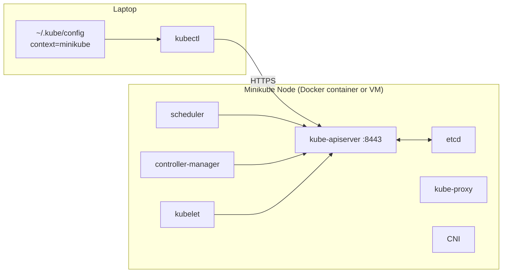

# Day 43: Minikube — A Local Cluster on Your Laptop

> **Goal**: Stand up a single-node Kubernetes cluster and confirm kubectl can reach it.
> **Prereqs**: Week 3 (Docker Desktop installed and running).

## 1. Scenario & Why It Matters

Running a production cluster is expensive and slow to iterate against. **Minikube** spins up a single-node Kubernetes cluster in a local VM or a Docker container so you can learn, prototype, and test manifests without paying AWS. The API, the kubelet, the CRI, the CNI — everything from [Day 42-6](../00_foundations/day42-6_architecture-overview.md) is present, just scaled down to one node.

## 2. Concept Deep-Dive

Under the hood, Minikube creates a Linux VM (or a privileged Docker container) and runs every control-plane process inside it as a static Pod. `kubectl` is just an HTTP client that talks to the API server listening on a port forwarded to your host.



**Alternatives to know**: `kind` (Kubernetes-in-Docker, multi-node possible, very fast), `k3d` (k3s-in-Docker), Docker Desktop's built-in Kubernetes.

## 3. Hands-On Mission

### Install

```bash
# Mac
brew install kubectl minikube
# Windows (PowerShell, admin)
choco install kubernetes-cli minikube
```

### Start

```bash
minikube start --driver=docker
```

`--driver=docker` uses your Docker Desktop as the hypervisor. Alternatives: `virtualbox`, `hyperkit`, `kvm2`.

### Verify

```bash
kubectl get nodes
kubectl cluster-info
kubectl get pods -n kube-system
```

### Useful knobs

```bash
minikube stop                       # keeps the cluster state
minikube delete                     # nukes it
minikube dashboard                  # web UI
minikube addons enable metrics-server
minikube ip                         # cluster IP
minikube ssh                        # shell inside the node VM
```

## 4. Your Task — Answer

**Q:** After `minikube start`, run `kubectl get nodes` and paste the status.

**Sample answer**:

```
NAME       STATUS   ROLES           AGE    VERSION
minikube   Ready    control-plane   1m     v1.30.0
```

`Ready` means the kubelet is reporting healthy heartbeats to the API server and the node is eligible to schedule Pods. If you see `NotReady`, the most common culprits are: (a) the CNI plugin didn't initialize yet (wait 30 seconds), (b) the Docker daemon is low on memory, (c) Minikube's VM cannot reach its registry mirror.

## 5. Q&A (Concepts Check)

**Q: Why is there only one node but it says `ROLES=control-plane`? Doesn't the control plane need to be separate from workers?**
A: In production, yes — you isolate the control plane from user workloads. Minikube collapses both into one node by default so you don't need 3 VMs to learn. The node has the `control-plane` role **and** serves as a worker because the usual "NoSchedule" taint is removed.

**Q: What's the difference between `minikube start --driver=docker` and just running Docker Desktop's Kubernetes?**
A: Minikube is a separate process that creates its own cluster and writes its own kubeconfig context. Docker Desktop has a built-in cluster toggle that adds `docker-desktop` as a kubeconfig context. They do not share state. Most tutorials assume Minikube because it is more portable.

**Q: Can I make a multi-node cluster with Minikube?**
A: Yes: `minikube start --nodes=3`. Useful when you want to test DaemonSets, node affinities, or Pod scheduling across nodes.

**Q: My LoadBalancer Service stays `<pending>` forever in Minikube. Why?**
A: No cloud provider is present, so nothing provisions the external LB. Use `minikube tunnel` (run in a separate terminal) to have Minikube emulate a cloud LB and assign a real external IP from your host.

**Q: Minikube runs in Docker. Is that "real" Kubernetes?**
A: Yes. Minikube installs upstream Kubernetes binaries (the same ones AKS/EKS/GKE use, just packaged differently). The API behaviour is identical. The only cluster-level difference is scale and cloud integration.

## 6. Further Reading

- minikube.sigs.k8s.io/docs/ — official docs.
- `kind` as an alternative: kind.sigs.k8s.io.
- Next: [Day 44 — The Pod](../02_workloads/day44_the-pod.md).
