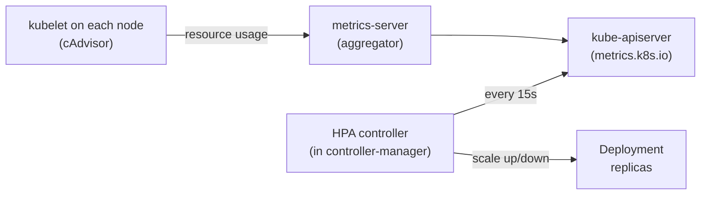

# Bonus: Horizontal Pod Autoscaler (HPA)

> **Goal**: Automatically add/remove Pod replicas based on CPU, memory, or custom metrics.
> **Prereqs**: [Deployments](day45_deployments.md), [Resource Limits](bonus_resource-limits.md).

## 1. Scenario & Why It Matters

At 3 AM your app gets 10 requests per minute. At noon it gets 10,000. Running 50 replicas 24/7 is wasteful; running 2 replicas at noon is catastrophic. The **HorizontalPodAutoscaler** is a controller that watches metrics and scales a Deployment's `replicas` field up or down to match current load.

## 2. Concept Deep-Dive



### The math

Target: average CPU utilization of 50% across all Pods.
Current: average CPU utilization is 80%.

`desiredReplicas = ceil(currentReplicas × (currentMetric / targetMetric))`
                  `= ceil(4 × 80/50) = ceil(6.4) = 7`

HPA updates `spec.replicas` on the Deployment to 7.

### What you need

1. **metrics-server** installed (Minikube: `minikube addons enable metrics-server`).
2. **Resource requests set** on the target Deployment — HPA uses the **request** value as the baseline. `currentUtilization = actualUsage / request`. No request = no scaling.
3. **An HPA object** pointing at the Deployment with min/max replicas and target metric.

### Full manifest

```yaml
apiVersion: autoscaling/v2
kind: HorizontalPodAutoscaler
metadata:
  name: scaled-app-hpa
spec:
  scaleTargetRef:
    apiVersion: apps/v1
    kind: Deployment
    name: scaled-app
  minReplicas: 1
  maxReplicas: 10
  metrics:
    - type: Resource
      resource:
        name: cpu
        target:
          type: Utilization
          averageUtilization: 50
```

### Scale-up vs scale-down behaviour

HPA scales up quickly but scales down slowly (default: wait 5 minutes of low usage before removing a Pod). This prevents thrashing on bursty traffic. In K8s 1.18+ you can tune behavior explicitly:

```yaml
behavior:
  scaleDown:
    stabilizationWindowSeconds: 300
    policies:
      - type: Percent
        value: 50
        periodSeconds: 60
  scaleUp:
    stabilizationWindowSeconds: 0
    policies:
      - type: Percent
        value: 100
        periodSeconds: 30
      - type: Pods
        value: 4
        periodSeconds: 30
    selectPolicy: Max
```

### Metrics sources beyond CPU

HPA `autoscaling/v2` supports:
- `Resource` — CPU, memory (via metrics-server).
- `Pods` — custom per-Pod metrics (e.g., HTTP requests/second).
- `Object` — metric about a specific K8s object (queue depth, etc.).
- `External` — metrics from outside the cluster (SQS queue length, Kafka lag).

Custom and external metrics require a **custom metrics adapter** (e.g., Prometheus adapter, KEDA).

## 3. Hands-On Mission

```bash
# Prerequisites
minikube addons enable metrics-server
kubectl get pods -n kube-system | grep metrics-server

# Deployment + HPA
kubectl apply -f scaled-app.yaml
kubectl apply -f hpa.yaml
# OR as a shortcut:
kubectl autoscale deployment scaled-app --min=1 --max=10 --cpu-percent=50

# Generate load
kubectl run load-gen --image=busybox --restart=Never -- \
  /bin/sh -c "while true; do wget -q -O- http://scaled-app; done"

# Watch
kubectl get hpa -w
```

## 4. Your Task — Answer

**Q:** Under heavy load, what changes in the HPA's `TARGETS` and `REPLICAS` columns?

**Sample answer**: `TARGETS` climbs above the target (e.g., from `0%/50%` to `150%/50%`), and within 30–60 seconds `REPLICAS` grows from 1 towards the cap (say, 1 → 3 → 6 → 8). After the load generator is deleted, `TARGETS` drops to 0%, and about 5 minutes later (the default `scaleDown.stabilizationWindowSeconds`) `REPLICAS` steps back down to `minReplicas`.

```
NAME              REFERENCE               TARGETS       MINPODS   MAXPODS   REPLICAS   AGE
scaled-app-hpa    Deployment/scaled-app   180%/50%      1         10        5          2m
```

## 5. Q&A (Concepts Check)

**Q: HPA shows `<unknown>/50%` forever. What's wrong?**
A: metrics-server is not installed or not healthy. `kubectl top pods` would also fail. Run `kubectl -n kube-system logs -l k8s-app=metrics-server` and look for TLS or kubelet-reach errors.

**Q: Why does HPA require resource requests?**
A: Utilization is computed as `usage / request`. Without a request, there's no denominator — HPA refuses to scale and reports `<unknown>`.

**Q: Can HPA and manual `kubectl scale` coexist?**
A: No. If HPA owns a Deployment and you manually scale it, HPA overwrites you on its next reconcile (default every 15 seconds). Disable HPA first (`kubectl delete hpa ...`) or switch to **Cluster Autoscaler** for node-level scaling combined with HPA for Pod-level.

**Q: What's the difference between HPA and VPA?**
A: HPA changes **number of Pods** (horizontal). VPA (Vertical Pod Autoscaler) changes **resource requests/limits** of existing Pods (vertical). VPA requires pod recreation. They can be combined only carefully (for different metrics), otherwise they fight.

**Q: When should I use KEDA instead of HPA?**
A: KEDA (Kubernetes Event-Driven Autoscaling) scales on queue depth, stream lag, HTTP latency, and 70+ event sources — and can scale to zero. HPA cannot scale below `minReplicas: 1` (technically possible with HPA v2 + `minReplicas: 0` + an addon, but KEDA does it natively).

## 6. Further Reading

- kubernetes.io/docs/tasks/run-application/horizontal-pod-autoscale/.
- KEDA: keda.sh.
- Next: [StatefulSets](bonus_statefulsets.md).
