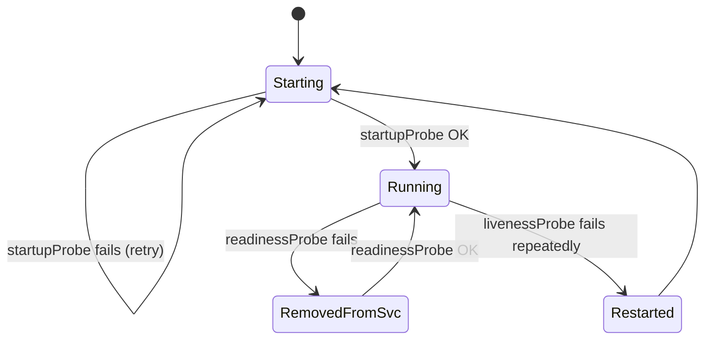
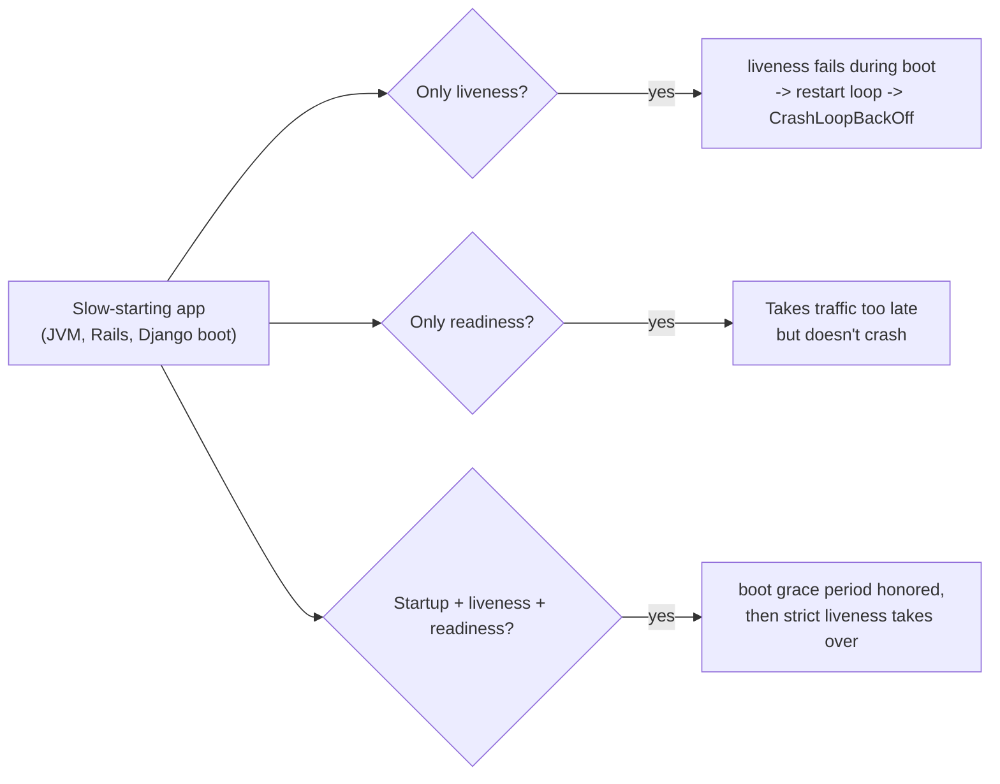

# Bonus: Liveness, Readiness & Startup Probes

> **Goal**: Give Kubernetes an accurate health signal so it can self-heal without false positives.
> **Prereqs**: [Day 45 — Deployments](day45_deployments.md).

## 1. Scenario & Why It Matters

`kubectl get pods` says `Running`, but your app has frozen, is still booting, or is overloaded. Without probes, K8s keeps sending traffic to it and restarts are never triggered. Probes are the three-question diagnostic kubelet runs on a schedule to answer: "is it alive?", "is it ready for traffic?", "has it finished starting up?". Getting them right is one of the top-three causes of production incident postmortems in K8s.

## 2. Concept Deep-Dive

Three probe types, three very different reactions:

| Probe | Question | On failure |
|-------|----------|-----------|
| `livenessProbe` | Is the container still alive? | kubelet **kills and restarts** the container |
| `readinessProbe` | Ready to serve traffic? | kubelet **removes** the Pod IP from every Service endpoints list; container is left alive |
| `startupProbe` | Has it finished booting? | kubelet **pauses** liveness/readiness until startup succeeds |



### Probe mechanics

Three ways to probe:

- `httpGet` — send `GET path`. Success = HTTP status 2xx/3xx.
- `tcpSocket` — open a TCP connection. Success = port open.
- `exec` — run a command inside the container. Success = exit code 0.

### All timing fields

| Field | Default | Meaning |
|-------|---------|---------|
| `initialDelaySeconds` | 0 | Wait this long before the first probe |
| `periodSeconds` | 10 | Poll interval |
| `timeoutSeconds` | 1 | Max wait for a single probe response |
| `failureThreshold` | 3 | Consecutive failures before action |
| `successThreshold` | 1 | Consecutive successes to be considered healthy (readiness only, must be 1 for liveness/startup) |

### Full example

```yaml
apiVersion: apps/v1
kind: Deployment
metadata:
  name: healthy-app
spec:
  replicas: 2
  selector:
    matchLabels:
      app: healthy
  template:
    metadata:
      labels:
        app: healthy
    spec:
      containers:
        - name: app
          image: nginx:alpine
          ports:
            - containerPort: 80
          startupProbe:
            httpGet:
              path: /
              port: 80
            failureThreshold: 30     # 30 * 2s = 60s allowed for startup
            periodSeconds: 2
          livenessProbe:
            httpGet:
              path: /
              port: 80
            periodSeconds: 10
            failureThreshold: 3      # 30s of failure triggers restart
            timeoutSeconds: 1
          readinessProbe:
            httpGet:
              path: /
              port: 80
            periodSeconds: 5
            failureThreshold: 1      # one fail = out of the Service
            successThreshold: 1
```

### Why you need all three



## 3. Hands-On Mission

Apply the manifest, then simulate a crash by removing the health endpoint:

```bash
kubectl apply -f probed-deployment.yaml
kubectl get pods -l app=healthy

POD=$(kubectl get pods -l app=healthy -o name | head -1)
kubectl exec $POD -- rm /usr/share/nginx/html/index.html
kubectl get pods -l app=healthy -w       # watch RESTARTS increment
```

## 4. Your Task — Answer

**Q:** After breaking the health endpoint, what does the RESTARTS column show?

**Sample answer**: It increments from 0 to 1 within ~30 seconds (3 consecutive liveness failures at 10s intervals). kubelet responds to a failed liveness probe by sending `SIGTERM` to the container (then `SIGKILL` after the grace period) and creating a fresh container in the same Pod sandbox. The Pod's name and IP stay the same; only the container is replaced.

```
NAME              READY   STATUS    RESTARTS   AGE
healthy-app-xxx   1/1     Running   1          2m
```

## 5. Q&A (Concepts Check)

**Q: When do I need a readiness probe vs a liveness probe?**
A: Readiness is for transient unavailability (warming caches, upstream dependency down, graceful shutdown). Liveness is for permanent brokenness (deadlock, panic loop). If you only have one, make it readiness — a missing readiness probe means traffic reaches unready Pods; a missing liveness probe just means you don't auto-recover from deadlocks.

**Q: Should liveness and readiness hit the same endpoint?**
A: Usually not. Readiness depends on downstream dependencies (DB, cache). Liveness should NOT — if your DB goes down and your liveness probe returns 500, every Pod restarts, and you turn a DB outage into a thundering-herd crash loop.

**Q: What's the relationship between startup and liveness probes?**
A: Liveness probes are **paused** until the startup probe succeeds once. This lets slow-starting apps boot without getting killed. Set `failureThreshold * periodSeconds` on the startupProbe to match your worst-case boot time.

**Q: My Pod has an `exec` probe that spawns a process every 10 seconds. Is that expensive?**
A: Yes — forking a process in a container has non-trivial overhead, especially on nodes with tight CPU limits. Prefer `httpGet` or `tcpSocket`. Save `exec` for cases where HTTP isn't available.

**Q: Does a failed readiness probe kill the container?**
A: No. It only removes the Pod from Service endpoints. The container keeps running; traffic just stops flowing to it. Once readiness recovers, the Pod is re-added.

## 6. Further Reading

- kubernetes.io/docs/tasks/configure-pod-container/configure-liveness-readiness-startup-probes/.
- Next: [Resource Requests & Limits](bonus_resource-limits.md).
