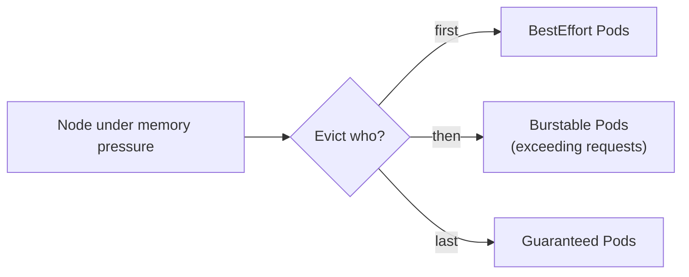

# Bonus: Resource Requests & Limits (The Budget)

> **Goal**: Prevent noisy-neighbor problems and earn predictable scheduling.
> **Prereqs**: [Day 42-2 — cgroups](../00_foundations/day42-2_cgroups-cpu-memory.md).

## 1. Scenario & Why It Matters

A node has 4 CPU cores and 8 GiB of memory to share between every Pod scheduled onto it. Without explicit budgets, one runaway process can starve everyone else. **Requests** tell the scheduler what a container needs; **limits** tell the kernel what it may never exceed.

## 2. Concept Deep-Dive

See [Day 42-2](../00_foundations/day42-2_cgroups-cpu-memory.md) for the kernel-level view. At the Kubernetes level:

| Field | Used for | If exceeded |
|-------|----------|-------------|
| `requests.cpu` | **Scheduling** — node must have this much allocatable CPU free | No effect at runtime |
| `requests.memory` | **Scheduling** — same | No effect at runtime |
| `limits.cpu` | **Runtime cap** via cgroup `cpu.max` | Container is **throttled** (not killed) |
| `limits.memory` | **Runtime cap** via cgroup `memory.max` | Container is **OOMKilled** (exit code 137) |

Units:
- CPU: `500m` = 0.5 cores. `1` = 1 full core. `2000m` = 2 cores.
- Memory: `128Mi` = 128 × 1024² bytes. Use `Mi`/`Gi` (binary), not `M`/`G` (decimal — 1000²).

### QoS classes — who survives under pressure

| QoS | Condition | Eviction |
|-----|-----------|----------|
| `Guaranteed` | Every container has `requests == limits` for CPU and memory | Last to be evicted |
| `Burstable` | At least one container has requests (and they don't equal limits) | Middle |
| `BestEffort` | No requests, no limits anywhere | First to go |



### Full example

```yaml
apiVersion: v1
kind: Pod
metadata:
  name: limited-app
spec:
  containers:
    - name: stress
      image: polinux/stress
      command: ["stress"]
      args: ["--vm", "1", "--vm-bytes", "200M", "--timeout", "60s"]
      resources:
        requests:
          cpu: "100m"
          memory: "64Mi"
        limits:
          cpu: "200m"
          memory: "128Mi"     # container tries 200M -> OOMKilled
```

### LimitRange and ResourceQuota

At the namespace level you can enforce defaults and caps centrally:

```yaml
apiVersion: v1
kind: LimitRange
metadata:
  name: default-limits
spec:
  limits:
    - type: Container
      default:            # assigned if Pod spec omits them
        cpu: 500m
        memory: 256Mi
      defaultRequest:
        cpu: 100m
        memory: 64Mi
---
apiVersion: v1
kind: ResourceQuota
metadata:
  name: team-quota
spec:
  hard:
    requests.cpu: "10"
    requests.memory: 20Gi
    limits.cpu: "20"
    limits.memory: 40Gi
```

## 3. Hands-On Mission

```bash
kubectl apply -f limited-pod.yaml
kubectl get pods limited-app -w
kubectl describe pod limited-app | grep -A 5 "Last State"
kubectl get pod limited-app -o jsonpath='{.status.qosClass}'
```

## 4. Your Task — Answer

**Q:** After applying the manifest, what termination reason does `kubectl describe` show, and what QoS class is the Pod?

**Sample answer**:

```
Last State:     Terminated
  Reason:       OOMKilled
  Exit Code:    137
```

QoS class: `Burstable` (requests < limits). The container requested 64 MiB memory, was allowed up to 128 MiB, and the `stress` tool tried to allocate 200 MiB. The kernel's cgroup memory controller killed it the moment the allocation exceeded 128 MiB. Exit code 137 = 128 + 9 (SIGKILL signal number).

## 5. Q&A (Concepts Check)

**Q: Why does exceeding CPU limits only slow the Pod, while exceeding memory kills it?**
A: CPU is elastic — the scheduler can always give you fewer cycles next period. Memory, once allocated, can't be reclaimed without swap (which is off by default on K8s). OOM-kill is the only backstop the kernel has.

**Q: Should I always set limits equal to requests?**
A: For memory, yes (it's the only way to hit `Guaranteed` QoS and avoid surprise kills). For CPU, it's debated: equal = stable throughput but wastes spare cycles; limits > requests = burst on idle nodes, but risk of throttling-induced latency.

**Q: I set `limits.cpu: "1"` but my Pod is only getting half a core. Why?**
A: CPU throttling is measured in a sliding window. If your app micro-bursts above 1 core for a few ms at a time, the cgroup throttles it aggressively. On HTTP-burst workloads, this shows up as tail-latency spikes. Consider dropping CPU limits entirely on trusted workloads (keep requests for scheduling).

**Q: What's the difference between "evicted" and "OOMKilled"?**
A: OOMKilled happens when a **container** exceeds its own cgroup memory limit — the kernel kills that one process. Eviction happens when the **node** runs out of memory and kubelet picks low-QoS Pods to delete entirely (to free up memory for higher-QoS workloads).

**Q: Does `LimitRange` retroactively apply to existing Pods?**
A: No. It applies at admission time. Existing Pods keep their original spec; new Pods (or Pods recreated from a Deployment) get the defaults.

## 6. Further Reading

- kubernetes.io/docs/concepts/configuration/manage-resources-containers/.
- Next: [Horizontal Pod Autoscaler](bonus_hpa.md).
