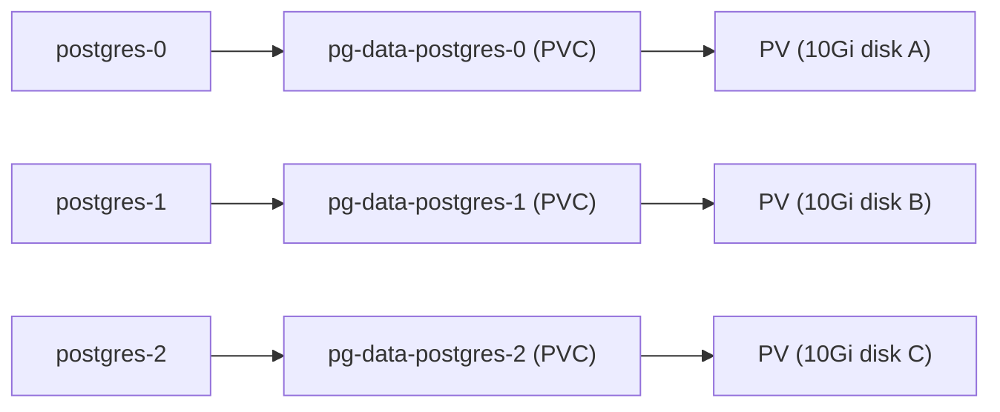
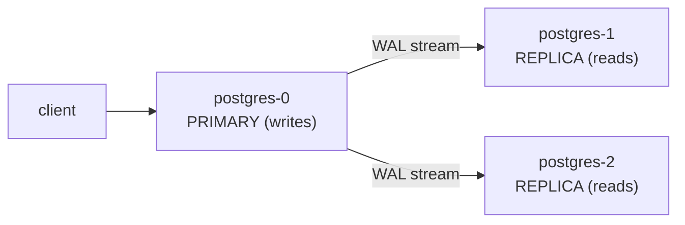

# Bonus: StatefulSets — Pods With Identity

> **Goal**: Run stateful workloads (databases, queues) where each Pod's identity matters.
> **Prereqs**: [Deployments](day45_deployments.md), [Headless Services](../03_networking/day46-5_headless-service.md), [Persistent Storage](../05_storage/bonus_persistent-storage.md).

## 1. Scenario & Why It Matters

You try to run a PostgreSQL cluster as a Deployment. When `postgres-7c989d-abc1` (the primary) dies, the ReplicaSet makes a new one called `postgres-7c989d-xyz9`. Its Pod IP is different, its DNS name is different, and its storage is gone. Replicas can't find it. Your database is broken. StatefulSets solve this: each replica has a stable name (`postgres-0`, `postgres-1`), stable DNS, its own PVC, and ordered startup.

## 2. Concept Deep-Dive

### StatefulSet vs Deployment — side by side

| Feature | Deployment | StatefulSet |
|---------|-----------|-------------|
| Pod names | Random hash `nginx-7c989d-abc1` | Ordered `postgres-0, postgres-1, postgres-2` |
| Identity on restart | Different name, different IP | **Same** name, **same** storage |
| Startup order | All at once | Sequential (0 → 1 → 2) |
| Shutdown order | All at once | Reverse (2 → 1 → 0) |
| Storage | Shared or none | Each Pod gets its own PVC via `volumeClaimTemplates` |
| DNS | Service round-robin | Per-Pod: `<pod>.<svc>.<ns>.svc.cluster.local` |
| Use case | Stateless web/API | Databases, queues, distributed consensus |

### The three guarantees

**1. Stable network identity.** Requires a **headless Service** (`clusterIP: None`). DNS:

```
postgres-0.db-headless.default.svc.cluster.local
postgres-1.db-headless.default.svc.cluster.local
postgres-2.db-headless.default.svc.cluster.local
```

**2. Stable persistent storage.** Each replica gets its own PVC through `volumeClaimTemplates`. The PVC name is `<template>-<sts-name>-<index>` — so `pg-data-postgres-1` always belongs to `postgres-1`, even across restarts.



Deleting a Pod doesn't delete its PVC. Deleting the StatefulSet also doesn't delete the PVCs (you must clean them up manually).

**3. Ordered deployment/scaling.** `postgres-1` is created only after `postgres-0` is Running and Ready. Scale-down reverses — `postgres-2` terminates before `postgres-1`. Rolling updates go in reverse order too.

### Full manifest

```yaml
apiVersion: v1
kind: Service
metadata:
  name: db-headless
spec:
  clusterIP: None
  selector:
    app: database
  ports:
    - port: 5432
      targetPort: 5432
---
apiVersion: apps/v1
kind: StatefulSet
metadata:
  name: postgres
spec:
  serviceName: db-headless              # REQUIRED — must match the headless Service
  replicas: 3
  podManagementPolicy: OrderedReady     # Default. "Parallel" skips ordering.
  updateStrategy:
    type: RollingUpdate
    rollingUpdate:
      partition: 0                      # Only update Pods with index >= partition (canary trick)
  selector:
    matchLabels:
      app: database
  template:
    metadata:
      labels:
        app: database
    spec:
      containers:
        - name: postgres
          image: postgres:16
          ports:
            - containerPort: 5432
          env:
            - name: POSTGRES_PASSWORD
              value: "changeme"         # Use a Secret in production
            - name: POD_NAME
              valueFrom:
                fieldRef:
                  fieldPath: metadata.name    # "postgres-0", etc.
          volumeMounts:
            - name: pg-data
              mountPath: /var/lib/postgresql/data
  volumeClaimTemplates:
    - metadata:
        name: pg-data
      spec:
        accessModes: ["ReadWriteOnce"]
        resources:
          requests:
            storage: 10Gi
```

### Replication patterns (K8s does NOT do this for you)

StatefulSets give you identity and storage. **Data replication is your problem** — via init containers, sidecars, or an Operator.



| Pattern | What | Who manages replication |
|---------|------|-------------------------|
| Init container + `pg_basebackup` | Clone primary data on first start | You (scripting) |
| Sidecar agent | Continuous stream between containers | You (custom agent) |
| Built-in (Postgres streaming, MySQL GTID) | Database's own replication | You (config) |
| **Operator** (CloudNativePG, Zalando, etc.) | Full HA, failover, backups, PITR | The Operator |

For production: **use an Operator**. Don't roll your own.

## 3. Hands-On Mission

```bash
kubectl apply -f db-headless-service.yaml
kubectl apply -f postgres-statefulset.yaml

# Ordered startup
kubectl get pods -l app=database -w     # postgres-0 goes Ready before postgres-1 starts

# Per-Pod PVCs
kubectl get pvc

# Stable identity — delete a Pod and watch it return with the same name and PVC
kubectl delete pod postgres-2
kubectl get pods -l app=database -w
```

## 4. Your Task — Answer

**Q:** After deleting `postgres-2`, what name does the replacement Pod have, and which PVC does it use?

**Sample answer**: The replacement Pod is named `postgres-2` (identical to the one you deleted — not a random hash). It reattaches to the same PVC, `pg-data-postgres-2`, so the data is still there:

```
NAME                    STATUS   VOLUME       CAPACITY   ACCESS MODES   AGE
pg-data-postgres-0      Bound    pv-abc123    10Gi       RWO            5m
pg-data-postgres-1      Bound    pv-def456    10Gi       RWO            4m
pg-data-postgres-2      Bound    pv-ghi789    10Gi       RWO            4m   # SAME PVC, just reattached
```

## 5. Q&A (Concepts Check)

**Q: My StatefulSet creates Pods but they're never "Ready". Why?**
A: Most commonly, the headless Service doesn't exist yet (StatefulSet needs `serviceName` to resolve). Run `kubectl get svc db-headless`. Second common cause: PVC can't bind (no matching StorageClass). Check `kubectl get pvc`.

**Q: Can I go from 3 replicas to 5?**
A: Yes — `kubectl scale statefulset postgres --replicas=5`. `postgres-3` and `postgres-4` come up in order. Each gets a new PVC (`pg-data-postgres-3`, `pg-data-postgres-4`). Scaling **down** from 5 to 3 terminates Pods in reverse but leaves the PVCs behind for safety.

**Q: What's `podManagementPolicy: Parallel`?**
A: It creates/deletes all Pods simultaneously (no ordering), useful when the workload doesn't care about startup order (stateful but independent, like a sharded cache where each shard is self-contained). Identity and storage guarantees still hold.

**Q: What's `updateStrategy.rollingUpdate.partition`?**
A: Only Pods with index ≥ partition are updated during a rollout. Set to `replicas` to **freeze** all updates. Start at `replicas - 1` to canary-update only the highest-index Pod, then decrement once validated — a classic canary technique for stateful workloads.

**Q: Can a StatefulSet use a regular ClusterIP Service instead of headless?**
A: The `serviceName` field **must** reference a headless Service — that's how individual Pod DNS names work. You can additionally create a regular ClusterIP Service for client traffic (load-balanced across all replicas) alongside the headless one.

**Q: Do I still need `replicas: 3` if I use an Operator?**
A: The Operator usually exposes a higher-level Custom Resource (`Cluster` or `Database`) where you declare the replica count, and it generates the StatefulSet for you. You rarely touch the StatefulSet directly.

## 6. Further Reading

- kubernetes.io/docs/concepts/workloads/controllers/statefulset/.
- CloudNativePG Operator: cloudnative-pg.io.
- "Kubernetes Operators" by Jason Dobies & Joshua Wood.
- Next: [Day 46 — Services overview](../03_networking/day46-0_services-summary.md).
