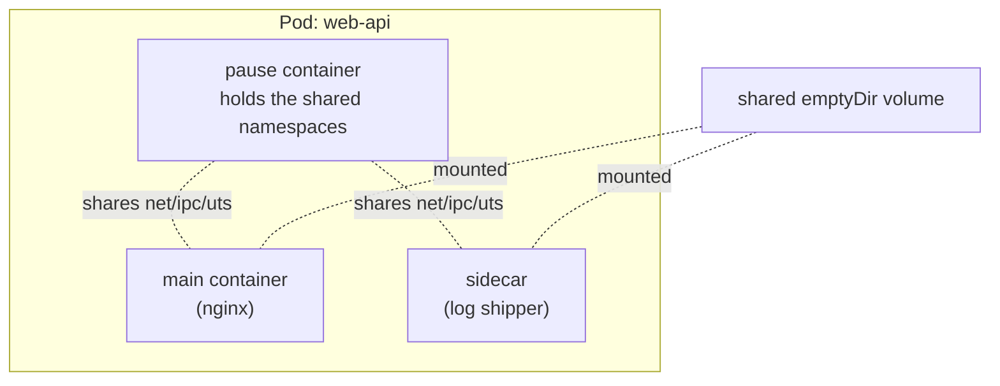
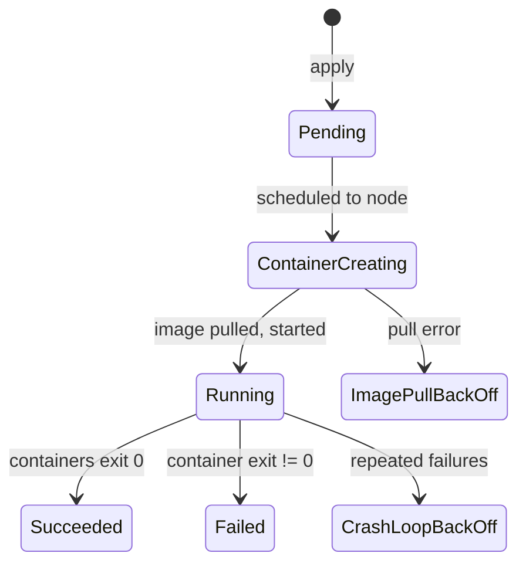

# Day 44: The Pod — Kubernetes' Atomic Unit

> **Goal**: Create a Pod from YAML, understand what every field means, and inspect it.
> **Prereqs**: [Day 43 — Minikube](../01_getting-started/day43_minikube.md), [Day 42-1 — Namespaces](../00_foundations/day42-1_linux-namespaces.md).

## 1. Scenario & Why It Matters

Docker runs containers. Kubernetes runs **Pods**. A Pod is a wrapper around one or more tightly-coupled containers that share a network, IPC, and (optionally) process namespace. You cannot run a bare container in K8s — everything is a Pod. Every higher-level resource (Deployment, StatefulSet, Job) ultimately produces Pods.

## 2. Concept Deep-Dive

A Pod is **one unit of scheduling** — all its containers are placed on the same node, share one IP, and live/die together. Typical composition:



**Why multiple containers in one Pod?** When two processes must always be co-located, co-scheduled, and share resources — for example: an app + its log shipper, an app + its reverse-proxy, an app + a credential-refresh sidecar. Anti-example: an app + its database. Those scale independently and must be in separate Pods (often separate Deployments).

### The minimum viable manifest

```yaml
apiVersion: v1
kind: Pod
metadata:
  name: my-first-pod
  labels:
    app: nginx
spec:
  containers:
    - name: nginx-container
      image: nginx:alpine
      ports:
        - containerPort: 80
```

| Field | What it does |
|-------|--------------|
| `apiVersion` | Which API schema to parse against. `v1` covers Pod, Service, ConfigMap, Secret, Namespace. |
| `kind` | The resource type. |
| `metadata.name` | Unique identifier within the namespace. Used by kubectl, in DNS, in logs. |
| `metadata.labels` | Key/value tags. Labels are how **selectors** find objects (Services select Pods by labels). |
| `spec.containers[].image` | OCI image reference. Defaults to Docker Hub. |
| `spec.containers[].ports[].containerPort` | Purely **informational** — the container listens on whatever port its process binds to. This field documents it for humans and selects the right port for probes. |

### Pod lifecycle



| Phase | Meaning |
|-------|---------|
| `Pending` | Accepted by the API but not yet scheduled to a node (or image still pulling). |
| `Running` | At least one container is running. |
| `Succeeded` | All containers exited with code 0 (terminal). For Jobs. |
| `Failed` | All containers terminated, at least one failed. |

Plus reason codes you will see in `kubectl describe pod`:

| Reason | What it means |
|--------|---------------|
| `ContainerCreating` | Image pulling or volume mounting |
| `ImagePullBackOff` | Registry rejected the pull (404, auth, typo) |
| `CrashLoopBackOff` | Container keeps exiting; kubelet backs off restarts exponentially |
| `OOMKilled` | cgroup memory limit exceeded |
| `Error` / exit code 1+ | The container ran and exited non-zero |

## 3. Hands-On Mission

Save the manifest above as `pod.yaml`, then:

```bash
kubectl apply -f pod.yaml
kubectl get pods                    # wait for STATUS=Running
kubectl get pod my-first-pod -o wide    # adds node and IP
kubectl describe pod my-first-pod       # events, conditions, full spec
kubectl logs my-first-pod               # stdout/stderr
kubectl exec -it my-first-pod -- sh     # interactive shell
kubectl port-forward my-first-pod 8080:80   # reach it from your laptop
curl http://localhost:8080
kubectl delete pod my-first-pod         # Pod is gone, STAYS gone (no controller)
```

## 4. Your Task — Answer

**Q:** After applying the manifest and running `kubectl get pods`, paste the output.

**Sample answer**:

```
NAME           READY   STATUS    RESTARTS   AGE
my-first-pod   1/1     Running   0          12s
```

- `READY 1/1` means 1 of 1 containers passed its readiness probe (no probe = immediately ready).
- `STATUS Running` means the Pod phase is Running.
- `RESTARTS 0` means no container in this Pod has crashed and been restarted.

## 5. Q&A (Concepts Check)

**Q: What happens if I delete this Pod?**
A: It stays dead. Bare Pods have no controller. If you want self-healing, wrap it in a Deployment (tomorrow).

**Q: Can two containers in the same Pod listen on port 80 simultaneously?**
A: No — they share a single network namespace, so they share a single port space. One of them has to pick a different port (or use different protocols).

**Q: What IP does `containerPort: 80` actually bind to?**
A: None. `containerPort` is documentation. The container process binds wherever it chooses (`nginx` binds `0.0.0.0:80` because that's what its config says). K8s uses `containerPort` to name the port so probes and Services can reference it by name.

**Q: Why can I exec into a container with `kubectl exec`? Does the container run an SSH server?**
A: No SSH. kubelet connects to the container runtime (CRI) and asks it to attach to the container's stdin/stdout via the runtime's `exec` API, which ultimately calls the `setns` + `execve` combo inside the container's namespaces.

**Q: My Pod is `Running` but my app isn't responding. Where do I look first?**
A: (1) `kubectl logs <pod>` — did the app actually start? (2) `kubectl exec -it <pod> -- netstat -tlnp` — is it listening on the expected port? (3) `kubectl describe pod` — any events or failed probes? (4) `kubectl port-forward` and bypass the Service to rule out networking issues.

## 6. Further Reading

- kubernetes.io/docs/concepts/workloads/pods/.
- "Patterns for composing Pods" — Brendan Burns.
- Next: [Day 45 — Deployments](day45_deployments.md).
