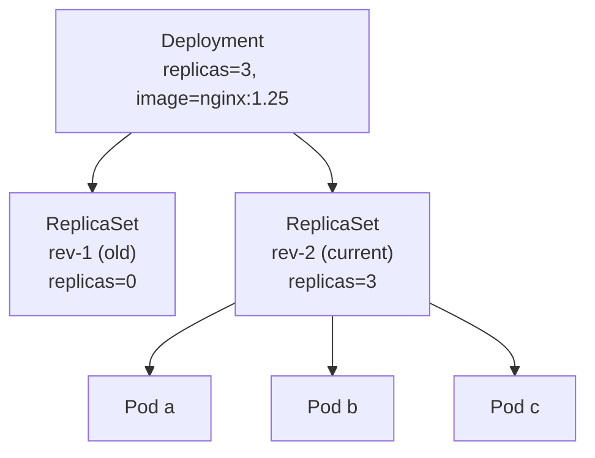
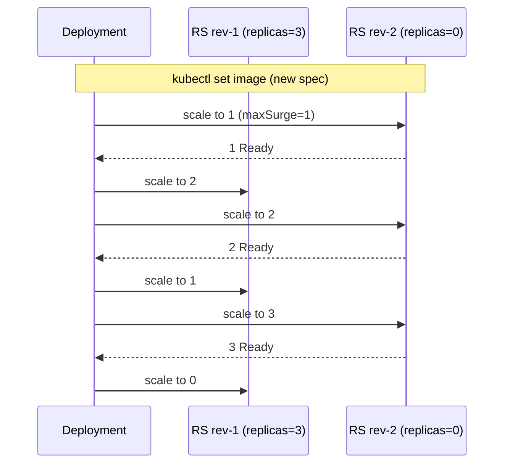

# Day 45: Deployments — Self-Healing, Scaling, Rolling Updates

> **Goal**: Move from bare Pods to a production-grade workload controller.
> **Prereqs**: [Day 44 — The Pod](day44_the-pod.md).

## 1. Scenario & Why It Matters

A bare Pod is fragile: delete it and it stays gone. In production you want *"always keep N replicas running, and when I change the image, roll out the new version without downtime"*. That's a **Deployment** — the most common workload resource in Kubernetes. Every stateless web server, API, worker, and function you run in K8s should be a Deployment unless you have a very specific reason otherwise.

## 2. Concept Deep-Dive

A Deployment owns **ReplicaSets**, which own **Pods**. You rarely create ReplicaSets by hand; the Deployment does it for you on every spec change.



On `kubectl set image deployment/... image=nginx:1.26`, the Deployment creates a new ReplicaSet `rev-3` and scales it up while scaling `rev-2` down. You keep old ReplicaSets around (revisions) so you can roll back.

### Full manifest

```yaml
apiVersion: apps/v1
kind: Deployment
metadata:
  name: nginx-deployment
spec:
  replicas: 3
  strategy:
    type: RollingUpdate
    rollingUpdate:
      maxSurge: 1          # during rollout, allow 1 extra Pod (so 4 total briefly)
      maxUnavailable: 0    # never drop below replicas
  selector:
    matchLabels:
      app: web
  template:
    metadata:
      labels:
        app: web           # MUST match the selector
    spec:
      containers:
        - name: nginx
          image: nginx:alpine
          ports:
            - containerPort: 80
```

| Field | Purpose |
|-------|---------|
| `replicas` | Desired Pod count. Controller reconciles continuously. |
| `selector.matchLabels` | How the Deployment finds "its" Pods. **Immutable** after create. |
| `template.metadata.labels` | Applied to every Pod. Must match `selector.matchLabels` or the API server rejects the manifest. |
| `strategy.type` | `RollingUpdate` (default) or `Recreate` (kill all, then create new — causes downtime). |
| `strategy.rollingUpdate.maxSurge` | How many extra Pods allowed during rollout (absolute number or %). |
| `strategy.rollingUpdate.maxUnavailable` | How many Pods may be missing during rollout. `0` = zero-downtime rollout. |

### Rolling update in motion



### Scaling — three ways

```bash
kubectl scale deployment nginx-deployment --replicas=10
kubectl edit deployment nginx-deployment       # change replicas field
kubectl apply -f deployment.yaml               # GitOps way
```

The first is imperative (fast, but your YAML and cluster state diverge). The third is declarative (slower to type, safe).

### Rollbacks

Every revision is kept (bounded by `.spec.revisionHistoryLimit`, default 10):

```bash
kubectl rollout history deployment/nginx-deployment
kubectl rollout undo deployment/nginx-deployment              # back to previous
kubectl rollout undo deployment/nginx-deployment --to-revision=3
kubectl rollout status deployment/nginx-deployment            # wait for complete
```

## 3. Hands-On Mission

Clean up yesterday's Pod and apply the Deployment:

```bash
kubectl delete pod my-first-pod --ignore-not-found
kubectl apply -f deployment.yaml
kubectl get deployments,rs,pods -l app=web
```

Kill one Pod and watch it respawn:

```bash
kubectl get pods -l app=web
kubectl delete pod <one-of-them>
kubectl get pods -l app=web     # a new Pod appears within a few seconds
```

Trigger a rolling update and watch it:

```bash
kubectl set image deployment/nginx-deployment nginx=nginx:1.27-alpine
kubectl rollout status deployment/nginx-deployment
```

Scale:

```bash
kubectl scale deployment/nginx-deployment --replicas=5
```

## 4. Your Task — Answer

**Q:** Delete one of the three Pods, then run `kubectl get pods`. How many Pods are listed and what does the AGE column show?

**Sample answer**: Three Pods are still listed. Two of them have AGE measured in minutes (the survivors), and one has an AGE measured in seconds (the replacement the ReplicaSet controller created the moment it noticed there were only 2 Pods instead of the desired 3).

```
NAME                                READY   STATUS    RESTARTS   AGE
nginx-deployment-7c989d-abc1        1/1     Running   0          2m
nginx-deployment-7c989d-def2        1/1     Running   0          2m
nginx-deployment-7c989d-xyz3        1/1     Running   0          4s   # freshly created
```

## 5. Q&A (Concepts Check)

**Q: I changed the `selector.matchLabels` field and got an error. Why?**
A: The selector is immutable after the Deployment is created. This prevents a Deployment from silently adopting or orphaning the wrong Pods mid-rollout. If you need to change selectors, delete and recreate the Deployment.

**Q: What's the difference between `replicas: 3` at Deployment level and at ReplicaSet level?**
A: You set it on the Deployment. The controller writes the number to the ReplicaSet. Never edit the ReplicaSet directly — the Deployment controller will reset it on its next reconcile cycle.

**Q: My rollout is stuck halfway. What do I check?**
A: `kubectl rollout status` will report the stall. Common causes: (a) new Pods never become Ready (readiness probe failing) — check `kubectl describe pod`; (b) `maxUnavailable: 0` plus insufficient node capacity — the new Pod can't schedule. `kubectl rollout pause`/`resume` lets you inspect without the controller interfering.

**Q: Do I need `maxSurge` if I have `maxUnavailable: 0`?**
A: Yes. With `maxUnavailable: 0`, you must allow at least 1 surge Pod, otherwise the rollout can never start (you can't take any old Pod down, but also can't add any new Pod). The scheduler would be deadlocked.

**Q: How is a Deployment different from a StatefulSet?**
A: A Deployment treats all Pods as interchangeable (random names, any Pod can replace any other, storage is shared or ephemeral). A StatefulSet gives each Pod a stable identity (`postgres-0`, `postgres-1`), its own PVC, and ordered startup. See [StatefulSets](./bonus_statefulsets.md).

**Q: Should I run databases as a Deployment?**
A: Almost never. Deployments assume statelessness and will happily replace a "primary" database Pod with a fresh, empty one. Use StatefulSets + PersistentVolumeClaims, or a database Operator.

## 6. Further Reading

- kubernetes.io/docs/concepts/workloads/controllers/deployment/.
- Argo Rollouts / Flagger for advanced strategies (canary, blue-green).
- Next: [Day 46 — Services overview](../03_networking/day46-0_services-summary.md).
