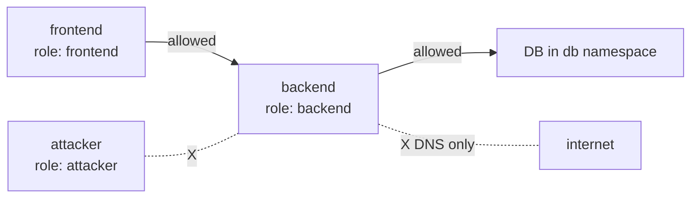

# Bonus: NetworkPolicies — The Pod Firewall

> **Goal**: Restrict which Pods can send traffic to which, based on labels.
> **Prereqs**: [Day 42-5 — CNI and kube-proxy](../00_foundations/day42-5_cni-and-kube-proxy.md).

## 1. Scenario & Why It Matters

By default, every Pod in Kubernetes can talk to every other Pod. Frontend can reach your database. Test-namespace apps can reach production-namespace Redis. An attacker who compromises any Pod has the whole network. A **NetworkPolicy** is a firewall rule written in YAML, enforced by your CNI plugin, that specifies which Pods may send (egress) and receive (ingress) traffic.

## 2. Concept Deep-Dive

A NetworkPolicy is **additive**: the moment any policy selects a Pod, that Pod becomes **default-deny** for the direction(s) the policy covers. You then explicitly allow what's needed.



Four building blocks:

1. `podSelector` — which Pods the policy applies to.
2. `policyTypes` — `Ingress`, `Egress`, or both.
3. `ingress.from` — allowed sources (Pod selectors, namespace selectors, IP blocks).
4. `egress.to` — allowed destinations.

### Default-deny template

```yaml
apiVersion: networking.k8s.io/v1
kind: NetworkPolicy
metadata:
  name: deny-all-ingress-to-backend
spec:
  podSelector:
    matchLabels:
      role: backend
  policyTypes:
    - Ingress
  ingress: []              # empty list = deny everything
```

### Allow only frontend to reach backend on port 80

```yaml
apiVersion: networking.k8s.io/v1
kind: NetworkPolicy
metadata:
  name: allow-frontend-to-backend
spec:
  podSelector:
    matchLabels:
      role: backend
  policyTypes:
    - Ingress
  ingress:
    - from:
        - podSelector:
            matchLabels:
              role: frontend
      ports:
        - protocol: TCP
          port: 80
```

### Egress with DNS carve-out (you almost always need this)

```yaml
apiVersion: networking.k8s.io/v1
kind: NetworkPolicy
metadata:
  name: backend-egress
spec:
  podSelector:
    matchLabels:
      role: backend
  policyTypes:
    - Egress
  egress:
    - to:
        - podSelector:
            matchLabels:
              role: database
      ports:
        - protocol: TCP
          port: 5432
    - to:                     # DNS must be allowed or nothing resolves
        - namespaceSelector:
            matchLabels:
              kubernetes.io/metadata.name: kube-system
          podSelector:
            matchLabels:
              k8s-app: kube-dns
      ports:
        - protocol: UDP
          port: 53
        - protocol: TCP
          port: 53
```

### `from`/`to` options

- `podSelector` — Pods in the **same** namespace matching labels.
- `namespaceSelector` — all Pods in namespaces matching labels.
- Both together (logical AND) — Pods matching both selectors.
- `ipBlock` — CIDR ranges (for external IPs, or cluster-internal when you want). Supports `except`.

## 3. Hands-On Mission

> Important: NetworkPolicies only work if your CNI enforces them. Minikube's default `kindnet` **does not**. Use `minikube start --cni=calico` or install Cilium.

```bash
kubectl run frontend --image=nginx:alpine --labels="role=frontend" --port=80
kubectl run backend  --image=nginx:alpine --labels="role=backend"  --port=80
kubectl expose pod backend --port=80

# 1. Baseline: wide open
kubectl exec frontend -- curl -s --max-time 3 http://backend     # succeeds

# 2. Apply deny-all
kubectl apply -f deny-all.yaml
kubectl exec frontend -- curl -s --max-time 3 http://backend     # timeout (blocked)

# 3. Allow frontend explicitly
kubectl apply -f allow-frontend.yaml
kubectl exec frontend -- curl -s --max-time 3 http://backend     # succeeds
```

## 4. Your Task — Answer

**Q:** What does `curl backend` look like after deny-all, and after allow-frontend?

**Sample answer**:

After `deny-all.yaml`:
```
curl: (28) Operation timed out after 3001 ms
```
The packet is silently dropped by the CNI's firewall rules — the kernel sees no route to accept it.

After `allow-frontend.yaml`:
```
<html>
<head><title>Welcome to nginx!</title></head>
...
```
The frontend Pod's `role=frontend` label matches the allow rule, so the packet is permitted through.

## 5. Q&A (Concepts Check)

**Q: Why do my policies appear to have no effect?**
A: Your CNI doesn't enforce them. Default Minikube CNI and Flannel (out of the box) don't. Install Calico or Cilium, or start Minikube with `--cni=calico`.

**Q: How do I write a "deny everything by default" posture?**
A: Apply a NetworkPolicy per namespace that selects **all** Pods with `podSelector: {}` and has empty `ingress` and `egress` lists. Then layer explicit allow rules on top.

**Q: Do NetworkPolicies apply to traffic from outside the cluster?**
A: Yes — an external client hitting a NodePort has the source IP rewritten (under `externalTrafficPolicy: Cluster`) and the policy sees the node's perspective. To match external traffic by IP, use `ipBlock`. To preserve source IPs, use `externalTrafficPolicy: Local`.

**Q: I allowed traffic to my database's Service, but it still fails.**
A: NetworkPolicies apply to **Pods**, not Services. Allow traffic to the **Pod labels** of the database (or the namespace label), not to the Service name. The Service is just a virtual IP; the packet eventually reaches a Pod, and that's what the policy evaluates.

**Q: Does a NetworkPolicy stop egress to another namespace?**
A: Yes, if the policy has `policyTypes: [Egress]`. Use a `namespaceSelector` in `egress.to` to allow specific namespaces.

**Q: What's the difference between a NetworkPolicy and a Service Mesh policy (Istio, Linkerd)?**
A: NetworkPolicy is L3/L4 (IPs, ports). Service mesh policies are L7 (HTTP methods, paths, JWT claims, mTLS identities). They are complementary: NetworkPolicy is the foundation; mesh adds L7 enforcement on top.

## 6. Further Reading

- kubernetes.io/docs/concepts/services-networking/network-policies/.
- networkpolicy.io — interactive NetworkPolicy editor.
- Next: [Day 47 — ConfigMaps](../04_config-and-secrets/day47_config-maps.md).
