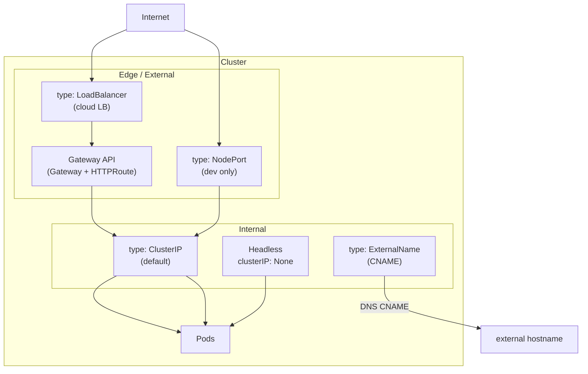

# Day 46 (Overview): Services at a Glance

> **Goal**: Know which Service type to reach for, at a glance, before drilling into each.
> **Prereqs**: [Day 42-5 — CNI and kube-proxy](../00_foundations/day42-5_cni-and-kube-proxy.md).

## 1. Why so many types?

Pod IPs are ephemeral. A Service gives a **stable address** for a set of Pods (selected by labels) and load-balances to them. Different Service types expose that address differently — some stay internal, some reach the outside, some return per-Pod IPs instead of a single virtual one.

## 2. The map

## 3. Cheat sheet

| Type | Reachable from | Gets external IP? | Typical use |
|------|----------------|-------------------|-------------|
| `ClusterIP` (default) | Inside cluster only | No | Pod-to-Pod (frontend → backend) |
| `NodePort` | `<nodeIP>:<30000-32767>` | No (uses node IP + port) | Dev, on-prem with external LB you manage |
| `LoadBalancer` | Cloud-provisioned external IP/hostname | Yes | Production public services |
| `ExternalName` | DNS CNAME only | N/A | Alias an external hostname (RDS, third-party APIs) |
| Headless (`clusterIP: None`) | Inside, returns per-Pod IPs | No | StatefulSets, client-side load balancing |
| Gateway API (Gateway + HTTPRoute) | Cloud LB with HTTP routing | Yes | Production, HTTP/HTTPS/gRPC, multiple apps behind one LB |

## 4. Rules of thumb

- **Default to `ClusterIP`.** You'll need one for every internal service regardless.
- **For external HTTP(S) traffic, use the Gateway API** (Ingress is deprecated, see [Day 46-6](day46-6_gateway-api.md)).
- **Use a single LoadBalancer in front of the Gateway**, not one per service — cloud LBs cost money.
- **Pair Headless + StatefulSet** for anything that needs per-Pod addressing (databases, message brokers).
- **ExternalName for external dependencies** you want to swap without redeploying Pods.

## 5. Drill-down

- [Day 46-1 — ClusterIP](day46-1_clusterip.md)
- [Day 46-2 — NodePort](day46-2_nodeport.md)
- [Day 46-3 — LoadBalancer](day46-3_loadbalancer.md)
- [Day 46-4 — ExternalName](day46-4_externalname.md)
- [Day 46-5 — Headless Service](day46-5_headless-service.md)
- [Day 46-6 — Gateway API](day46-6_gateway-api.md)
- [Network Policies](bonus_network-policies.md)
