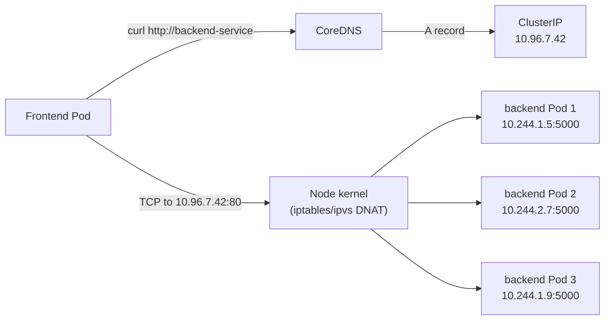

# Day 46-1: ClusterIP — The Internal Hotline

> **Goal**: Give a Deployment a stable internal address that other Pods can call by name.
> **Prereqs**: [Day 42-5 — CNI and kube-proxy](../00_foundations/day42-5_cni-and-kube-proxy.md), [Day 42-4 — Cluster DNS](../00_foundations/day42-4_cluster-dns.md).

## 1. Scenario & Why It Matters

Your frontend Deployment has 3 Pods, each with a different, ephemeral IP. When a Pod restarts it gets a new IP. Frontend code can't hardcode the backend's Pod IPs — they would all be stale tomorrow. A **ClusterIP** gives your backend one stable virtual IP plus a DNS name inside the cluster that automatically load-balances across healthy Pods. This is the default Service type and the one you'll use most.

## 2. Concept Deep-Dive

A ClusterIP is a **virtual** IP — no device owns it, no process binds it. `kube-proxy` (on every node) programs the kernel so that traffic to the ClusterIP is DNAT'd to one of the backing Pod IPs chosen from the Service's Endpoints list.



The Service watches for Pods whose labels match its `selector`. Matching Pods are written into an **Endpoints** (or newer **EndpointSlice**) object. Only **Ready** Pods are listed — failing the readiness probe removes you from the Endpoints automatically.

### Full manifest

```yaml
apiVersion: v1
kind: Service
metadata:
  name: backend-service
spec:
  selector:
    app: backend
  ports:
    - protocol: TCP
      port: 80           # Service port — what other Pods call
      targetPort: 5000   # Container port — where the app actually listens
  type: ClusterIP        # default; can be omitted
```

| Field | Purpose |
|-------|---------|
| `selector` | Labels that identify which Pods this Service routes to |
| `port` | Port exposed by the Service (virtual IP side) |
| `targetPort` | Port the container actually listens on |
| `type` | `ClusterIP` is the default |

### DNS names

Kubernetes auto-creates:
- `backend-service` — usable from Pods in the **same namespace**
- `backend-service.<namespace>` — from any namespace
- `backend-service.<namespace>.svc.cluster.local` — the full FQDN

## 3. Hands-On Mission

```bash
kubectl apply -f clusterip-service.yaml
kubectl get svc backend-service      # Should show TYPE=ClusterIP, EXTERNAL-IP=<none>
kubectl get endpoints backend-service
kubectl describe svc backend-service

# Test resolution from another Pod
kubectl run tester --rm -it --image=busybox:1.36 --restart=Never -- sh
/ # nslookup backend-service
/ # wget -qO- http://backend-service
```

## 4. Your Task — Answer

**Q:** Paste the output of `kubectl get svc backend-service`.

**Sample answer**:

```
NAME              TYPE        CLUSTER-IP     EXTERNAL-IP   PORT(S)   AGE
backend-service   ClusterIP   10.96.7.42     <none>        80/TCP    30s
```

- `CLUSTER-IP 10.96.7.42` — the virtual IP kube-proxy DNAT's to Pod IPs.
- `EXTERNAL-IP <none>` — not reachable from outside the cluster.
- `PORT(S) 80/TCP` — Service port (requests from other Pods come here).

## 5. Q&A (Concepts Check)

**Q: How does load balancing work — round robin?**
A: In `iptables` mode (default), the kernel picks a random endpoint per new connection, with uniform probability. In `ipvs` mode, you choose (round-robin, least-connection, etc.). Within an existing TCP connection, all packets go to the same endpoint (that's what conntrack ensures).

**Q: What's the difference between `port` and `targetPort`?**
A: `port` is what clients call (`http://svc:port`). `targetPort` is where the container listens. Almost always they are the same; having them differ is a convenience when you can't change the app.

**Q: My Service has zero endpoints. Why can't it route traffic?**
A: Either no Pods match the selector, or no matching Pods are Ready. Run `kubectl get endpoints backend-service` — empty means the selector is wrong or readiness probes are failing. Then `kubectl get pods -l app=backend --show-labels`.

**Q: Can a ClusterIP be reached from my laptop?**
A: Not directly — it only exists inside the cluster. For ad-hoc access from your laptop, use `kubectl port-forward svc/backend-service 8080:80` (it creates a tunnel via the API server).

**Q: What is an EndpointSlice?**
A: An EndpointSlice is the modern, scalable replacement for the Endpoints object. For a Service with 1000 backends, a single Endpoints object would be huge and slow to update. EndpointSlices split it across many smaller objects, reducing API churn. kube-proxy reads both for backwards compatibility.

**Q: Can I point a Service at Pods across different namespaces?**
A: Not via a selector. But you can create a Service with **no selector** and manually create an Endpoints object listing arbitrary IPs. This is how you front external or cross-namespace resources with a stable internal name.

## 6. Further Reading

- kubernetes.io/docs/concepts/services-networking/service/.
- Next: [Day 46-2 — NodePort](day46-2_nodeport.md).
