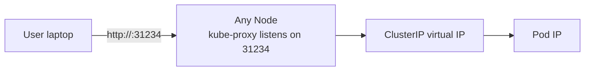

# Day 46-2: NodePort — Expose on Every Node's IP

> **Goal**: Reach a Service from outside the cluster without a cloud load balancer.
> **Prereqs**: [Day 46-1 — ClusterIP](day46-1_clusterip.md).

## 1. Scenario & Why It Matters

Your dev cluster has no cloud LB. You need to hit your app from your laptop. NodePort opens a static port (30000–32767) on **every** node. Anything that can reach the node IP on that port is routed through to your Pods.

## 2. Concept Deep-Dive

NodePort is **ClusterIP + an extra hop**. kube-proxy binds a port on every node and forwards to the underlying ClusterIP, which then DNATs to a Pod.



If you have 3 nodes, the port is open on all 3. A request to **any** of them gets routed to any matching Pod, possibly on a different node. That cross-node hop goes through the CNI overlay.

### Full manifest

```yaml
apiVersion: v1
kind: Service
metadata:
  name: my-web-service
spec:
  selector:
    app: web
  ports:
    - protocol: TCP
      port: 80           # ClusterIP side
      targetPort: 80     # container
      # nodePort: 31000  # optional — K8s assigns 30000-32767 if omitted
  type: NodePort
```

### Traffic policy: `Cluster` vs `Local`

```yaml
spec:
  externalTrafficPolicy: Local
```

| Policy | Behavior | Trade-off |
|--------|----------|-----------|
| `Cluster` (default) | Node accepts traffic even if no local Pods exist; forwards cross-node | Even distribution, but source IP is rewritten (you see the node's IP, not the client's) |
| `Local` | Node only accepts if a matching Pod runs locally; otherwise drops | Preserves client source IP; uneven distribution if Pods aren't on all nodes |

For LoadBalancers in front of NodePorts (real setups), `Local` is often preferred for HTTP services because you usually need the client's source IP for logging/rate-limiting.

## 3. Hands-On Mission

```bash
kubectl apply -f nodeport-service.yaml
kubectl get svc my-web-service

# Minikube helper
minikube service my-web-service        # opens browser
minikube service my-web-service --url  # prints URL

# Or directly
NODE_IP=$(minikube ip)
PORT=$(kubectl get svc my-web-service -o jsonpath='{.spec.ports[0].nodePort}')
curl http://$NODE_IP:$PORT
```

## 4. Your Task — Answer

**Q:** Paste the `PORT(S)` column of `kubectl get svc my-web-service`.

**Sample answer**:

```
NAME              TYPE       CLUSTER-IP      EXTERNAL-IP   PORT(S)        AGE
my-web-service    NodePort   10.96.54.123    <none>        80:31234/TCP   10s
```

The `80:31234/TCP` format means: port `80` on the ClusterIP (virtual IP inside the cluster) is backed by port `31234` on every node IP externally.

## 5. Q&A (Concepts Check)

**Q: Why the 30000–32767 range?**
A: It's the default `--service-node-port-range` on the API server — a reserved window outside the ephemeral-port range used by clients, so you don't collide with outbound connections. You can change it if you really need to.

**Q: If traffic hits node A but the Pod is on node B, is there extra latency?**
A: Yes — the packet takes an extra CNI hop from A to B (overlay decap/encap). With `externalTrafficPolicy: Local`, node A wouldn't accept the packet at all if no Pod is local, avoiding the extra hop at the cost of uneven distribution.

**Q: Is NodePort production-ready?**
A: Rarely. Node IPs are usually private (behind a firewall), port 31234 is ugly, and you have no TLS termination or routing. In production, NodePort is typically used as the back-end target of an external load balancer you manage (or a `type: LoadBalancer` Service, which itself creates a NodePort behind the scenes).

**Q: Does `type: NodePort` still have a ClusterIP?**
A: Yes — implicitly. NodePort is strictly additive: you get a ClusterIP **and** a NodePort. Internal Pods can still call the Service by DNS as usual.

**Q: I see `externalTrafficPolicy: Local` mentioned for health checks. What's the connection?**
A: Cloud load balancers placed in front of NodePorts send health checks to each node on a special healthz port. With `Local`, the node's healthz returns 200 only if at least one matching Pod is running there. The LB then stops sending traffic to nodes without local Pods — exactly what you want for source-IP preservation.

## 6. Further Reading

- kubernetes.io/docs/concepts/services-networking/service/#type-nodeport.
- Next: [Day 46-3 — LoadBalancer](day46-3_loadbalancer.md).
