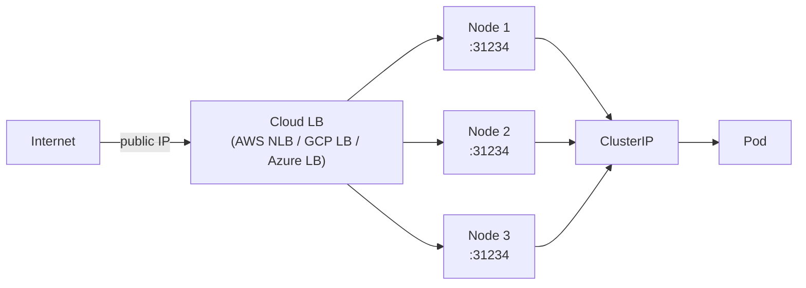

# Day 46-3: LoadBalancer — Public Entry Point via the Cloud

> **Goal**: Get a real public IP for your Service by having the cloud provider provision a load balancer.
> **Prereqs**: [Day 46-2 — NodePort](day46-2_nodeport.md), [Day 42-6 — Architecture Overview](../00_foundations/day42-6_architecture-overview.md).

## 1. Scenario & Why It Matters

NodePort exposes your Service but on non-standard ports and private node IPs. For a real public endpoint, you want a single public IP/URL on port 80/443 with cloud-managed availability. `type: LoadBalancer` tells the cloud-controller-manager to call the cloud provider's API and provision a real load balancer (AWS ELB/NLB/ALB, GCP L4 or L7, Azure Load Balancer).

## 2. Concept Deep-Dive

`LoadBalancer` = `NodePort` + `ClusterIP` + "call the cloud API to create an external LB in front of the NodePorts".



Who does what:

1. You `kubectl apply` a Service with `type: LoadBalancer`.
2. Kubernetes allocates a NodePort (auto or fixed) on every node.
3. The **cloud-controller-manager** sees the new Service and calls the cloud API: "please create an LB whose targets are each node's IP on port 31234".
4. The cloud returns a public address. The CCM writes it back to `.status.loadBalancer.ingress`.
5. `EXTERNAL-IP` changes from `<pending>` to the assigned IP/hostname.

### Manifest

```yaml
apiVersion: v1
kind: Service
metadata:
  name: public-front-door
spec:
  selector:
    app: ingress-controller
  ports:
    - port: 80
      targetPort: 80
    - port: 443
      targetPort: 443
  type: LoadBalancer
```

You rarely point LoadBalancer directly at app Pods in production. Instead, you place **one** LoadBalancer in front of an Ingress controller / Gateway API Gateway, and that smart proxy routes to many internal services — one public IP, many apps.

### Cloud-specific annotations

All clouds expose knobs via annotations:

```yaml
metadata:
  annotations:
    # AWS — NLB with cross-zone LB
    service.beta.kubernetes.io/aws-load-balancer-type: nlb
    service.beta.kubernetes.io/aws-load-balancer-cross-zone-load-balancing-enabled: "true"
    # GCP — use internal LB (private only)
    cloud.google.com/load-balancer-type: "Internal"
```

### Cost warning

A single `type: LoadBalancer` on AWS runs an NLB that charges per hour **and** per LCU (Load Balancer Capacity Unit). Ten such Services = ten LBs = ten hourly charges. Use **one** in front of a Gateway.

## 3. Hands-On Mission

```bash
kubectl apply -f public-lb-service.yaml
kubectl get svc public-front-door
# EXTERNAL-IP is <pending> for 1–2 minutes
kubectl get svc public-front-door -w
```

On **Minikube**, there is no cloud. Use `minikube tunnel` (in a separate terminal) to emulate a cloud LB and allocate an IP on your host:

```bash
minikube tunnel
# In another terminal:
kubectl get svc public-front-door
# EXTERNAL-IP is now a local address like 127.0.0.1
```

## 4. Your Task — Answer

**Q:** After ~2 minutes, what does the EXTERNAL-IP column show for `public-front-door`?

**Sample answer** (on AWS):

```
NAME                TYPE           CLUSTER-IP      EXTERNAL-IP                                                  PORT(S)                      AGE
public-front-door   LoadBalancer   10.100.55.12    a8b9c0d1e2f3-123456789.us-east-1.elb.amazonaws.com           80:31234/TCP,443:32456/TCP   2m
```

The `EXTERNAL-IP` is actually a DNS name (AWS NLB/ELB don't return a raw IP). On GCP it's an IPv4 address. On Minikube with `minikube tunnel`, it's a local host IP.

## 5. Q&A (Concepts Check)

**Q: My EXTERNAL-IP stays `<pending>` forever. Why?**
A: (a) No cloud-controller-manager is running (bare-metal cluster) — install MetalLB for a software LB. (b) Running Minikube without `minikube tunnel`. (c) On AWS, the required IAM role on the cluster is missing permissions to create ELBs.

**Q: LoadBalancer costs money. How do teams avoid one-LB-per-Service?**
A: Deploy **one** LoadBalancer Service in front of a Gateway API Gateway (or Ingress). The Gateway does HTTP routing to many internal ClusterIPs. You pay for one LB and split it across dozens of apps.

**Q: What happens to `EXTERNAL-IP` if I delete the Service?**
A: The cloud-controller-manager observes the deletion and calls the cloud API to destroy the LB. You stop paying for it. If it's not cleaned up (cluster destroyed improperly), the LB can linger and keep billing — always `kubectl delete svc` before tearing down a cluster.

**Q: NLB vs ALB vs ELB — which does `type: LoadBalancer` create on AWS?**
A: By default, the legacy "Classic" ELB. Modern clusters should annotate with `aws-load-balancer-type: nlb` (Network LB, L4, very cheap, blazing fast). For L7 features (path-based routing, host headers), use the AWS Load Balancer Controller + the Gateway API or Ingress to get ALBs.

**Q: Can I preserve the client's source IP?**
A: Yes — set `externalTrafficPolicy: Local`. The cloud LB's health checks then only mark nodes healthy if they have a local Pod, and traffic reaches Pods without a source-IP rewrite. Some cloud LBs (like AWS NLB in instance mode) preserve source IP natively.

## 6. Further Reading

- kubernetes.io/docs/concepts/services-networking/service/#type-loadbalancer.
- MetalLB (bare-metal LoadBalancer): metallb.universe.tf.
- Next: [Day 46-4 — ExternalName](day46-4_externalname.md).
