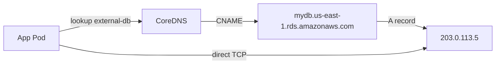

# Day 46-4: ExternalName — A DNS Alias for External Services

> **Goal**: Hide an external hostname behind a stable in-cluster name.
> **Prereqs**: [Day 42-4 — Cluster DNS](../00_foundations/day42-4_cluster-dns.md).

## 1. Scenario & Why It Matters

Your Pods talk to AWS RDS at `mydb.us-east-1.rds.amazonaws.com`. If you hardcode that hostname in every Deployment, moving the DB (disaster recovery, region failover, migration to Aurora) means rebuilding every image. Instead, create an **ExternalName** Service called `external-db`. Pods call `external-db`. Kubernetes DNS returns a CNAME to the real hostname. The day the DB moves, you edit one Service.

## 2. Concept Deep-Dive

ExternalName is the **one Service type that doesn't route traffic**. It is a pure DNS trick: CoreDNS returns a CNAME record pointing at the external hostname, and your Pod's resolver follows the CNAME to resolve the real IP.



No ClusterIP. No kube-proxy rules. No Endpoints object. Just DNS.

### Manifest

```yaml
apiVersion: v1
kind: Service
metadata:
  name: external-db
spec:
  type: ExternalName
  externalName: mydb.us-east-1.rds.amazonaws.com
```

Notice: **no selector, no ports, no clusterIP**.

## 3. Hands-On Mission

```bash
kubectl apply -f externalname-service.yaml
kubectl get svc external-db
# TYPE: ExternalName
# CLUSTER-IP: (none)
# EXTERNAL-IP: mydb.us-east-1.rds.amazonaws.com

kubectl run dns-test --rm -it --image=busybox:1.36 --restart=Never -- sh
/ # nslookup external-db
# Returns: external-db  canonical name = mydb.us-east-1.rds.amazonaws.com
/ # nslookup external-db | tail
```

## 4. Your Task — Answer

**Q:** Paste the output of `kubectl get svc external-db`.

**Sample answer**:

```
NAME          TYPE           CLUSTER-IP   EXTERNAL-IP                           PORT(S)   AGE
external-db   ExternalName   <none>       mydb.us-east-1.rds.amazonaws.com     <none>    10s
```

- `TYPE ExternalName` — the DNS-only mode.
- `CLUSTER-IP <none>` — there is no virtual IP.
- `EXTERNAL-IP` — here it shows the target hostname (slightly misleading naming — it's not an IP, it's the CNAME target).

## 5. Q&A (Concepts Check)

**Q: Why not just put the external hostname in a ConfigMap?**
A: You could. ExternalName wins when (a) multiple Pods need the same name and your config templating is annoying, (b) you want to change the target without rolling Pods (DNS TTL is much faster than a redeploy), (c) you want the client code to read the same in-cluster DNS name everywhere for consistency.

**Q: Does ExternalName work with IP addresses?**
A: No. The value must be a **hostname**. If you have an IP, create a Service with no selector and a manual Endpoints object instead.

**Q: Can I attach ports to an ExternalName Service?**
A: You can write `ports:` in the spec, but they're informational only — no proxying happens. Use ports if you want to embed the target port in the Service definition for documentation.

**Q: What's the difference between an ExternalName Service and CNAME at your DNS provider?**
A: ExternalName exists inside the cluster's DNS (CoreDNS), visible only to Pods. A CNAME at your DNS provider is public. ExternalName is the cluster-local equivalent: your Pods see `external-db` in their resolv.conf scope, external clients do not.

**Q: Can I migrate from external-to-external?**
A: Yes — that's the whole point. Update `externalName` to point at a new DB, and within the DNS TTL (~30s in most clusters) all Pods start connecting to the new target without restart.

## 6. Further Reading

- kubernetes.io/docs/concepts/services-networking/service/#externalname.
- Next: [Day 46-5 — Headless Service](day46-5_headless-service.md).
