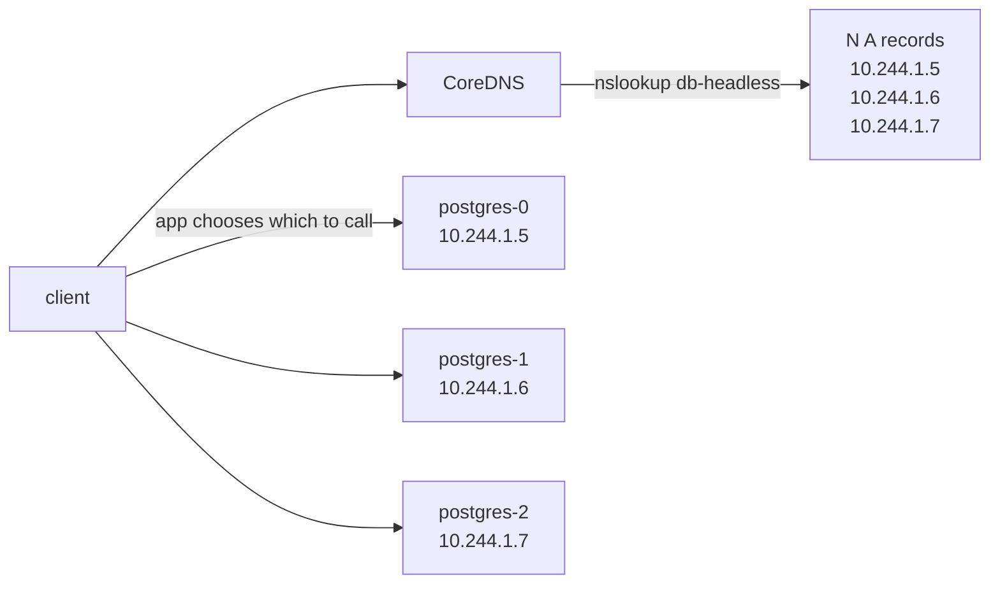

# Day 46-5: Headless Service — Per-Pod DNS, No Virtual IP

> **Goal**: Address individual Pods by name for StatefulSets and client-side load balancing.
> **Prereqs**: [Day 46-1 — ClusterIP](day46-1_clusterip.md), [StatefulSets](../02_workloads/bonus_statefulsets.md).

## 1. Scenario & Why It Matters

A normal ClusterIP hides individual Pods behind a single virtual IP and load-balances for you. But for a database cluster, you often need to reach a **specific** replica: `postgres-0` is the primary, `postgres-1` is a replica you want to read from. You need to address Pods directly. **Headless Services** (`clusterIP: None`) return the raw set of Pod IPs via DNS — no virtual IP, no kube-proxy rules, no load balancing. Clients choose.

## 2. Concept Deep-Dive

Key line: `spec.clusterIP: None`. The API server skips allocating a virtual IP, kube-proxy skips programming DNAT rules, and CoreDNS instead of one A record returns **N A records** — one per ready endpoint.



### Paired with a StatefulSet: stable per-Pod DNS

When the StatefulSet's `serviceName` points at a headless Service, K8s ALSO registers a DNS record per Pod:

```
postgres-0.db-headless.default.svc.cluster.local  -> 10.244.1.5
postgres-1.db-headless.default.svc.cluster.local  -> 10.244.1.6
postgres-2.db-headless.default.svc.cluster.local  -> 10.244.1.7
```

These names survive restarts because the Pod name is stable (`postgres-1` is always `postgres-1`).

### Manifest

```yaml
apiVersion: v1
kind: Service
metadata:
  name: db-headless
spec:
  clusterIP: None
  selector:
    app: database
  ports:
    - protocol: TCP
      port: 5432
      targetPort: 5432
```

## 3. Hands-On Mission

Assuming a StatefulSet `postgres` with label `app: database` exists:

```bash
kubectl apply -f headless-service.yaml
kubectl get svc db-headless                   # CLUSTER-IP should be None

kubectl run dns-test --rm -it --image=busybox:1.36 --restart=Never -- sh
/ # nslookup db-headless
/ # nslookup postgres-0.db-headless
```

## 4. Your Task — Answer

**Q:** What does `nslookup db-headless` return, and how is it different from a normal ClusterIP lookup?

**Sample answer**: A headless Service returns multiple A records (one per ready Pod), while a normal Service returns one virtual ClusterIP.

```
Name:      db-headless.default.svc.cluster.local
Address 1: 10.244.1.5  postgres-0.db-headless.default.svc.cluster.local
Address 2: 10.244.1.6  postgres-1.db-headless.default.svc.cluster.local
Address 3: 10.244.1.7  postgres-2.db-headless.default.svc.cluster.local
```

Normal ClusterIP: one record, one virtual IP (kube-proxy handles load balancing).
Headless: N records, one per Pod (client handles selection, DNS round-robin is the default).

## 5. Q&A (Concepts Check)

**Q: If there's no kube-proxy DNAT, where's the load balancing?**
A: In the client. Typical options: (a) use DNS round-robin (resolver picks an address from the list), (b) resolve all A records and pick in application code (gRPC, modern HTTP libraries), (c) connect to every replica and pool connections.

**Q: Do I still get stable DNS for each Pod without a StatefulSet?**
A: No. Per-Pod DNS records (`<pod-name>.<svc>`) are only created for **StatefulSet** Pods. For a Deployment behind a headless Service, you only get the multi-A-record lookup at the Service name — not per-Pod entries.

**Q: Can I use a headless Service for a normal stateless app?**
A: Technically yes — for example, gRPC clients often benefit from knowing all endpoint IPs so their own L7 load balancing can work. But most stateless apps don't need this and a ClusterIP is simpler.

**Q: What do the DNS records look like when a Pod is not yet Ready?**
A: Unready Pods are excluded by default. Set `spec.publishNotReadyAddresses: true` on the Service to include them — useful for peer-discovery at startup (each Pod needs to learn the others before they're individually Ready).

**Q: What happens to DNS when a Pod restarts?**
A: With a StatefulSet, the new Pod has the same name, so the stable DNS name `postgres-1.db-headless` immediately resolves to its new IP after the restart. With a Deployment, Pods get new names on every restart — you lose identity.

## 6. Further Reading

- kubernetes.io/docs/concepts/services-networking/service/#headless-services.
- Next: [Day 46-6 — Gateway API](day46-6_gateway-api.md).
