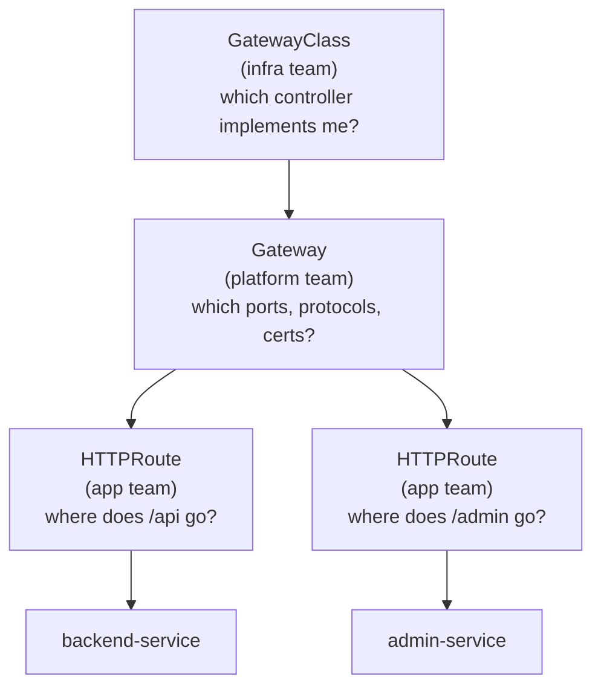

# Day 46-6: Gateway API — The Modern Replacement for Ingress

> **Goal**: Route HTTP/HTTPS/gRPC to multiple internal Services through a single entry point.
> **Prereqs**: [Day 46-3 — LoadBalancer](day46-3_loadbalancer.md).

## 1. Scenario & Why It Matters

You have a frontend, a backend API, and an admin panel — three internal Services. Creating three separate `type: LoadBalancer` Services means three public IPs and three bills. A smarter solution is **one** LoadBalancer in front of a smart proxy that routes based on URL — `/api` to backend, `/admin` to admin, `/` to frontend. That smart proxy in modern Kubernetes is the **Gateway API**.

> **Why Gateway API and not Ingress?** The classic `kind: Ingress` and the popular ingress-nginx controller are **retiring by March 2026**. Ingress only supported HTTP and path/host routing, had no traffic splitting, no built-in role separation, and its annotations dialect was a mess across controllers. The Kubernetes community built Gateway API as the official replacement. It is GA since K8s 1.29.

## 2. Concept Deep-Dive

Gateway API splits the old "Ingress" concept into three resources with clear ownership:



- **GatewayClass** — named set of a controller (e.g., `nginx`, `envoy`, cloud-specific).
- **Gateway** — an actual listener on ports (80, 443), using a class. One LB in front.
- **HTTPRoute** (also TLSRoute, GRPCRoute, TCPRoute) — routing rules, ownable by app teams, attach to a Gateway via `parentRefs`.

### Full setup

Install the CRDs and a controller (once per cluster):

```bash
kubectl apply -f https://github.com/kubernetes-sigs/gateway-api/releases/download/v1.2.1/standard-install.yaml
kubectl apply -f https://github.com/nginx/nginx-gateway-fabric/releases/download/v1.6.2/nginx-gateway.yaml
kubectl get pods -n nginx-gateway
```

**GatewayClass:**

```yaml
apiVersion: gateway.networking.k8s.io/v1
kind: GatewayClass
metadata:
  name: nginx
spec:
  controllerName: gateway.nginx.org/nginx-gateway-controller
```

**Gateway** (listeners):

```yaml
apiVersion: gateway.networking.k8s.io/v1
kind: Gateway
metadata:
  name: main-gateway
spec:
  gatewayClassName: nginx
  listeners:
    - name: http
      protocol: HTTP
      port: 80
      allowedRoutes:
        namespaces:
          from: All
    - name: https
      protocol: HTTPS
      port: 443
      tls:
        mode: Terminate
        certificateRefs:
          - kind: Secret
            name: myapp-tls
      allowedRoutes:
        namespaces:
          from: All
```

**HTTPRoute** (routing rules):

```yaml
apiVersion: gateway.networking.k8s.io/v1
kind: HTTPRoute
metadata:
  name: app-routes
spec:
  parentRefs:
    - name: main-gateway
  hostnames:
    - "myapp.local"
  rules:
    - matches:
        - path:
            type: PathPrefix
            value: /api
      backendRefs:
        - name: backend-service
          port: 80
    - matches:
        - path:
            type: PathPrefix
            value: /
      backendRefs:
        - name: frontend-service
          port: 80
```

### What you can match on (that Ingress can't)

- `path.type`: `PathPrefix` or `Exact` (Ingress had both, but awkwardly).
- `headers`: route by HTTP header values.
- `queryParams`: route by query string.
- `method`: `GET`, `POST`, etc.

Plus built-in **traffic splitting** (canary/blue-green) using weighted `backendRefs`:

```yaml
rules:
  - backendRefs:
      - name: backend-v1
        port: 80
        weight: 90
      - name: backend-v2
        port: 80
        weight: 10
```

### Old Ingress vs Gateway API

| Feature | Ingress | Gateway API |
|---------|---------|-------------|
| Protocols | HTTP(S) only | HTTP, HTTPS, TCP, UDP, gRPC |
| Matching | Path, host | Path, host, headers, query, method |
| Traffic splitting | Not standard | First-class |
| Multi-namespace | No secure model | `allowedRoutes.namespaces.from` |
| Role separation | Mixed in one object | GatewayClass / Gateway / Route |
| Status | Retiring | GA since K8s 1.29 |

## 3. Hands-On Mission

```bash
kubectl apply -f gateway-class.yaml
kubectl apply -f gateway.yaml
kubectl apply -f http-routes.yaml

kubectl get gatewayclass
kubectl get gateway
kubectl get httproute

# Minikube: map the hostname
echo "$(minikube ip) myapp.local" | sudo tee -a /etc/hosts
curl http://myapp.local/
curl http://myapp.local/api
```

## 4. Your Task — Answer

**Q:** What does `kubectl get gateways` show for the `main-gateway`?

**Sample answer**:

```
NAME           CLASS   ADDRESS        PROGRAMMED   AGE
main-gateway   nginx   192.168.49.2   True         1m
```

`PROGRAMMED: True` means the controller has accepted the Gateway and configured its data plane (the NGINX Pod) to listen on the specified ports. `ADDRESS` is the external-facing IP (on cloud, the LB address; on Minikube, the node IP).

## 5. Q&A (Concepts Check)

**Q: Why two objects (Gateway + HTTPRoute) instead of one?**
A: Separation of concerns. Platform teams own Gateways (ports, TLS, LB costs). App teams own HTTPRoutes (their routing rules) and can attach them to the shared Gateway. Changes on one side don't require approval from the other.

**Q: What happens if two HTTPRoutes match the same path?**
A: Gateway API has a well-defined precedence: most specific match wins (exact > prefix, longer prefix > shorter, older route > newer for ties). This is stricter than Ingress, which was controller-defined chaos.

**Q: Can one Gateway serve routes from multiple namespaces?**
A: Yes, if `allowedRoutes.namespaces.from` allows it (`All`, `Same`, or `Selector`). Routes in other namespaces must reference the Gateway in `parentRefs.namespace`. This is how "shared ingress" is modeled securely.

**Q: How does TLS termination work?**
A: Put a `tls:` block on an HTTPS listener pointing at a Kubernetes Secret of type `kubernetes.io/tls`. The controller terminates TLS at the Gateway; backends receive plain HTTP. Use cert-manager + Let's Encrypt for automatic renewal.

**Q: Should I still use Ingress?**
A: For new projects: no — start on Gateway API. For existing Ingress deployments: fine to stay until your Ingress controller's sunset date, then migrate. Many controllers (nginx, Envoy Gateway, Istio, Traefik) support both side-by-side.

**Q: Is Gateway API tied to a particular implementation?**
A: No — it's a spec with many implementations: NGINX Gateway Fabric, Envoy Gateway, Istio, Kong, Traefik, Contour, cloud-native ones (GKE Gateway, AWS Gateway API). Switching is a matter of changing the `GatewayClass`.

## 6. Further Reading

- gateway-api.sigs.k8s.io (official docs with migration guide from Ingress).
- Envoy Gateway: gateway.envoyproxy.io.
- Next: [Network Policies](bonus_network-policies.md).
