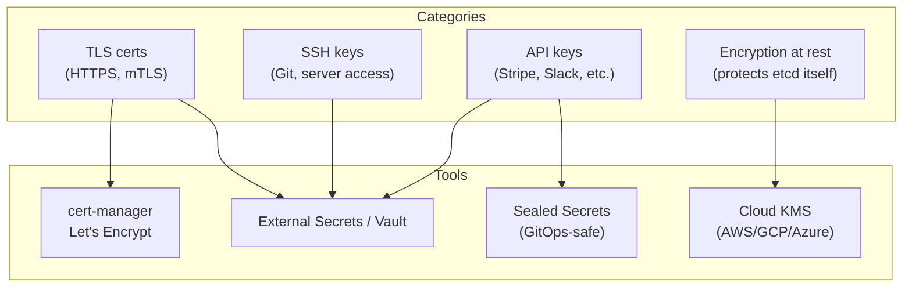

# Bonus: Key Management — TLS, SSH, API Keys, Encryption at Rest

> **Goal**: Know which Kubernetes mechanism to use for each category of sensitive material.
> **Prereqs**: [Day 48 — Secrets](day48_secrets.md), [Secrets & Certificates](bonus_secrets-and-cert.md).

## 1. Scenario & Why It Matters

A production cluster handles at least four categories of sensitive material: TLS certificates for HTTPS, SSH keys for cloning private Git, API tokens for third parties, and encryption keys that protect etcd at rest. Each has its own Secret type, its own lifecycle, and its own anti-patterns.

## 2. Concept Deep-Dive



### TLS certificates

Manual:

```bash
kubectl create secret tls myapp-tls --cert=tls.crt --key=tls.key
```

Automatic (the right way in production) — `cert-manager`:

```yaml
apiVersion: cert-manager.io/v1
kind: ClusterIssuer
metadata:
  name: letsencrypt-prod
spec:
  acme:
    server: https://acme-v02.api.letsencrypt.org/directory
    email: admin@example.com
    privateKeySecretRef:
      name: letsencrypt-prod-key
    solvers:
      - http01:
          gatewayHTTPRoute:
            parentRefs:
              - name: main-gateway
---
apiVersion: cert-manager.io/v1
kind: Certificate
metadata:
  name: myapp-cert
spec:
  secretName: myapp-tls-auto           # cert-manager creates this Secret
  issuerRef:
    name: letsencrypt-prod
    kind: ClusterIssuer
  dnsNames:
    - myapp.example.com
```

cert-manager provisions the cert from Let's Encrypt, stores it in a Secret, and **renews it automatically** 30 days before expiry.

### SSH keys (clone private Git repos)

```bash
kubectl create secret generic git-ssh-key \
  --from-file=ssh-privatekey=~/.ssh/deploy_key \
  --type=kubernetes.io/ssh-auth
```

```yaml
volumeMounts:
  - name: ssh-key
    mountPath: /root/.ssh
    readOnly: true
volumes:
  - name: ssh-key
    secret:
      secretName: git-ssh-key
      defaultMode: 0400               # REQUIRED — SSH refuses loose perms
```

### API keys (third parties)

Safer as a file than as an env var:

```yaml
volumeMounts:
  - name: api-keys
    mountPath: /etc/secrets/stripe
    readOnly: true
volumes:
  - name: api-keys
    secret:
      secretName: stripe-api-key
# App: fs.readFileSync('/etc/secrets/stripe/STRIPE_SECRET_KEY', 'utf8').trim()
```

Reason: env vars propagate to child processes and are easy to accidentally log.

### Encryption at rest (for etcd)

On self-managed clusters you configure the API server with an `EncryptionConfiguration`:

```yaml
apiVersion: apiserver.config.k8s.io/v1
kind: EncryptionConfiguration
resources:
  - resources: ["secrets"]
    providers:
      - aescbc:
          keys:
            - name: key1
              secret: <base64-32-bytes>
      - identity: {}                  # fallback for values written before encryption
```

On managed clouds:

- **EKS** — enable KMS envelope encryption at cluster create:
  ```bash
  aws eks associate-encryption-config \
    --cluster-name my-cluster \
    --encryption-config '[{"resources":["secrets"],"provider":{"keyArn":"arn:aws:kms:us-east-1:123:key/abc"}}]'
  ```
- **GKE** — "Application-layer Secrets Encryption" toggle in cluster config.
- **AKS** — Azure Key Vault provider for Secrets Store CSI driver + encryption at host.

### Sealed Secrets — GitOps-safe committing

Plain Secrets can't go into Git (just Base64). **Bitnami Sealed Secrets** encrypts a Secret so only the controller in your cluster can decrypt it:

```bash
kubeseal --format=yaml < secret.yaml > sealed-secret.yaml
# Commit sealed-secret.yaml freely
kubectl apply -f sealed-secret.yaml
# Controller decrypts, creates a regular Secret automatically
```


### Key types summary

| Material | Secret type | Tool in production |
|----------|-------------|--------------------|
| TLS cert | `kubernetes.io/tls` | cert-manager + Let's Encrypt |
| SSH deploy key | `kubernetes.io/ssh-auth` | Mount as file with `defaultMode: 0400` |
| API key | `Opaque` | External Secrets Operator (Vault, SM) |
| Docker registry | `kubernetes.io/dockerconfigjson` | `imagePullSecrets` on Pods |
| Encryption of etcd | N/A (cluster config) | Cloud KMS |
| GitOps-committed Secret | `SealedSecret` | Bitnami Sealed Secrets |

## 3. Hands-On Mission

```bash
openssl req -x509 -nodes -days 365 -newkey rsa:2048 \
  -keyout tls.key -out tls.crt -subj "/CN=myapp.local"

kubectl create secret tls myapp-tls --cert=tls.crt --key=tls.key
kubectl get secret myapp-tls -o yaml | head
```

## 4. Your Task — Answer

**Q:** After creating the TLS Secret, what does `kubectl get secret myapp-tls -o yaml` show?

**Sample answer**: the Secret has type `kubernetes.io/tls` and a `data` map with two keys — `tls.crt` and `tls.key`, both base64-encoded:

```yaml
apiVersion: v1
kind: Secret
metadata:
  name: myapp-tls
type: kubernetes.io/tls
data:
  tls.crt: LS0tLS1CRUdJTi...   # base64-encoded PEM
  tls.key: LS0tLS1CRUdJTi...
```

## 5. Q&A (Concepts Check)

**Q: cert-manager vs manually uploading certs — is it ever worth not using cert-manager?**
A: Only for internal PKI that doesn't allow external ACME solvers. Otherwise, cert-manager eliminates an entire class of outages (expired certs) and is straightforward to operate.

**Q: Sealed Secrets vs External Secrets Operator — which is better?**
A: They solve overlapping but different problems. Sealed Secrets: encrypt-at-commit, self-contained in the cluster. ESO: sync from an external vault (AWS Secrets Manager, HashiCorp Vault, GCP SM). ESO is preferred when your org already has a vault; Sealed Secrets is simpler for small teams.

**Q: What does "envelope encryption" mean for EKS Secrets?**
A: Each Secret is encrypted with a random Data Encryption Key (DEK). The DEK itself is encrypted by a KMS master Key Encryption Key (KEK). Only the encrypted DEK lives in etcd; decrypting a Secret requires a call to KMS. Fast, rotatable, auditable.

**Q: Why can't I just put the TLS cert in a ConfigMap?**
A: You could for the cert. You must not for the key — ConfigMaps have weaker RBAC expectations, are printed in `kubectl describe`, and aren't tmpfs-mounted. Keep certs and keys together in a single Secret.

**Q: How do I rotate a TLS cert with zero downtime?**
A: cert-manager renews transparently and updates the Secret. Your Gateway controller (or whoever mounts the Secret) reloads the TLS material within seconds without connection drops. Manual flow: update Secret, then trigger a rolling restart of whatever consumes it.

## 6. Further Reading

- cert-manager.io.
- bitnami.com/labs/sealed-secrets.
- external-secrets.io.
- Next: [RBAC](bonus_rbac.md).
