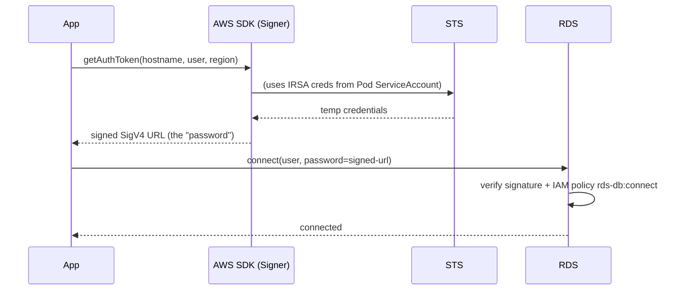

# Bonus: Passwordless Databases (IAM Auth Tokens)

> **Goal**: Authenticate to RDS/Aurora without a static password stored anywhere.
> **Prereqs**: [Pod Identities](bonus_pod-identities.md).

## 1. Scenario & Why It Matters

Hardcoding a DB password anywhere — image, ConfigMap, Secret — is a leak waiting to happen. Modern AWS RDS supports **IAM database authentication**: your app calls the AWS SDK to generate a signed, short-lived (15 minute) token and uses it in place of a password. No password ever exists on disk.

## 2. Concept Deep-Dive



The "password" is actually an HTTPS URL like:

```
db.us-east-1.rds.amazonaws.com:5432/?Action=connect&DBUser=iam_db_user
  &X-Amz-Algorithm=AWS4-HMAC-SHA256
  &X-Amz-Credential=...&X-Amz-Date=20260313T124735Z
  &X-Amz-Expires=900
  &X-Amz-SignedHeaders=host
  &X-Amz-Signature=aee...
```

It self-destructs after 900 seconds (`X-Amz-Expires`). RDS accepts it as a password, verifies the SigV4 signature, checks the `rds-db:connect` IAM action, and lets you in.

### Code (Node.js)

```javascript
import { Signer } from "@aws-sdk/rds-signer";

async function getTemporaryIAMToken() {
  const signer = new Signer({
    hostname: "db-cluster.us-east-1.rds.amazonaws.com",
    port: 5432,
    region: "us-east-1",
    username: "iam_db_user",
  });
  return await signer.getAuthToken();
}
```

### Prerequisites

1. RDS must have IAM authentication enabled on the instance/cluster.
2. The IAM role attached via IRSA must have `rds-db:connect` on the target DB user.
3. The database user must be created with `IAM` auth enabled (`GRANT rds_iam TO iam_db_user;` on PostgreSQL).
4. The Pod must use SSL to connect (RDS requires TLS for IAM auth). See [Secrets & Certificates](bonus_secrets-and-cert.md).

## 3. Hands-On Mission

```bash
node generate-token.js
# Inspect the output: X-Amz-Expires=900, X-Amz-Date, X-Amz-Signature
```

## 4. Your Task — Answer

**Q:** How does the database driver use the generated token?

**Sample answer**: The token is just a long string. You pass it as the `password` field in your DB connection config (`{ host, port, user, password: <token>, ssl: true }`). The PostgreSQL/MySQL protocol treats it like an opaque password, but RDS intercepts and validates the SigV4 signature. The connection must also be TLS (required for IAM auth).

## 5. Q&A (Concepts Check)

**Q: What happens after 15 minutes?**
A: The token is valid for 15 minutes. After that, new connections with the same token are refused. **Existing** connections stay open — you only need a fresh token for new connections. Pool lifespans should stay under 15 minutes, or your pool must refresh tokens per connection.

**Q: Do I still need a DB password for other users?**
A: You can keep password-based roles (e.g., for manual DBA access) and use IAM only for app connections. They coexist.

**Q: Can this work outside AWS?**
A: The concept is AWS-specific (SigV4 signing). GCP Cloud SQL has a similar feature using IAM and Cloud SQL Auth Proxy. Azure Database supports Azure AD auth tokens.

**Q: Is it faster or slower than a password?**
A: Slightly slower — token generation is a hash-based signing step, typically <10ms. Most pools generate one token per connection setup, which is negligible compared to TCP + TLS handshake.

**Q: Why not just put the password in Secrets Manager?**
A: Fine too — External Secrets Operator can sync from Secrets Manager into a K8s Secret. IAM DB auth goes one step further: no password at all. Choose based on your compliance posture and how much rotation you want automated.

## 6. Further Reading

- docs.aws.amazon.com/AmazonRDS/latest/UserGuide/UsingWithRDS.IAMDBAuth.html.
- Next: [Secrets & Certificates for DB TLS](bonus_secrets-and-cert.md).
