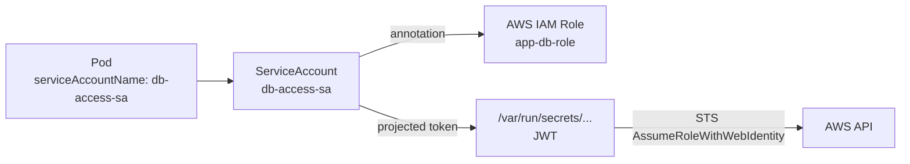

# Bonus: Pod Identities — ServiceAccounts

> **Goal**: Give a Pod a named identity that other systems (K8s API, AWS IAM) can recognize.
> **Prereqs**: [Day 48 — Secrets](day48_secrets.md).

## 1. Scenario & Why It Matters

Every Pod in Kubernetes runs as some identity — by default, the namespace's `default` ServiceAccount, which has almost no permissions. When you need a Pod to call the Kubernetes API, talk to AWS services, or push to a registry with a scoped credential, you give it a dedicated **ServiceAccount**.

## 2. Concept Deep-Dive

A ServiceAccount is a K8s identity (a username in the form `system:serviceaccount:<ns>:<sa-name>`). Three things get wired together:



- The ServiceAccount is the K8s-level identity.
- On AWS EKS, an IAM role is bound to the SA via the `eks.amazonaws.com/role-arn` annotation (IRSA — IAM Roles for ServiceAccounts).
- K8s automatically projects a short-lived JWT token into the Pod at `/var/run/secrets/kubernetes.io/serviceaccount/token`.
- The AWS SDK reads that token and exchanges it with STS for temporary AWS credentials — no static keys anywhere.

### Manifest

```yaml
apiVersion: v1
kind: ServiceAccount
metadata:
  name: db-access-sa
  namespace: default
  annotations:
    eks.amazonaws.com/role-arn: arn:aws:iam::123456789012:role/app-db-role
---
apiVersion: v1
kind: Pod
metadata:
  name: secure-db-app
spec:
  serviceAccountName: db-access-sa
  containers:
    - name: app
      image: my-node-app:latest
```

### Token projection (the modern way)

K8s 1.21+ uses **bound service account tokens**: each Pod gets a token scoped to its Pod UID, audience-bound (so a token meant for AWS can't be replayed against the K8s API), and expiring in ~1 hour. kubelet refreshes them transparently.

### Beyond EKS

- **GKE** — Workload Identity (bind SA to a GCP IAM Service Account).
- **AKS** — Azure AD Workload Identity.
- **Vault** — `kubernetes` auth method (Vault validates the SA token and hands out Vault tokens).

## 3. Hands-On Mission

```bash
kubectl apply -f db-pod.yaml
kubectl get pod secure-db-app -o yaml | grep serviceAccountName
```

Look at the projected token inside:

```bash
kubectl exec secure-db-app -- cat /var/run/secrets/kubernetes.io/serviceaccount/token
# Long JWT — decode at jwt.io to see sub, aud, exp
```

## 4. Your Task — Answer

**Q:** What ServiceAccount is the Pod using?

**Sample answer**:

```
serviceAccountName: db-access-sa
```

(Without the `serviceAccountName` field, Pods default to `default` — which has no meaningful permissions. Specifying `db-access-sa` explicitly links the Pod to the annotated SA and therefore, through the IRSA chain, to the AWS IAM role `app-db-role`.)

## 5. Q&A (Concepts Check)

**Q: What's the difference between a ServiceAccount and a User in Kubernetes?**
A: Users are for humans (managed outside K8s: x509 certs, OIDC, etc.). ServiceAccounts are for Pods and live as K8s objects. Both are subjects that RBAC rules can reference.

**Q: Why not just bake AWS keys into a Secret?**
A: Static keys leak. They don't rotate. You can't tell which Pod used which key in an incident. IRSA (via ServiceAccounts) produces short-lived, per-Pod credentials with full CloudTrail attribution.

**Q: Can one ServiceAccount be used by Pods in multiple namespaces?**
A: No — ServiceAccounts are namespaced. Each namespace has its own. Share patterns across namespaces via RBAC (ClusterRole + many RoleBindings) or via GitOps templating.

**Q: What's the `automountServiceAccountToken` field for?**
A: If a Pod doesn't need to call the K8s API, set `automountServiceAccountToken: false` on the Pod (or on the SA) to skip the token mount entirely. Defense in depth — shrinks the attack surface.

**Q: How does a Pod get an IAM role without any static secret on disk?**
A: The projected JWT token. The AWS SDK reads it, calls `sts:AssumeRoleWithWebIdentity` (which trusts the cluster's OIDC issuer), and receives temporary credentials. All of this is transparent to your app code if you use the latest SDK.

## 6. Further Reading

- IRSA: docs.aws.amazon.com/eks/latest/userguide/iam-roles-for-service-accounts.html.
- Next: [Passwordless Databases](bonus_passwordless-databases.md), [Secrets & Certificates](bonus_secrets-and-cert.md).
