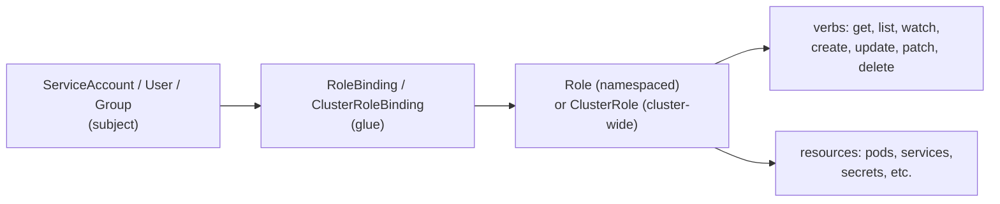

# Bonus: RBAC — Who Can Do What

> **Goal**: Grant exactly the permissions a ServiceAccount (or user) needs, nothing more.
> **Prereqs**: [Pod Identities](bonus_pod-identities.md).

## 1. Scenario & Why It Matters

A ServiceAccount alone is just a name. Without RBAC, it has no K8s API permissions — or worse, in misconfigured clusters, has **too many** permissions. RBAC (Role-Based Access Control) is the permissions layer: who (subject) can do what (verb) on which resource (object).

## 2. Concept Deep-Dive

Four primary objects:



- **Subject** — ServiceAccount, User, or Group. The "who".
- **Role / ClusterRole** — a list of (apiGroups, resources, verbs) tuples. The "what".
- **RoleBinding / ClusterRoleBinding** — links subject to role. The "glue".

Role is namespace-scoped; ClusterRole is cluster-wide. Same for Bindings.

### Example: read-only access to Pods in `default`

```yaml
apiVersion: v1
kind: ServiceAccount
metadata:
  name: readonly-sa
  namespace: default
---
apiVersion: rbac.authorization.k8s.io/v1
kind: Role
metadata:
  name: pod-reader
  namespace: default
rules:
  - apiGroups: [""]                  # "" = core group (pods, services, secrets)
    resources: ["pods"]
    verbs: ["get", "list", "watch"]
---
apiVersion: rbac.authorization.k8s.io/v1
kind: RoleBinding
metadata:
  name: read-pods-binding
  namespace: default
subjects:
  - kind: ServiceAccount
    name: readonly-sa
    namespace: default
roleRef:
  kind: Role
  name: pod-reader
  apiGroup: rbac.authorization.k8s.io
```

### ClusterRole + ClusterRoleBinding (cluster-scoped)

For resources like `nodes`, `persistentvolumes`, `customresourcedefinitions`, or for granting the same access across all namespaces:

```yaml
apiVersion: rbac.authorization.k8s.io/v1
kind: ClusterRole
metadata:
  name: node-reader
rules:
  - apiGroups: [""]
    resources: ["nodes"]
    verbs: ["get", "list"]
---
apiVersion: rbac.authorization.k8s.io/v1
kind: ClusterRoleBinding
metadata:
  name: read-nodes-binding
subjects:
  - kind: ServiceAccount
    name: readonly-sa
    namespace: default
roleRef:
  kind: ClusterRole
  name: node-reader
  apiGroup: rbac.authorization.k8s.io
```

### Common verbs & apiGroups

- Verbs: `get`, `list`, `watch`, `create`, `update`, `patch`, `delete`, `deletecollection`.
- apiGroups: `""` (core: pods, services, secrets, configmaps), `"apps"` (deployments, statefulsets), `"networking.k8s.io"` (networkpolicies), `"gateway.networking.k8s.io"` (gateways), `"rbac.authorization.k8s.io"`.

### Testing with `kubectl auth can-i`

```bash
kubectl auth can-i list pods --as=system:serviceaccount:default:readonly-sa   # yes
kubectl auth can-i delete pods --as=system:serviceaccount:default:readonly-sa # no
kubectl auth can-i '*' '*' --as=system:serviceaccount:default:readonly-sa     # overall check
```

## 3. Hands-On Mission

```bash
kubectl apply -f rbac-demo.yaml
kubectl auth can-i list pods --as=system:serviceaccount:default:readonly-sa
kubectl auth can-i delete pods --as=system:serviceaccount:default:readonly-sa
```

## 4. Your Task — Answer

**Q:** What do the two `can-i` checks return?

**Sample answer**:

```
kubectl auth can-i list pods   --as=...readonly-sa   # yes
kubectl auth can-i delete pods --as=...readonly-sa   # no
```

The `Role` granted `get, list, watch` on `pods` — so `list` is allowed. It did NOT grant `delete` — so `delete` is denied. RBAC defaults to deny; everything not explicitly allowed is forbidden.

## 5. Q&A (Concepts Check)

**Q: What's the difference between Role and ClusterRole?**
A: Role is scoped to a single namespace. ClusterRole is cluster-wide AND is the only way to grant access to cluster-scoped resources (nodes, PVs, CRDs) or to grant permissions across all namespaces with a single definition.

**Q: Can a RoleBinding reference a ClusterRole?**
A: Yes — a RoleBinding can reference a ClusterRole to reuse a standard rule set but scope its effect to one namespace. Common pattern: one ClusterRole `view`, many RoleBindings in different namespaces each granting `view` to a different team's SA.

**Q: I get "forbidden" calling the K8s API from my Pod. How do I debug?**
A: `kubectl auth can-i --as=system:serviceaccount:<ns>:<sa> <verb> <resource>`. It returns yes/no exactly as the API server would. Cross-check the Pod's `serviceAccountName` field.

**Q: Is `admin` the same as `cluster-admin`?**
A: Different ClusterRoles. `admin` is namespace-scoped (all rights within a namespace, no node/PV). `cluster-admin` is the superuser — everything, everywhere. The "aggregated" view/edit/admin/cluster-admin are preinstalled; use them instead of reinventing.

**Q: What's `resourceNames`?**
A: Narrow a rule to specific object names. `resources: ["secrets"], verbs: ["get"], resourceNames: ["api-key"]` — can `get` the Secret `api-key` specifically, nothing else. Great for tight least-privilege.

**Q: Can I do "role assumption" like AWS STS?**
A: Not natively in RBAC. You use `--as` (impersonation) which requires `impersonate` permission on your real account — that's how admins audit what a specific SA can do. For cross-account style flows, pair with OIDC federation.

## 6. Further Reading

- kubernetes.io/docs/reference/access-authn-authz/rbac/.
- `kubectl who-can` plugin for reverse lookups.
- Next: [Day 49 — Namespaces](../06_production-and-challenge/day49_namespaces.md).
