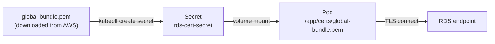

# Bonus: Secrets & Certificates (Mounting PEMs)

> **Goal**: Deliver TLS/SSL certificates to a Pod via a Secret mount.
> **Prereqs**: [Day 48 — Secrets](day48_secrets.md).

## 1. Scenario & Why It Matters

To connect to AWS RDS over TLS, your app needs AWS's root certificate bundle (`global-bundle.pem`). Baking it into the image means rebuilding every time AWS rotates the bundle. The right move: store the PEM in a Secret, mount it as a file, let kubelet deliver it freshly at Pod start.

## 2. Concept Deep-Dive



### Create the Secret from the file

```bash
curl -o global-bundle.pem \
  https://truststore.pki.rds.amazonaws.com/global/global-bundle.pem

kubectl create secret generic rds-cert-secret \
  --from-file=global-bundle.pem
```

### Mount it

```yaml
apiVersion: v1
kind: Pod
metadata:
  name: secure-db-app
spec:
  serviceAccountName: db-access-sa
  containers:
    - name: app
      image: alpine:latest
      command: ["sleep", "3600"]
      volumeMounts:
        - name: pem-vault
          mountPath: /app/certs
          readOnly: true
  volumes:
    - name: pem-vault
      secret:
        secretName: rds-cert-secret
        defaultMode: 0400          # read-only for the file owner
```

In code:

```javascript
import fs from "node:fs";
const ca = fs.readFileSync("/app/certs/global-bundle.pem");
const client = new pg.Client({
  host: "...", user: "...", password: iamToken,
  ssl: { ca, rejectUnauthorized: true }
});
```

## 3. Hands-On Mission

```bash
kubectl apply -f pod-with-secret.yaml
kubectl get pods                               # wait for Running
kubectl exec secure-db-app -- ls -l /app/certs
```

## 4. Your Task — Answer

**Q:** What does `kubectl exec secure-db-app -- ls -l /app/certs` show?

**Sample answer**:

```
total 4
lrwxrwxrwx    1 root     root            24 Mar 12 12:00 global-bundle.pem -> ..data/global-bundle.pem
```

The filename is a symlink into a hidden `..data/` directory — that's K8s's atomic-update trick. When the Secret changes, kubelet writes a new `..data` directory and swaps the symlink atomically so readers never see a half-written file.

## 5. Q&A (Concepts Check)

**Q: Why is the file a symlink?**
A: Atomic updates. Secrets (and ConfigMaps) get updated as a set of files; the symlink jump makes the swap atomic from the app's perspective.

**Q: `defaultMode: 0400` — when does it matter?**
A: For SSH keys and some TLS private keys, clients refuse to load a file with permissive perms (group/world readable). `0400` = owner-read only.

**Q: Can I mount just one key from a multi-key Secret?**
A: Yes, with `items`:

```yaml
volumes:
  - name: pem-vault
    secret:
      secretName: rds-cert-secret
      items:
        - key: global-bundle.pem
          path: ca.pem       # file appears as /app/certs/ca.pem
```

**Q: The PEM changed at AWS. How do I roll it?**
A: Update the Secret (`kubectl create secret ... --dry-run=client -o yaml | kubectl apply -f -`). kubelet refreshes mounted files within ~60 seconds. The app must re-read the file — add a filesystem watcher, or just roll the Deployment.

**Q: What's the difference between mounting as a file vs putting in an env var?**
A: Files support multi-line values natively (PEMs are multi-line). Env vars support one-line strings; multi-line PEMs either need escaping or break. Always mount certs as files.

## 6. Further Reading

- AWS RDS TLS certificate rotation: docs.aws.amazon.com/AmazonRDS/latest/UserGuide/UsingWithRDS.SSL.html.
- Next: [Key Management (TLS, SSH, API keys)](bonus_key-management.md).
