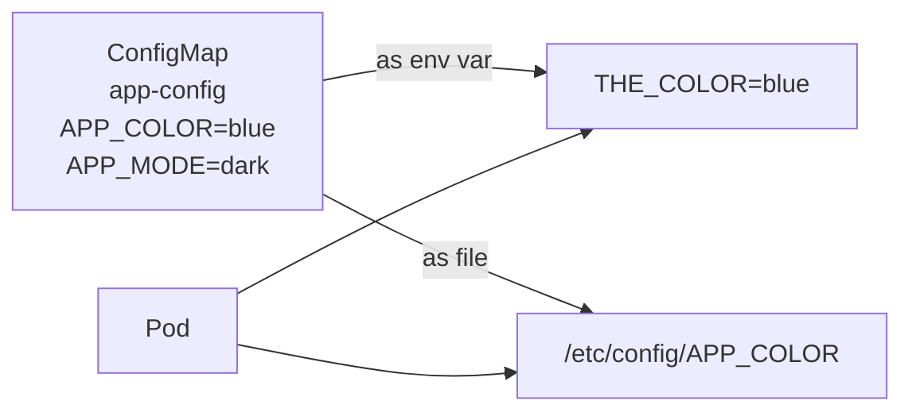

# Day 47: ConfigMaps — Inject Non-Sensitive Configuration

> **Goal**: Decouple configuration from container images.
> **Prereqs**: [Day 44 — The Pod](../02_workloads/day44_the-pod.md).

## 1. Scenario & Why It Matters

Your frontend container should say "Welcome to staging" in staging and "Welcome to production" in production — same image, different text. Baking config into the image is an anti-pattern: rebuilds on every knob change, secrets accidentally committed, no per-environment differences. A **ConfigMap** holds your key/value pairs (or entire config files) in the API server and K8s injects them into Pods at runtime.

## 2. Concept Deep-Dive

A ConfigMap is a namespaced object with a `data:` (strings) and `binaryData:` (base64). Size limit: 1 MiB per ConfigMap — larger configs should be split or moved to a PVC.



### Create from CLI (fastest)

```bash
kubectl create configmap app-config \
  --from-literal=APP_COLOR=blue \
  --from-literal=APP_MODE=dark

kubectl create configmap nginx-conf --from-file=nginx.conf
kubectl create configmap app-config --from-env-file=.env
```

### Create from YAML

```yaml
apiVersion: v1
kind: ConfigMap
metadata:
  name: app-config
data:
  APP_COLOR: "blue"
  APP_MODE: "dark"
  config.json: |
    {
      "theme": "dark",
      "lang": "en"
    }
```

### Injection strategies

**(a) As a single env var:**

```yaml
env:
  - name: THE_COLOR
    valueFrom:
      configMapKeyRef:
        name: app-config
        key: APP_COLOR
```

**(b) Bulk — every key becomes an env var:**

```yaml
envFrom:
  - configMapRef:
      name: app-config
```

**(c) As mounted files** (one file per key):

```yaml
volumeMounts:
  - name: config-vol
    mountPath: /etc/config
    readOnly: true
volumes:
  - name: config-vol
    configMap:
      name: app-config
```

Each key becomes a filename; each value is its content. So `/etc/config/APP_COLOR` = `"blue"`.

### Updating a ConfigMap — the catch

- **Mounted files**: kubelet eventually refreshes them in-place (~ one kubelet sync period, typically under a minute). No Pod restart needed.
- **Environment variables**: set **once** at Pod start. Updating the ConfigMap does **not** propagate. You must recreate the Pod (roll the Deployment).

To trigger a roll on ConfigMap change, annotate the Deployment template with a checksum:

```yaml
template:
  metadata:
    annotations:
      checksum/config: "{{ sha256sum config.yaml }}"
```

## 3. Hands-On Mission

```bash
kubectl create configmap app-config --from-literal=APP_COLOR=blue

# Edit your deployment.yaml to add the env mapping above, then:
kubectl apply -f deployment.yaml

POD=$(kubectl get pods -l app=web -o name | head -1)
kubectl exec $POD -- env | grep THE_COLOR
```

## 4. Your Task — Answer

**Q:** Run `kubectl exec <pod> -- env | grep THE_COLOR`. What's the output?

**Sample answer**:

```
THE_COLOR=blue
```

The env var name is `THE_COLOR` (chosen in the Pod spec), the value is `blue` (read from the ConfigMap's `APP_COLOR` key at container start). Changing the ConfigMap afterwards does **not** update this env var until you recreate the Pod.

## 5. Q&A (Concepts Check)

**Q: Why not use environment variables directly in the Pod spec?**
A: You could (`env: - name: X, value: "y"`), and it's fine for one-off values. ConfigMaps win when (a) many Pods share the same config, (b) config changes without code changes, (c) you want to mount config files (not just env vars), (d) Helm/Kustomize templating becomes cleaner.

**Q: Can I put secrets in a ConfigMap?**
A: Don't. Secrets have a separate type with marginally better handling (stored in tmpfs, not printed in `kubectl describe`, can integrate with encryption-at-rest). See [Day 48](day48_secrets.md).

**Q: I updated the ConfigMap but the mounted file in the Pod is unchanged. Why?**
A: Mounted ConfigMap files update via the **kubelet sync loop**, which runs every ~60 seconds by default. Wait a minute. If it still hasn't changed, you may be mounting with `subPath` — which bypasses atomic updates and requires a Pod restart to refresh.

**Q: Is there a size limit?**
A: 1 MiB per ConfigMap (etcd value-size limit). If your config is bigger, split it, or store on a PersistentVolume and mount that.

**Q: What happens if a Pod references a ConfigMap that doesn't exist?**
A: Pod creation fails with `CreateContainerConfigError`. The Pod stays `Pending` until you create the ConfigMap or fix the reference. You can set `optional: true` in the reference to skip it silently.

**Q: How do I template different ConfigMaps per environment?**
A: Kustomize (overlays per env) or Helm (values.yaml + templates). Both produce different `ConfigMap` manifests for staging/prod from the same source.

## 6. Further Reading

- kubernetes.io/docs/concepts/configuration/configmap/.
- Next: [Day 48 — Secrets](day48_secrets.md).
