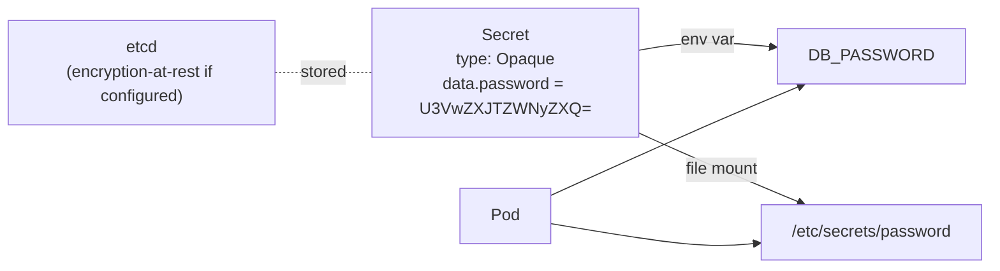

# Day 48: Secrets — Sensitive Configuration

> **Goal**: Store passwords, tokens, certs, and inject them into Pods safely.
> **Prereqs**: [Day 47 — ConfigMaps](day47_config-maps.md).

## 1. Scenario & Why It Matters

ConfigMaps are fine for UI themes. They are **not** fine for database passwords. Secrets are K8s's dedicated resource for sensitive data: Base64-encoded values, stored in tmpfs on nodes (not persisted to node disk), kept out of `kubectl describe` output, and — when configured — encrypted at rest in etcd.

## 2. Concept Deep-Dive

A Secret looks almost identical to a ConfigMap, with a crucial difference: the `type` field hints at the content, and the values are Base64-encoded (which is **encoding**, not encryption).



### Built-in Secret types

| Type | Expected keys | Purpose |
|------|---------------|---------|
| `Opaque` | anything | Generic (default) |
| `kubernetes.io/tls` | `tls.crt`, `tls.key` | HTTPS cert pair |
| `kubernetes.io/dockerconfigjson` | `.dockerconfigjson` | Pull private images from a registry |
| `kubernetes.io/basic-auth` | `username`, `password` | HTTP basic auth |
| `kubernetes.io/ssh-auth` | `ssh-privatekey` | SSH deploy keys |
| `kubernetes.io/service-account-token` | auto | Managed for ServiceAccounts |

### Create — three ways

```bash
# From literal
kubectl create secret generic db-user-pass \
  --from-literal=password='SuperSecret123'

# From file
kubectl create secret generic tls-cert \
  --from-file=tls.crt --from-file=tls.key

# As YAML with stringData (K8s base64s for you)
cat <<'EOF' | kubectl apply -f -
apiVersion: v1
kind: Secret
metadata:
  name: db-user-pass
type: Opaque
stringData:
  password: SuperSecret123
EOF
```

### Inject — env var vs file

Env var (convenient, but can leak via logs/crash dumps):

```yaml
env:
  - name: DB_PASSWORD
    valueFrom:
      secretKeyRef:
        name: db-user-pass
        key: password
```

File (preferred for sensitive values):

```yaml
volumeMounts:
  - name: secret-volume
    mountPath: /etc/secrets
    readOnly: true
volumes:
  - name: secret-volume
    secret:
      secretName: db-user-pass
      defaultMode: 0400          # critical for SSH keys / strict readers
```

### The encryption-at-rest reality

By default, Secrets are **base64-encoded in etcd** — that is **encoding**, not **encryption**. Anyone who can read the etcd database can decode them. For real encryption at rest:

- **Self-managed** — configure `EncryptionConfiguration` with AES-CBC or (better) a KMS provider.
- **EKS** — enable KMS encryption with an AWS KMS key at cluster creation.
- **GKE** — enable "Application-layer Secrets Encryption" (per-cluster setting).
- **AKS** — enable encryption at host + an Azure Key Vault provider.

### Pulling from an external secret manager

For production, many teams keep Secrets **out** of etcd entirely and pull them from AWS Secrets Manager / HashiCorp Vault / GCP Secret Manager via operators like **External Secrets Operator** or **Secrets Store CSI Driver**. The K8s Secret resource becomes a thin projection; the source of truth lives in the external vault.

## 3. Hands-On Mission

```bash
kubectl create secret generic db-user-pass \
  --from-literal=password='SuperSecret123'

# Apply a Deployment that mounts the Secret as a file (see section 2)
kubectl apply -f deployment.yaml

POD=$(kubectl get pod -l app=web -o name | head -1)
kubectl exec $POD -- cat /etc/secrets/password
```

Base64-decode from etcd-view to confirm:

```bash
kubectl get secret db-user-pass -o jsonpath='{.data.password}' | base64 -d
```

## 4. Your Task — Answer

**Q:** What text is printed by `kubectl exec <pod> -- cat /etc/secrets/password`?

**Sample answer**:

```
SuperSecret123
```

K8s base64-decoded the Secret's `data.password` when mounting it; the file content is the raw plaintext, readable only inside the container's filesystem (tmpfs-backed; never written to the node's disk).

## 5. Q&A (Concepts Check)

**Q: Is a Secret actually secret?**
A: Only as much as you've hardened etcd and RBAC. Out of the box, a Secret is a Base64-encoded blob readable by anyone with `get secret` RBAC or direct etcd access. Enable encryption at rest and tight RBAC (and, in production, external secret managers) for real protection.

**Q: env var injection vs file mount — which is safer?**
A: File mount. Env vars propagate to child processes, appear in `/proc/<pid>/environ` (readable with right perms), show up in crash dumps, and can leak into logs that dump `process.env`. Files stay in-container and have defined permissions.

**Q: When I update a Secret, does the mounted file update?**
A: Yes — similar to ConfigMaps, within the kubelet sync interval (~60s). `subPath` mounts don't update; avoid them for Secrets that rotate.

**Q: Why is my image pull failing from a private registry?**
A: You need an `imagePullSecret` of type `kubernetes.io/dockerconfigjson`. Create it:

```bash
kubectl create secret docker-registry regcred \
  --docker-server=registry.example.com \
  --docker-username=user \
  --docker-password=pass
```

Then attach to the Pod: `spec.imagePullSecrets: [{name: regcred}]`.

**Q: How do I rotate a Secret safely?**
A: Update it and roll the consumers (trigger a Deployment restart). For mounted Secrets, the file updates automatically but the app must re-read it — use a sidecar that SIGHUPs the app on file change (or `inotify`), or simply do a rolling restart.

**Q: Can I commit Secrets to Git?**
A: Not in plain form. Use **Sealed Secrets** (Bitnami) or SOPS for encrypted-at-commit-time workflows, or keep Secrets out of Git entirely and sync from an external vault with External Secrets Operator.

## 6. Further Reading

- kubernetes.io/docs/concepts/configuration/secret/.
- External Secrets Operator: external-secrets.io.
- Next: [Pod Identities (ServiceAccounts)](bonus_pod-identities.md).
