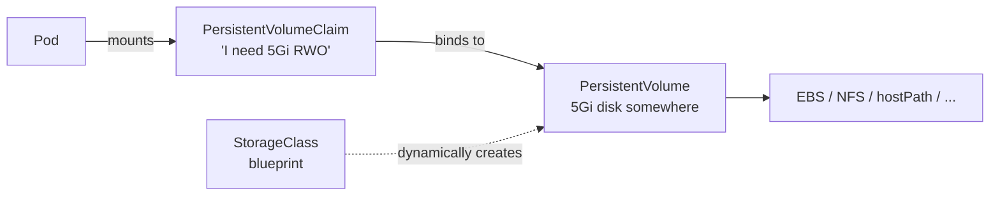

# Bonus: Persistent Storage — Volumes, PVs, PVCs

> **Goal**: Store data that survives Pod restarts and rescheduling.
> **Prereqs**: [Day 44 — The Pod](../02_workloads/day44_the-pod.md).

## 1. Scenario & Why It Matters

Container filesystems are ephemeral: when a Pod dies, everything written inside it is gone. For databases, file uploads, caches that shouldn't be lost, ML model checkpoints, anything that has state — you need **persistent volumes**.

## 2. Concept Deep-Dive

Three related objects:



- **Volume types** — in-Pod only (`emptyDir`, `hostPath`, `configMap`, `secret`, `persistentVolumeClaim`, cloud types).
- **PersistentVolume (PV)** — a piece of storage in the cluster. Cluster-scoped (not namespaced).
- **PersistentVolumeClaim (PVC)** — a request for storage. Namespaced. A PVC binds to a PV that matches size and access mode.
- **StorageClass** — a blueprint for **dynamic provisioning**. Instead of creating PVs by hand, a StorageClass tells K8s how to ask the cloud for a fresh volume when a PVC appears.

### Volume types (shortest path)

| Type | Lifetime | Use |
|------|----------|-----|
| `emptyDir` | Pod | Scratch space shared between containers in the same Pod |
| `hostPath` | Node | Dev only — reads/writes the node's filesystem |
| `configMap` / `secret` | Config | Inject config/secret files |
| `persistentVolumeClaim` | Survives Pod restart | Production — anything stateful |
| Cloud (EBS/EFS/PD) | Independent | Provisioned by cloud provider |

### Access modes

| Mode | Short | Meaning |
|------|-------|---------|
| `ReadWriteOnce` | RWO | One **node** mounts rw (multiple Pods on that node can share) |
| `ReadOnlyMany` | ROX | Many nodes mount read-only |
| `ReadWriteMany` | RWX | Many nodes mount read-write (NFS/EFS-like) |
| `ReadWriteOncePod` | RWOP | Exactly one **Pod** mounts rw |

### Reclaim policies

| Policy | On PVC delete |
|--------|---------------|
| `Retain` | PV and data kept; admin cleans up manually |
| `Delete` | PV and underlying storage destroyed (default for dynamic) |

### Example manifests

```yaml
# StorageClass (blueprint)
apiVersion: storage.k8s.io/v1
kind: StorageClass
metadata:
  name: fast-storage
provisioner: k8s.io/minikube-hostpath    # EBS example: ebs.csi.aws.com
reclaimPolicy: Retain
volumeBindingMode: Immediate              # or "WaitForFirstConsumer"

---
# PVC (the request)
apiVersion: v1
kind: PersistentVolumeClaim
metadata:
  name: app-data
spec:
  accessModes: ["ReadWriteOnce"]
  storageClassName: fast-storage
  resources:
    requests:
      storage: 1Gi

---
# Pod mounting the PVC
apiVersion: v1
kind: Pod
metadata:
  name: storage-test
spec:
  containers:
    - name: app
      image: alpine:latest
      command: ["sleep", "3600"]
      volumeMounts:
        - name: data-vol
          mountPath: /data
  volumes:
    - name: data-vol
      persistentVolumeClaim:
        claimName: app-data
```

### StatefulSets with `volumeClaimTemplates`

For databases, each replica gets its **own** PVC via a template. See [StatefulSets](../02_workloads/bonus_statefulsets.md):

```yaml
volumeClaimTemplates:
  - metadata:
      name: pg-data
    spec:
      accessModes: ["ReadWriteOnce"]
      storageClassName: fast-storage
      resources:
        requests:
          storage: 10Gi
```

K8s auto-creates `pg-data-postgres-0`, `pg-data-postgres-1`, etc.

### `volumeBindingMode`: Immediate vs WaitForFirstConsumer

- **Immediate** — PVC binds at creation time. Risk: the PV may end up in a zone where no node can schedule the Pod.
- **WaitForFirstConsumer** — PVC stays `Pending` until a Pod referencing it is scheduled, then both the PV and the Pod land in the same zone. Recommended for cloud clusters.

## 3. Hands-On Mission

```bash
kubectl apply -f storageclass.yaml
kubectl apply -f pvc.yaml
kubectl apply -f pod-with-storage.yaml

# Write & survive
kubectl exec storage-test -- sh -c "echo 'I survived' > /data/proof.txt"
kubectl delete pod storage-test
kubectl apply -f pod-with-storage.yaml     # PVC stays; new Pod binds to same PV
kubectl exec storage-test -- cat /data/proof.txt
```

## 4. Your Task — Answer

**Q:** After deleting and recreating the Pod, what does `cat /data/proof.txt` show?

**Sample answer**:

```
I survived
```

The Pod is new, but the PVC (and therefore the underlying PV) is not deleted when you `kubectl delete pod`. When the new Pod references the same PVC, kubelet reattaches it, and the file that the previous Pod wrote is still there.

## 5. Q&A (Concepts Check)

**Q: PV and PVC — why two objects?**
A: Separation of provisioner and consumer. The cluster admin provisions PVs (or configures StorageClasses for dynamic provisioning); app developers write PVCs in their namespace. The PVC says "I need storage like this"; K8s finds or creates a matching PV.

**Q: My PVC is stuck in `Pending`. Why?**
A: Three usual causes: (1) No StorageClass matches and no static PV exists. (2) StorageClass exists but provisioner plugin is failing — check logs of the CSI driver Pods. (3) `volumeBindingMode: WaitForFirstConsumer` and no Pod references the PVC yet (expected).

**Q: Can multiple Pods share the same PVC?**
A: Depends on access mode. `ReadWriteOnce` allows multiple Pods on the **same node** to share. `ReadWriteMany` allows multiple Pods on different nodes (requires NFS, EFS, or filesystem-like backend). For most cloud block storage (EBS, GCE PD), you only get RWO.

**Q: What happens when I delete the PVC?**
A: The PV's reclaim policy decides. `Delete` → the PV and underlying storage are destroyed. `Retain` → PV moves to `Released` and keeps the data; an admin must clean it up. Always use `Retain` for production data stores.

**Q: Why do PVCs for StatefulSets survive even when I delete the StatefulSet?**
A: Safety. Pod-per-PVC mapping (`pg-data-postgres-0`) is intentional — K8s assumes your data matters more than the controller. To cleanup fully, you have to `kubectl delete pvc` explicitly.

**Q: What's the difference between `hostPath` and a PVC backed by a local PV?**
A: Both store data on the node's local disk. `hostPath` is ad-hoc (any Pod can mount it anywhere), has no scheduler awareness (your Pod may hop to a node without the data), and is a security risk (access to any host path). Local PVs integrate with scheduler-aware local-storage provisioners; recommended even for "local" use cases.

## 6. Further Reading

- kubernetes.io/docs/concepts/storage/.
- CSI (Container Storage Interface) spec: github.com/container-storage-interface/spec.
- Next: [Day 49 — Namespaces](../06_production-and-challenge/day49_namespaces.md).
