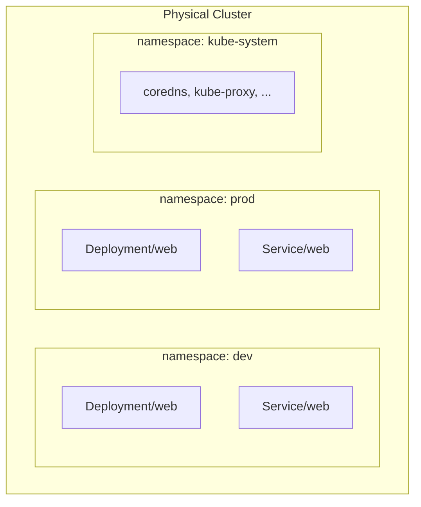

# Day 49: Namespaces — Virtual Clusters Inside Your Cluster

> **Goal**: Split one physical cluster into isolated "virtual clusters" for teams, environments, or tenants.
> **Prereqs**: [Deployments](../02_workloads/day45_deployments.md), [Services](../03_networking/day46-0_services-summary.md).

## 1. Scenario & Why It Matters

You're working on two projects — `project-a` and `project-b`. Both want a Service called `web`. Both teams want to set resource quotas. Both want their own RBAC. Running a cluster per project is wasteful; running them side by side in the same namespace is chaotic. **Namespaces** solve this cleanly: they are virtual scopes inside a cluster.

## 2. Concept Deep-Dive



- **Namespace-scoped** resources: Pods, Services, Deployments, ConfigMaps, Secrets, PVCs, Roles, RoleBindings, NetworkPolicies.
- **Cluster-scoped** resources: Nodes, PersistentVolumes, StorageClasses, ClusterRoles, ClusterRoleBindings, CRDs, Namespaces themselves.
- Names must be unique within a namespace, not across namespaces.

### DNS implications

Cross-namespace access uses fully-qualified service DNS:

```
<service>.<namespace>.svc.cluster.local
```

Example: Pod in `frontend` reaches Postgres in `data`:

```
postgresql.data.svc.cluster.local:5432
```

Inside the same namespace, short name `postgresql` is enough.

### Standard built-in namespaces

| Namespace | Purpose |
|-----------|---------|
| `default` | Default for commands without `-n`. Don't put real workloads here |
| `kube-system` | K8s control-plane addons (CoreDNS, kube-proxy). Don't touch |
| `kube-public` | Cluster-wide readable (rarely used) |
| `kube-node-lease` | Node heartbeats (don't touch) |

### `kubens` / context for quality of life

```bash
kubectl config set-context --current --namespace=dev
# Now all commands default to dev
kubectl get pods                       # = kubectl get pods -n dev
```

Or install `kubens` to toggle namespaces interactively.

### ResourceQuota and LimitRange per namespace

Namespaces aren't just naming — they're the unit of resource governance:

```yaml
apiVersion: v1
kind: ResourceQuota
metadata:
  name: team-a-quota
  namespace: team-a
spec:
  hard:
    requests.cpu: "10"
    requests.memory: 20Gi
    limits.cpu: "20"
    limits.memory: 40Gi
    pods: "50"
```

Any Pod that would push the namespace over these caps is rejected.

## 3. Hands-On Mission

```bash
kubectl create namespace dev
kubectl create namespace prod

kubectl apply -f - -n dev <<'EOF'
apiVersion: apps/v1
kind: Deployment
metadata:
  name: web
spec:
  replicas: 1
  selector: { matchLabels: { app: web } }
  template:
    metadata: { labels: { app: web } }
    spec:
      containers:
        - name: nginx
          image: nginx:alpine
EOF

kubectl get pods                    # empty or unrelated default namespace
kubectl get pods -n dev             # Nginx Pod running, isolated
```

## 4. Your Task — Answer

**Q:** What is the status of the Pod in the `dev` namespace?

**Sample answer**:

```
NAME                   READY   STATUS    RESTARTS   AGE
web-55c56d48b5-kpxq6   1/1     Running   0          12s
```

It's `Running`, in the `dev` namespace, invisible from the `default` namespace. That's the point — full logical isolation with a single kubectl flag.

## 5. Q&A (Concepts Check)

**Q: Do namespaces provide network isolation?**
A: **No** — namespaces alone do NOT isolate network traffic. By default, a Pod in `team-a` can reach a Pod in `team-b`. You need [NetworkPolicies](../03_networking/bonus_network-policies.md) to enforce network isolation.

**Q: When should I create a new namespace?**
A: When the bag of objects shares a lifecycle, ownership, or policy boundary — one per team, one per environment (dev/stage/prod) in a multi-tenant cluster, or one per application for cleaner lifecycle management. Avoid 1 namespace = 1 microservice — too fine-grained.

**Q: How do I move a resource from one namespace to another?**
A: You can't directly. Export with `kubectl get <res> -o yaml`, edit the `metadata.namespace`, recreate in the new namespace, then delete the old one. Stateful things (PVCs) make this nontrivial — data would need to be migrated.

**Q: What happens to Pods when I delete a namespace?**
A: Everything namespace-scoped in it is deleted cascadingly. Deployment → ReplicaSet → Pods → PVCs → etc. Cluster-scoped bindings referring to SAs in that namespace may become orphaned — clean them up separately.

**Q: Can a Pod in one namespace mount a Secret from another namespace?**
A: No. Secrets and ConfigMaps are namespace-scoped; a Pod can only reference them from its own namespace. Common workaround: replicate via a controller (e.g., `reflector` or External Secrets Operator synchronizing from a central namespace or vault).

**Q: Should I run production alongside development in the same cluster with just namespaces?**
A: For small orgs with NetworkPolicies, RBAC, and ResourceQuotas — yes. For compliance-regulated industries or large orgs, separate clusters are safer (namespace isolation has kernel-level holes, e.g., noisy neighbors, kernel CVEs, shared control-plane blast radius).

## 6. Further Reading

- kubernetes.io/docs/concepts/overview/working-with-objects/namespaces/.
- Next: [Day 49 — Weekly Challenge](day49_weekly-challenge.md).
