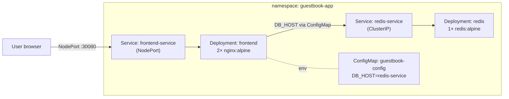

# Day 49: Weekly Challenge — The Multi-Tier Guestbook

> **Goal**: Ship a small two-tier app to Kubernetes using every core primitive you've learned this week.
> **Prereqs**: Everything in Week 7.

## 1. Scenario

You are the Lead SRE. Developers have written a simple **Guestbook** app. Your job is to deliver the reference Kubernetes manifests.

Architecture:



## 2. Requirements

1. **Namespace** — everything lives in `guestbook-app`.
2. **Database (Backend)**
   - Deployment: 1 replica of `redis:alpine` on port 6379.
   - Service `redis-service`, type ClusterIP.
3. **Frontend**
   - ConfigMap `guestbook-config` with `DB_HOST=redis-service`.
   - Deployment: 2 replicas of `nginx:alpine`.
   - Inject `DB_HOST` from the ConfigMap into the Nginx containers as env var.
   - Service `frontend-service`, type NodePort (`:30080`).

## 3. Execution

**Step 1 — Namespace**

```yaml
apiVersion: v1
kind: Namespace
metadata:
  name: guestbook-app
```

**Step 2 — Redis (Backend) Deployment + Service**

```yaml
apiVersion: apps/v1
kind: Deployment
metadata:
  name: redis
  namespace: guestbook-app
spec:
  replicas: 1
  selector:
    matchLabels:
      app: redis
  template:
    metadata:
      labels:
        app: redis
    spec:
      containers:
        - name: redis
          image: redis:alpine
          ports:
            - containerPort: 6379
---
apiVersion: v1
kind: Service
metadata:
  name: redis-service
  namespace: guestbook-app
spec:
  selector:
    app: redis
  ports:
    - port: 6379
      targetPort: 6379
```

**Step 3 — ConfigMap**

```yaml
apiVersion: v1
kind: ConfigMap
metadata:
  name: guestbook-config
  namespace: guestbook-app
data:
  DB_HOST: "redis-service"
```

**Step 4 — Frontend Deployment + Service**

```yaml
apiVersion: apps/v1
kind: Deployment
metadata:
  name: frontend
  namespace: guestbook-app
spec:
  replicas: 2
  selector:
    matchLabels:
      app: frontend
  template:
    metadata:
      labels:
        app: frontend
    spec:
      containers:
        - name: web
          image: nginx:alpine
          ports:
            - containerPort: 80
          env:
            - name: DB_HOST
              valueFrom:
                configMapKeyRef:
                  name: guestbook-config
                  key: DB_HOST
---
apiVersion: v1
kind: Service
metadata:
  name: frontend-service
  namespace: guestbook-app
spec:
  type: NodePort
  selector:
    app: frontend
  ports:
    - port: 80
      targetPort: 80
      nodePort: 30080
```

## 4. Your Task — Answer

**Q:** Write the YAML for the **Frontend Deployment** only, with correct namespace, replicas, and env wiring from the ConfigMap.

**Sample answer** — see Step 4 above. Key points:

- `metadata.namespace: guestbook-app` — lives with the rest of the app.
- `spec.replicas: 2` — matches the brief.
- `env.valueFrom.configMapKeyRef` — the "wiring". `DB_HOST` is sourced from key `DB_HOST` of ConfigMap `guestbook-config`, not hardcoded.

To verify after apply:

```bash
kubectl -n guestbook-app exec deploy/frontend -- env | grep DB_HOST
# DB_HOST=redis-service

kubectl -n guestbook-app exec deploy/frontend -- \
  sh -c "nc -z redis-service 6379 && echo 'OK'"
# OK
```

## 5. Q&A (Concepts Check)

**Q: Why ClusterIP for Redis and NodePort for the Frontend?**
A: Redis should be reachable only from inside the cluster — ClusterIP is private. The frontend must be reachable from the outside — NodePort (or LoadBalancer / Ingress in a real cluster) exposes it. Principle of least exposure.

**Q: Why inject `DB_HOST` via ConfigMap instead of hardcoding `redis-service` in the image?**
A: Decoupling. Different environments (dev/stage/prod) can point at different Redis instances without rebuilding the image. If the Service name changes tomorrow, only the ConfigMap changes.

**Q: The frontend Pods restarted but they still have the old `DB_HOST`. Why?**
A: Pods read env vars at start time. Changing the ConfigMap does NOT automatically update env vars of running Pods — you need to restart them (`kubectl rollout restart`). If you want live reloads, mount the ConfigMap as a **file** instead; the kubelet eventually updates the file contents.

**Q: Two frontend replicas — will they both hit the same Redis?**
A: Yes. `redis-service` is a ClusterIP that fronts the single Redis Pod. Both frontend Pods resolve `redis-service` → same ClusterIP → same backend. If there were multiple Redis replicas (stateful leader/follower), you'd need a more sophisticated topology (StatefulSet + Sentinel).

**Q: How would I add TLS termination and a real hostname?**
A: Add an Ingress (or Gateway) in front of the NodePort/ClusterIP. Define a host (`guestbook.example.com`), attach a TLS Secret (cert-manager + Let's Encrypt), and route `/` to `frontend-service:80`. NodePort goes away or becomes internal-only.

**Q: How do I clean up everything after the challenge?**
A: One command: `kubectl delete namespace guestbook-app`. Cascading delete removes every namespace-scoped object: Deployments, ReplicaSets, Pods, Services, ConfigMaps.

## 6. Further Reading

- The classic upstream example: github.com/kubernetes/examples/tree/master/guestbook.
- Next: **Week 8 — Helm**.
