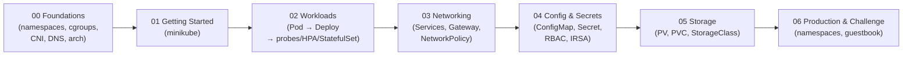

# Week 7 — Kubernetes

Kubernetes from the Linux primitives up to a two-tier app on your own cluster. The week is organized thematically; day numbers are preserved so you can still follow in order.

## Roadmap

## Index

### 00 — Foundations (the low-level layer)

- [Day 42-1: Linux Namespaces](00_foundations/day42-1_linux-namespaces.md)
- [Day 42-2: cgroups, CPU & Memory](00_foundations/day42-2_cgroups-cpu-memory.md)
- [Day 42-3: Container Runtime (containerd, CRI)](00_foundations/day42-3_container-runtime.md)
- [Day 42-4: Cluster DNS (CoreDNS)](00_foundations/day42-4_cluster-dns.md)
- [Day 42-5: CNI and kube-proxy](00_foundations/day42-5_cni-and-kube-proxy.md)
- [Day 42-6: Architecture Overview](00_foundations/day42-6_architecture-overview.md)

### 01 — Getting Started

- [Day 43: Minikube — your first cluster](01_getting-started/day43_minikube.md)

### 02 — Workloads

- [Day 44: The Pod](02_workloads/day44_the-pod.md)
- [Day 45: Deployments](02_workloads/day45_deployments.md)
- [Bonus: Probes (liveness / readiness / startup)](02_workloads/bonus_probes.md)
- [Bonus: Resource Requests & Limits](02_workloads/bonus_resource-limits.md)
- [Bonus: Horizontal Pod Autoscaler (HPA)](02_workloads/bonus_hpa.md)
- [Bonus: StatefulSets](02_workloads/bonus_statefulsets.md)

### 03 — Networking

- [Day 46-0: Services (summary)](03_networking/day46-0_services-summary.md)
- [Day 46-1: ClusterIP](03_networking/day46-1_clusterip.md)
- [Day 46-2: NodePort](03_networking/day46-2_nodeport.md)
- [Day 46-3: LoadBalancer](03_networking/day46-3_loadbalancer.md)
- [Day 46-4: ExternalName](03_networking/day46-4_externalname.md)
- [Day 46-5: Headless Service](03_networking/day46-5_headless-service.md)
- [Day 46-6: Gateway API (modern Ingress)](03_networking/day46-6_gateway-api.md)
- [Bonus: Network Policies](03_networking/bonus_network-policies.md)

### 04 — Config & Secrets

- [Day 47: ConfigMaps](04_config-and-secrets/day47_config-maps.md)
- [Day 48: Secrets](04_config-and-secrets/day48_secrets.md)
- [Bonus: RBAC](04_config-and-secrets/bonus_rbac.md)
- [Bonus: Pod Identities (IRSA / Workload Identity)](04_config-and-secrets/bonus_pod-identities.md)
- [Bonus: Passwordless Database Auth](04_config-and-secrets/bonus_passwordless-databases.md)
- [Bonus: Sealed Secrets & cert-manager](04_config-and-secrets/bonus_secrets-and-cert.md)
- [Bonus: Key Management (KMS)](04_config-and-secrets/bonus_key-management.md)

### 05 — Storage

- [Bonus: Persistent Storage (PV / PVC / StorageClass)](05_storage/bonus_persistent-storage.md)

### 06 — Production & Challenge

- [Day 49: Namespaces](06_production-and-challenge/day49_namespaces.md)
- [Day 49: Weekly Challenge — Multi-Tier Guestbook](06_production-and-challenge/day49_weekly-challenge.md)

## How to study this week

1. Do the **Foundations** first. Every "Why did my Pod get OOM-killed?" / "Why can't DNS resolve?" trace ends here.
2. Spin up **Minikube** once and keep it running — every later day is hands-on.
3. Work through **Workloads → Networking → Config & Secrets** in that order. You can't configure what you can't expose; you can't expose what you haven't deployed.
4. Do **Storage** when you've met your first stateful need (database, upload store).
5. Cap the week with the **Guestbook Challenge** — it stitches Deployments, Services, ConfigMaps, and Namespaces into one real app.

## Related resources

Code for hands-on and the weekly challenge lives in `Resources/Week7/` and `Resources/Week7/weekly_challenge/`.
