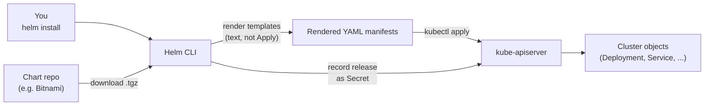

# Day 50: Why Helm? — The Package Manager for Kubernetes

> **Goal**: Understand what Helm is, why it exists, and how it fits alongside `kubectl`.
> **Prereqs**: [Week 7 — Kubernetes](../Week7/README.md).

## 1. Scenario & Why It Matters

You've just finished Week 7 and you have a Guestbook running on Kubernetes. It took ~5 YAML files. Now imagine installing **Prometheus** — that's ~30 YAML files (Deployments, Services, DaemonSets, RBAC, CRDs, Alertmanager, node-exporter…). Multiply by 5 more tools (Grafana, Loki, Istio, cert-manager, Argo CD) and you're drowning in YAML. You also need to parameterise each install for dev/stage/prod.

`apt` fixes this on Linux (`apt install nginx`). `npm` fixes it on Node. **Helm** is Kubernetes' equivalent: it packages all the manifests of an app into a versioned, templated bundle called a **Chart**, installs it atomically, and lets you upgrade or roll back with a single command.

## 2. Concept Deep-Dive

### The four Helm concepts

| Term | One-liner |
|------|-----------|
| **Chart** | A package. A directory (or `.tgz`) of YAML templates + a `values.yaml` + metadata |
| **Repository** | A server that hosts charts. You `helm repo add` and search |
| **Release** | A specific install of a chart into a cluster (named, versioned history) |
| **Values** | The input parameters to a chart (image tag, replicas, resources, flags) |

### How Helm interacts with Kubernetes



Crucial insight: **Helm is client-side templating + a small bookkeeping layer**. It renders charts into plain Kubernetes YAML, applies it, and stores the release history as a Secret in the release's namespace (`sh.helm.release.v1.<name>.v1`).

### Chart directory anatomy

```
my-chart/
├── Chart.yaml         # name, version, app version, dependencies
├── values.yaml        # default values (can be overridden with --set / -f)
├── templates/         # Go-template-flavoured YAML
│   ├── deployment.yaml
│   ├── service.yaml
│   ├── _helpers.tpl   # reusable template snippets
│   └── NOTES.txt      # printed after install
└── charts/            # sub-charts (dependencies) live here
```

### What Helm is *not*

- Not a cluster-side agent (Helm 2's Tiller was removed in Helm 3 — pure client tool now).
- Not a GitOps tool — it's a templating + install tool. Pair it with Argo CD or Flux if you want Git → cluster automation.
- Not a PaaS — you still need to understand Kubernetes objects.

## 3. Hands-On Mission

Install Helm (if you haven't):

```bash
# macOS
brew install helm
# Linux
curl https://raw.githubusercontent.com/helm/helm/main/scripts/get-helm-3 | bash
# Windows
choco install kubernetes-helm
```

Add a public repo and explore:

```bash
helm repo add bitnami https://charts.bitnami.com/bitnami
helm repo update
helm search repo redis
helm show values bitnami/redis | less       # what parameters does the chart accept?
```

No cluster actions yet — today is orientation.

## 4. Your Task — Answer

**Q:** What's in `Chart.yaml` versus `values.yaml` — and why are they separate files?

**Sample answer**:

- **`Chart.yaml`** is metadata about the package itself: `name`, `version` (the chart version), `appVersion` (the app shipped inside), `description`, `dependencies`. It rarely changes between installs.
- **`values.yaml`** is the **inputs** — image tag, replica count, resource limits, feature flags. Users override these per environment (`--set`, `-f prod-values.yaml`).

They are separate because the chart is immutable/versioned (like an npm package) while the values are what you (the operator) decide per install. Same chart, different values → dev vs prod installs.

## 5. Q&A (Concepts Check)

**Q: How is Helm different from `kubectl apply -f manifest.yaml` in a loop?**
A: Helm adds packaging, versioning, templating, dependency management, and install history. `kubectl apply` has no idea what a "release" is, can't render loops/conditionals, and can't upgrade + rollback atomically.

**Q: How is Helm different from Kustomize?**
A: Kustomize is pure overlay — no templating language, no variables, strategic-merge patches. Good for small tweaks to existing manifests. Helm has Go templates with full conditionals, loops, and functions — better for redistributable packages. Many projects use both: Helm for third-party installs, Kustomize for in-house apps.

**Q: Where does Helm store its state?**
A: As Kubernetes Secrets named `sh.helm.release.v1.<release>.v<rev>` in the release's namespace. That means cluster state is the source of truth — reinstall Helm on a new laptop and `helm list` still works.

**Q: Can I use Helm without installing on a cluster — just to render YAML?**
A: Yes: `helm template ./mychart > out.yaml`. This skips the install step, doesn't record a release, and produces plain YAML you can diff, audit, or apply with `kubectl apply -f out.yaml`. Used heavily in GitOps and CI.

**Q: When should I NOT use Helm?**
A: For trivial apps (< 3 manifests) where templating overhead outweighs benefit. For cluster-wide opinionated stacks better served by Operators. Also avoid if the chart you're pulling is low-quality — a bad chart can leak secrets or grant `cluster-admin`.

**Q: What's the difference between `helm upgrade` and deleting + reinstalling?**
A: `helm upgrade` is atomic per-release — it computes a diff, applies only changed objects, and can `--atomic` rollback on failure. Delete+reinstall drops data (PVCs may survive depending on reclaim policy), interrupts service, and loses revision history.

## 6. Further Reading

- helm.sh/docs/.
- artifacthub.io — the "Docker Hub" of Helm charts.
- Next: [Day 51 — Install & Use a Community Chart](day51_helm.md).
