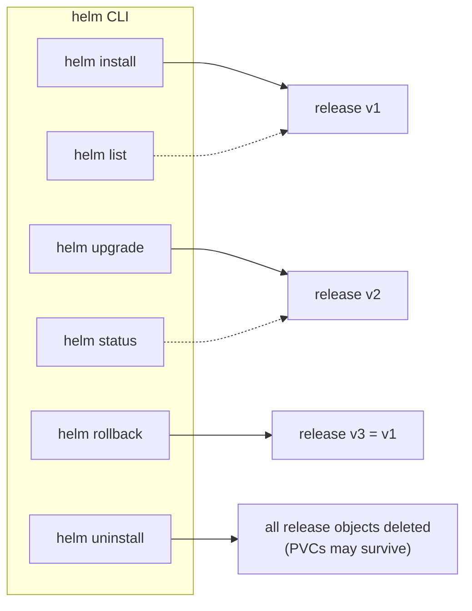

# Day 51: Installing Your First Chart

> **Goal**: Install a real, production-grade app from a community chart with one command, and learn the `helm install / list / status / uninstall` lifecycle.
> **Prereqs**: [Day 50 — Why Helm](day50_helm-intro.md), a running cluster (Minikube works).

## 1. Scenario & Why It Matters

Installing a full MariaDB with secrets, PVCs, a StatefulSet, a headless Service, and NetworkPolicies from scratch is a day of YAML. With Helm it's **one line**. Today you will install the Bitnami MariaDB chart, inspect what Helm created, and then tear it down — the full lifecycle of a Helm release.

## 2. Concept Deep-Dive

### Lifecycle commands



| Command | Effect |
|---------|--------|
| `helm install NAME CHART [--set k=v] [-f f.yaml]` | Creates release NAME |
| `helm list [-A]` | Lists releases in the current namespace (or all with `-A`) |
| `helm status NAME` | Shows the last rendered NOTES.txt + object summary |
| `helm get values NAME` | Shows values used to install |
| `helm upgrade NAME CHART …` | Applies new values / chart version |
| `helm rollback NAME N` | Reverts to revision N |
| `helm uninstall NAME` | Deletes the release (and everything in it except PVCs by default) |

### Override values: three levels

1. `--set key=value` — quick one-offs, nested with dots (`--set image.tag=1.28`).
2. `-f file.yaml` — a values file; composable (`-f base.yaml -f prod.yaml`, later overrides earlier).
3. `helm show values bitnami/mariadb` — show the chart's defaults to know what's available.

## 3. Hands-On Mission

```bash
# 1. Add repo and refresh
helm repo add bitnami https://charts.bitnami.com/bitnami
helm repo update

# 2. Peek at the knobs available
helm show values bitnami/mariadb | head -40

# 3. Install with a known root password
helm install my-db bitnami/mariadb --set auth.rootPassword=password123

# 4. Inspect
helm list
kubectl get pods,svc,pvc,secret -l app.kubernetes.io/instance=my-db

# 5. Read the install notes
helm status my-db

# 6. Clean up
helm uninstall my-db
kubectl get pvc          # PVCs may remain — delete manually if wanted
```

## 4. Your Task — Answer

**Q:** What is the name of the Pod created by Helm after `helm install my-db bitnami/mariadb --set auth.rootPassword=password123`?

**Sample answer**:

```
NAME         READY   STATUS    RESTARTS   AGE
my-db-mariadb-0   1/1     Running   0          45s
```

The Pod is `my-db-mariadb-0`. The `-0` suffix is because the Bitnami MariaDB chart uses a **StatefulSet** (not a Deployment) — MariaDB is stateful, so each replica has a stable name `<release>-<chart>-<ordinal>`.

## 5. Q&A (Concepts Check)

**Q: Why is the Pod named `my-db-mariadb-0` and not `my-db-0` or `mariadb-0`?**
A: The chart's templates use `{{ .Release.Name }}-{{ .Chart.Name }}` as the prefix. `Release.Name = my-db`, `Chart.Name = mariadb`. The trailing `-0` is the StatefulSet ordinal. This naming makes it safe to install the same chart multiple times in one namespace with different release names.

**Q: What happens to the MariaDB data when I `helm uninstall`?**
A: `helm uninstall` deletes everything owned by the release EXCEPT PersistentVolumeClaims — those have the annotation `helm.sh/resource-policy: keep` on stateful charts, on purpose. You must `kubectl delete pvc -l app.kubernetes.io/instance=my-db` manually. This protects you from nuking a database with one typo.

**Q: How do I change the root password after install?**
A: Don't try to `helm upgrade --set auth.rootPassword=...` — that will NOT actually change the password in the running DB because the Secret was only consumed at init. You either reset the password via SQL, or uninstall+reinstall (losing data unless you back up first). Lesson: Helm installs state, it doesn't mutate running databases.

**Q: My install hangs with `Error: context deadline exceeded`. What now?**
A: Default timeout is 5 minutes. Add `--timeout 15m` and `--wait` to watch real progress. Meanwhile check `kubectl get events --sort-by .lastTimestamp` and `kubectl describe pod <name>` — usually it's an image pull, insufficient resources, or a stuck PVC.

**Q: Can two people install the same chart with the same release name?**
A: Not in the same namespace — release names are unique per namespace. They can install the same chart with different release names (`my-db`, `db-backup`) or in different namespaces (`dev`, `prod`). `helm list -A` shows everything.

**Q: What's `--dry-run` and why should I always use it first?**
A: `helm install --dry-run --debug` renders the templates and prints the manifest AND release info, but does not apply to the cluster. Use it to spot `nil` values, syntax errors, or unexpected objects before going live.

## 6. Further Reading

- helm.sh/docs/helm/helm_install/.
- artifacthub.io/packages/helm/bitnami/mariadb — the chart used today.
- Next: [Day 52 — Build Your Own Chart](day52_first-chart.md).
