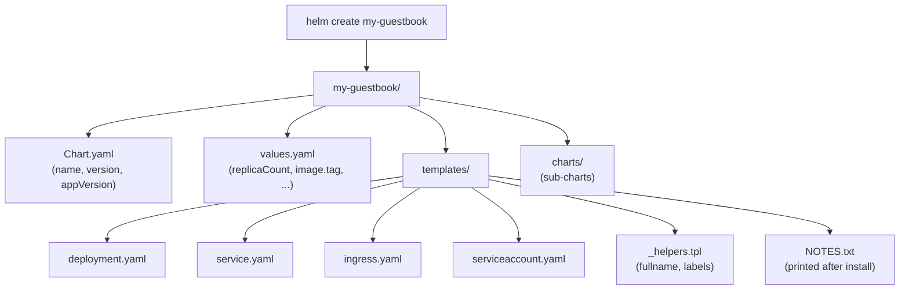

# Day 52: Your First Chart

> **Goal**: Scaffold, customise, and install your own Helm chart for the Guestbook app from Week 7.
> **Prereqs**: [Day 51](day51_helm.md).

## 1. Scenario & Why It Matters

Yesterday you *consumed* a chart. Today you *build* one. You are going to take the Nginx frontend from last week's Guestbook and turn it into a reusable, parameterised Helm chart `my-guestbook`. Anyone on your team (and CI/CD) will be able to install it with `helm install my-frontend ./my-guestbook --set replicaCount=5`.

## 2. Concept Deep-Dive

### `helm create` scaffolds a working chart



The scaffold is a working Nginx chart — you can `helm install` it immediately, then edit to taste.

### Go templates in 60 seconds

Everything in `templates/*.yaml` is rendered through the Go template engine. Three pieces of syntax you'll meet on day one:

| Syntax | Meaning |
|--------|---------|
| `{{ .Values.replicaCount }}` | Substitute the value from `values.yaml` |
| `{{ .Release.Name }}` | Substitute the release name at install time |
| `{{- include "my-guestbook.fullname" . }}` | Call a named template from `_helpers.tpl` |
| `{{- if .Values.ingress.enabled }} … {{- end }}` | Conditional block |
| `{{- toYaml .Values.resources | nindent 10 }}` | Render a sub-object as YAML, indented 10 spaces |

The `-` in `{{-` strips leading whitespace so the rendered YAML doesn't end up with blank lines.

### Built-in objects you'll use

| Object | What it gives you |
|--------|-------------------|
| `.Values` | Everything from `values.yaml` + `--set` overrides |
| `.Release` | `.Name`, `.Namespace`, `.IsInstall`, `.IsUpgrade`, `.Revision` |
| `.Chart` | `.Name`, `.Version`, `.AppVersion` |
| `.Files` | Files under the chart dir (e.g. `.Files.Get "configs/app.conf"`) |
| `.Capabilities` | Kubernetes version + available APIs |

### Render and install loop

```bash
helm lint ./my-guestbook              # syntax + best-practice check
helm template ./my-guestbook          # print fully-rendered YAML
helm install my-gb ./my-guestbook     # apply to cluster
helm upgrade my-gb ./my-guestbook --set replicaCount=4
```

## 3. Hands-On Mission

**1. Scaffold**

```bash
helm create my-guestbook
tree my-guestbook
```

**2. Customise for the Guestbook**

Edit `my-guestbook/values.yaml`:

```yaml
replicaCount: 2

image:
  repository: nginx
  tag: "alpine"          # pin an actual tag; default is "" which falls back to appVersion
  pullPolicy: IfNotPresent

service:
  type: NodePort
  port: 80

ingress:
  enabled: false         # we'll use NodePort for Minikube
```

**3. (Optional) Trim the scaffold**

The default template includes Ingress and ServiceAccount. Leave them — you can disable Ingress with a value and the ServiceAccount is cheap.

**4. Render & install**

```bash
helm lint ./my-guestbook
helm template ./my-guestbook | less
helm install my-gb ./my-guestbook
helm list
kubectl get pods,svc -l app.kubernetes.io/instance=my-gb
```

**5. Scale via upgrade**

```bash
helm upgrade my-gb ./my-guestbook --set replicaCount=4
kubectl get pods -l app.kubernetes.io/instance=my-gb    # now 4
```

Resources for this chart live in `Resources/Week8/weekly_challenge/` once you move on to the challenge — today keep it in a throwaway folder.

## 4. Your Task — Answer

**Q:** After `helm upgrade my-gb ./my-guestbook --set replicaCount=4`, how many Pods are running and what revision is the release?

**Sample answer**:

```
$ kubectl get pods -l app.kubernetes.io/instance=my-gb
NAME                                 READY   STATUS    RESTARTS   AGE
my-gb-my-guestbook-6c5f4b77b-abcd1   1/1     Running   0          30s
my-gb-my-guestbook-6c5f4b77b-abcd2   1/1     Running   0          30s
my-gb-my-guestbook-6c5f4b77b-abcd3   1/1     Running   0          5s
my-gb-my-guestbook-6c5f4b77b-abcd4   1/1     Running   0          5s

$ helm list
NAME    NAMESPACE   REVISION    STATUS      CHART               APP VERSION
my-gb   default     2           deployed    my-guestbook-0.1.0  1.16.0
```

**Four Pods**, release revision **2** (the install was rev 1, the upgrade bumped it to rev 2).

## 5. Q&A (Concepts Check)

**Q: Why is my Pod name `my-gb-my-guestbook-…` and not just `my-gb-…`?**
A: The scaffold's `_helpers.tpl` defines `fullname` as `{{ .Release.Name }}-{{ .Chart.Name }}` unless they are equal or a `fullnameOverride` is set. Set `nameOverride: ""` or `fullnameOverride: "guestbook"` in values to shorten.

**Q: What happens if I rename `Chart.yaml`'s `name` after install?**
A: Helm treats the renamed chart as a different chart. `helm upgrade` will want to rename every generated resource — in practice that's a destructive re-create. Treat chart names as stable once released.

**Q: Where does `.Release.Namespace` come from?**
A: From `--namespace` on the command line, or the current kubectl context, or `metadata.namespace` explicitly set on the command. Inside templates, `.Release.Namespace` is the resolved final value — rely on it rather than hardcoding.

**Q: How do I pass a list / nested object via `--set`?**
A: Nested: `--set image.repository=nginx,image.tag=1.28`. Lists: `--set 'envs={A,B,C}'`. Anything complex — use `-f values.prod.yaml`; `--set` syntax becomes unreadable fast.

**Q: My template produces `<nil>` for a value. Why?**
A: The value is not set in `values.yaml` or via `--set`. Use `default` in the template: `{{ .Values.image.tag | default .Chart.AppVersion }}`. Also `required` raises a clear error: `{{ required "tag is required" .Values.image.tag }}`.

**Q: What does `helm lint` actually check?**
A: Chart.yaml sanity (required fields, SemVer), template render success, icon URL reachability, deprecated API versions, and Kubernetes manifest best practices (e.g. `app.kubernetes.io/*` labels). It's cheap — run it in CI.

## 6. Further Reading

- helm.sh/docs/chart_template_guide/.
- `helm create` vs starter charts — helm.sh/docs/topics/chart_template_guide/starter/.
- Next: [Day 53 — Chart Dependencies](day53_chart-dependencies.md).
