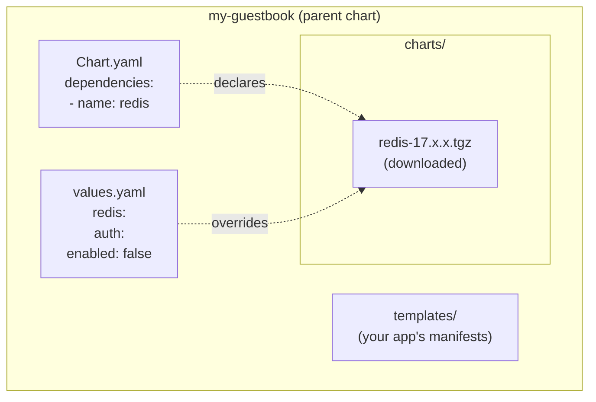

# Day 53: Chart Dependencies

> **Goal**: Bundle Redis as a sub-chart so your Guestbook installs its whole stack with one command.
> **Prereqs**: [Day 52 — Your First Chart](day52_first-chart.md).

## 1. Scenario & Why It Matters

Your Guestbook needs Redis. You don't want users of your chart to have to run "first install Redis, then install my app". You want them to run **one** command and get the whole stack. In Helm, this is a **chart dependency** (a.k.a. sub-chart).

## 2. Concept Deep-Dive

### Parent and sub-charts



Three moving parts:

1. **Declare** the dependency in `Chart.yaml`.
2. **Download** it with `helm dependency update` — it lands as a `.tgz` in `charts/`.
3. **Override** its values by nesting under the dep's name in your parent `values.yaml`.

### `Chart.yaml` snippet

```yaml
apiVersion: v2
name: my-guestbook
version: 0.2.0
appVersion: "1.0"
dependencies:
  - name: redis
    version: "17.x.x"
    repository: "https://charts.bitnami.com/bitnami"
    # Optional knobs:
    condition: redis.enabled          # disable with --set redis.enabled=false
    alias: cache                      # rename the dep in-tree
    import-values: []
```

After `helm dependency update ./my-guestbook`:

```
my-guestbook/
├── Chart.lock                   # pinned exact versions, like package-lock.json
└── charts/
    └── redis-17.15.6.tgz
```

### Override sub-chart values

In your parent `values.yaml`:

```yaml
replicaCount: 4                   # your own values

redis:                            # scopes all values under the dep name
  auth:
    enabled: false                # disable Redis auth for demo
  architecture: standalone        # one node instead of replication
  master:
    persistence:
      enabled: false              # no PVC for demo
```

### Global values (shared across all sub-charts)

```yaml
global:
  imageRegistry: my-registry.internal
  storageClass: fast-ssd
redis:
  auth:
    enabled: false
```

`global.*` is automatically passed to every sub-chart. Handy for cluster-wide policy.

### `Chart.lock` and reproducibility

Once you `helm dependency update`, `Chart.lock` pins the exact resolved versions. Commit this file. Run `helm dependency build` in CI to restore — it reads the lockfile instead of resolving fresh, giving you deterministic builds.

## 3. Hands-On Mission

```bash
# 1. Add the dependency
cat >> my-guestbook/Chart.yaml <<'EOF'
dependencies:
  - name: redis
    version: "17.x.x"
    repository: "https://charts.bitnami.com/bitnami"
EOF

# 2. Override Redis values
cat >> my-guestbook/values.yaml <<'EOF'
redis:
  auth:
    enabled: false
  architecture: standalone
  master:
    persistence:
      enabled: false
EOF

# 3. Fetch the sub-chart
helm dependency update ./my-guestbook
ls my-guestbook/charts/        # redis-xx.tgz

# 4. Render + install the mega-chart
helm template ./my-guestbook | head -60
helm install guestbook-stack ./my-guestbook

# 5. Inspect
helm list
kubectl get pods
```

## 4. Your Task — Answer

**Q:** After `helm install guestbook-stack ./my-guestbook` with `replicaCount: 4`, how many Pods are running in total?

**Sample answer**:

**5 Pods** — your 4 Nginx frontends + 1 Redis master.

```
NAME                                            READY   STATUS    RESTARTS   AGE
guestbook-stack-my-guestbook-6d8f8c8c78-abcd1   1/1     Running   0          1m
guestbook-stack-my-guestbook-6d8f8c8c78-abcd2   1/1     Running   0          1m
guestbook-stack-my-guestbook-6d8f8c8c78-abcd3   1/1     Running   0          1m
guestbook-stack-my-guestbook-6d8f8c8c78-abcd4   1/1     Running   0          1m
guestbook-stack-redis-master-0                  1/1     Running   0          1m
```

The Redis Pod name `guestbook-stack-redis-master-0` tells the whole story: release name `guestbook-stack`, dep chart name `redis`, role `master`, StatefulSet ordinal `0`.

## 5. Q&A (Concepts Check)

**Q: Why nest Redis values under `redis:` in the parent `values.yaml`?**
A: That's how Helm wires parent → child. Any key under `redis:` in the parent's values is passed as the **root** values of the Redis sub-chart. It keeps the parent responsible for deciding how the child is configured, without touching files in `charts/`.

**Q: What's `Chart.lock` vs `Chart.yaml`?**
A: `Chart.yaml` declares acceptable version ranges (`17.x.x`). `Chart.lock` pins the exact resolved version (`17.15.6`) + digest. Commit both. `dependency update` bumps the lock; `dependency build` respects it.

**Q: Can I depend on a local chart on disk (not a repo)?**
A: Yes — `repository: "file://../shared-lib"` in `Chart.yaml`. Useful for shared helper charts inside a monorepo.

**Q: What does `condition: redis.enabled` do?**
A: Lets users opt out of the dep. `helm install … --set redis.enabled=false` makes Helm skip installing the Redis sub-chart entirely — the parent chart installs "bare" (you'd typically point at an external Redis instead).

**Q: What's the difference between a sub-chart and a library chart?**
A: Sub-chart renders its own Kubernetes manifests and becomes real objects in the cluster. Library chart (`type: library` in `Chart.yaml`) only exposes reusable **template helpers** — no manifests. Use library charts for shared labels/annotations/partials across many app charts.

**Q: My `helm dependency update` fails with 401. How do I use a private chart repo?**
A: `helm repo add myrepo <url> --username … --password …` or configure credentials in `$HELM_REPOSITORY_CONFIG`. For OCI-registry-hosted charts, `helm registry login` first, then depend on `oci://…`.

## 6. Further Reading

- helm.sh/docs/topics/charts/#chart-dependencies.
- Bitnami Redis chart values: github.com/bitnami/charts/tree/main/bitnami/redis.
- Next: [Day 54 — Upgrade & Rollback](day54_helm-upgrade-and-rollback.md).
