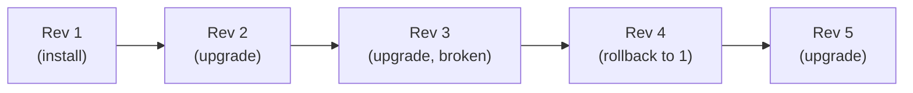

# Day 54: Upgrade & Rollback — The Safety Net

> **Goal**: Change a running release safely and revert instantly when something breaks.
> **Prereqs**: [Day 53 — Chart Dependencies](day53_chart-dependencies.md).

## 1. Scenario & Why It Matters

Shipping version 2.0 to a Kubernetes cluster used to mean editing 10 YAML files by hand and hoping nothing drifted. With Helm, every install and every change is a numbered **revision**. Break production? `helm rollback` to the last good revision in seconds, atomically. This is the single most valuable thing Helm gives you in ops.

## 2. Concept Deep-Dive

### Revisions form a linear history



Important properties:

- Every `install`, `upgrade`, `rollback` creates a new revision.
- History is stored as Kubernetes Secrets (`sh.helm.release.v1.<release>.v<rev>`) in the release namespace.
- `--history-max` (default 10) caps retained revisions.
- Rollback "to 3" actually creates revision N+1 whose state matches revision 3 — keeps history linear.

### Commands

```bash
helm upgrade NAME CHART [--set k=v] [-f f.yaml] \
  [--atomic] [--wait] [--timeout 10m] [--cleanup-on-fail] [--install]
helm history NAME
helm status NAME
helm rollback NAME [REVISION]          # omit to rollback to previous
helm get values NAME --revision N
helm get manifest NAME --revision N
```

### Flags you'll actually use

| Flag | What it does |
|------|--------------|
| `--atomic` | Roll back automatically if upgrade fails — use in CI always |
| `--wait` | Block until all resources are ready (or timeout) |
| `--cleanup-on-fail` | Delete new resources that upgrade created before it failed |
| `--install` | Create release if it doesn't exist — idempotent `upgrade -i` pattern |
| `--dry-run --debug` | Preview the manifest diff without applying |
| `--force` | Recreate resources instead of patching (dangerous — causes downtime) |

### The common CI pattern

```bash
helm upgrade --install \
  --atomic \
  --wait \
  --timeout 10m \
  --namespace myapp \
  --create-namespace \
  my-app ./chart -f values-prod.yaml
```

"Install if missing, upgrade if exists, roll back atomically on failure, wait for readiness, fail fast after 10 minutes." Paste this into a GitHub Action.

### Diffing before applying

Install the plugin:

```bash
helm plugin install https://github.com/databus23/helm-diff
helm diff upgrade my-app ./chart -f values-prod.yaml
```

Shows a line-by-line diff of what upgrade would change. Run in PR checks.

## 3. Hands-On Mission

```bash
# 1. Install base
helm install guestbook-stack ./my-guestbook
helm list                                        # revision 1

# 2. Upgrade — scale down
helm upgrade guestbook-stack ./my-guestbook --set replicaCount=2
kubectl get pods -l app.kubernetes.io/instance=guestbook-stack
helm history guestbook-stack                     # revisions 1 and 2 visible

# 3. Roll back to revision 1
helm rollback guestbook-stack 1
helm history guestbook-stack                     # now revision 3 says "Rollback to 1"
kubectl get pods -l app.kubernetes.io/instance=guestbook-stack    # back to 4 replicas

# 4. See what a revision contained
helm get values guestbook-stack --revision 2
helm get manifest guestbook-stack --revision 2 | head -40
```

## 4. Your Task — Answer

**Q:** After `helm upgrade guestbook-stack ./my-guestbook --set replicaCount=2` and then `helm history guestbook-stack`, what is the **DESCRIPTION** column of revision 2?

**Sample answer**:

```
$ helm history guestbook-stack
REVISION  UPDATED                    STATUS      CHART               DESCRIPTION
1         2024-01-15 10:00:00 +0000  superseded  my-guestbook-0.2.0  Install complete
2         2024-01-15 10:05:00 +0000  deployed    my-guestbook-0.2.0  Upgrade complete
```

The DESCRIPTION for revision 2 is `Upgrade complete`. Helm uses four canonical strings: `Install complete`, `Upgrade complete`, `Rollback to N`, `Uninstallation complete`. If the upgrade had failed, you'd see `Upgrade "guestbook-stack" failed: <reason>` — which is what tells you in CI exactly what went wrong.

## 5. Q&A (Concepts Check)

**Q: How does Helm compute the diff between revisions?**
A: Helm stores the fully-rendered manifest of each revision as part of the release Secret. On upgrade it three-way-merges: previous manifest, new manifest, and live cluster state. This catches out-of-band `kubectl` edits so the upgrade doesn't silently overwrite them.

**Q: What's the difference between `helm upgrade --force` and `helm rollback`?**
A: `--force` deletes and recreates resources that can't be patched (e.g. changing an immutable field on a Service). Causes service interruption. `rollback` is the safer alternative — reverts to a known-good configuration using the same diff logic as upgrade.

**Q: Can I roll back a release that has been uninstalled?**
A: Yes, if you uninstalled with `--keep-history`. Without that flag, `helm uninstall` deletes the release history — no way back except `helm install` fresh.

**Q: What does "Atomic" really guarantee?**
A: Two things: (1) if any resource fails to become ready within the timeout, Helm runs `rollback` automatically; (2) Helm tries harder to clean up any newly-created resources from the failed revision. It does NOT guarantee database migrations or other side effects outside Kubernetes — those need your own migration job + rollback logic.

**Q: Why does rollback-to-3 create revision 4 instead of just switching to 3?**
A: Linear history is auditable — you always know what was deployed and when, and revisions aren't "erased". It also means `helm history` shows the full timeline for compliance, even if you roll backwards.

**Q: My upgrade broke prod. Rollback worked, but we're stuck on an old DB migration schema. Helm bug?**
A: Not a bug — a design limitation. Helm manages Kubernetes objects; it doesn't understand application data migrations. Combine Helm with Kubernetes **Jobs** (run migrations as pre-install/pre-upgrade hooks) and design migrations to be backwards-compatible so a rollback can still talk to the new schema.

## 6. Further Reading

- helm.sh/docs/helm/helm_upgrade/ and `helm_rollback`.
- helm-diff plugin: github.com/databus23/helm-diff.
- Next: [Day 55 — Templates & Logic](day55_templates.md).
