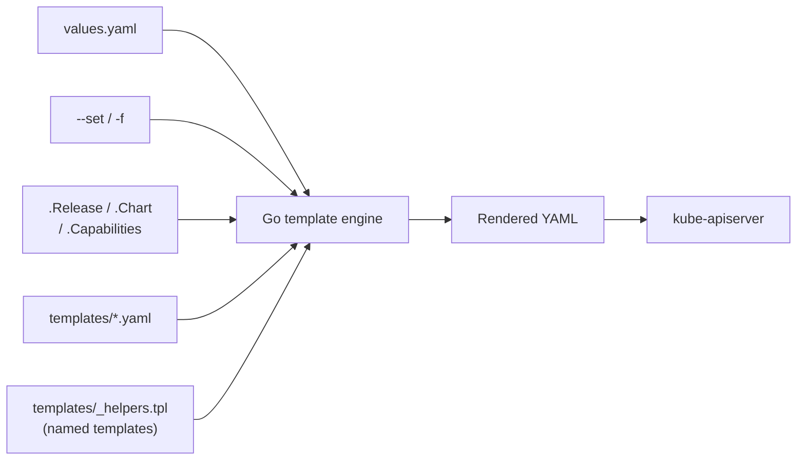

# Day 55: Templates & Logic

> **Goal**: Use `if`, `range`, helpers, and functions to make one chart serve dev, staging, and prod.
> **Prereqs**: [Day 54 — Upgrade & Rollback](day54_helm-upgrade-and-rollback.md).

## 1. Scenario & Why It Matters

A chart with no templating is just a folder of YAML. The point of Helm is that **one chart** can install a cheap, insecure, single-replica Dev install AND a multi-AZ, TLS-enabled, autoscaled Prod install — all by changing values. That requires conditionals, loops, and functions.

## 2. Concept Deep-Dive

### The template rendering pipeline



### `if / else`

```yaml
metadata:
  annotations:
    {{- if .Values.isProduction }}
    type: "mission-critical"
    {{- else }}
    type: "testing"
    {{- end }}
```

Truthy rules: `""`, `0`, `nil`, `false`, empty lists/maps are false.

### `range` — loop over a list or map

```yaml
env:
  {{- range $k, $v := .Values.env }}
  - name: {{ $k }}
    value: {{ $v | quote }}
  {{- end }}
```

With `.Values.env: { LOG_LEVEL: debug, PORT: "8080" }`, this renders two env entries.

### `with` — temporarily change scope

```yaml
{{- with .Values.imagePullSecrets }}
imagePullSecrets:
  {{- toYaml . | nindent 2 }}
{{- end }}
```

The block runs only if `.Values.imagePullSecrets` is non-empty, and inside the block `.` refers to that value.

### `define` and `include` — reusable helpers

In `templates/_helpers.tpl`:

```
{{/* Generate consistent labels */}}
{{- define "my-guestbook.labels" -}}
app.kubernetes.io/name: {{ .Chart.Name }}
app.kubernetes.io/instance: {{ .Release.Name }}
app.kubernetes.io/managed-by: {{ .Release.Service }}
app.kubernetes.io/version: {{ .Chart.AppVersion | quote }}
{{- end }}
```

Use it:

```yaml
metadata:
  labels:
    {{- include "my-guestbook.labels" . | nindent 4 }}
```

`include` is preferred over `template` because its output can be piped (`| nindent`, `| toYaml`).

### Essential functions (Sprig)

| Function | Use |
|----------|-----|
| `quote` / `squote` | Wrap in `"…"` / `'…'` |
| `default D V` | Return V if set, else D |
| `required "msg" V` | Fail render if V is missing |
| `toYaml` / `fromYaml` | Serialize / parse YAML |
| `nindent N` | Newline + indent N spaces |
| `b64enc` / `b64dec` | Base64 (Secrets!) |
| `include "name" .` | Run a named template |
| `lookup "v1" "Secret" "ns" "name"` | Read live cluster state (use sparingly) |
| `tpl` | Render a string as a template (dynamic values) |

### Example: a "Smart" Deployment

```yaml
apiVersion: apps/v1
kind: Deployment
metadata:
  name: {{ include "my-guestbook.fullname" . }}
  labels:
    {{- include "my-guestbook.labels" . | nindent 4 }}
  annotations:
    type: {{ if .Values.isProduction }}"mission-critical"{{ else }}"testing"{{ end }}
spec:
  replicas: {{ .Values.replicaCount | default 1 }}
  selector:
    matchLabels:
      app.kubernetes.io/instance: {{ .Release.Name }}
  template:
    metadata:
      labels:
        app.kubernetes.io/instance: {{ .Release.Name }}
    spec:
      {{- with .Values.imagePullSecrets }}
      imagePullSecrets:
        {{- toYaml . | nindent 8 }}
      {{- end }}
      containers:
        - name: app
          image: "{{ .Values.image.repository }}:{{ .Values.image.tag | default .Chart.AppVersion }}"
          ports:
            - containerPort: {{ .Values.service.port }}
          {{- with .Values.resources }}
          resources:
            {{- toYaml . | nindent 12 }}
          {{- end }}
```

### Debugging

```bash
helm template ./chart --set isProduction=true --debug
helm install --dry-run --debug my-gb ./chart -f prod.yaml
helm lint ./chart                      # catches most render errors
```

## 3. Hands-On Mission

**1. Add a toggle**

`values.yaml`:

```yaml
isProduction: false
```

**2. Use it in `templates/deployment.yaml`**:

```yaml
metadata:
  name: {{ include "my-guestbook.fullname" . }}
  annotations:
    {{- if .Values.isProduction }}
    type: "mission-critical"
    {{- else }}
    type: "testing"
    {{- end }}
```

**3. Test both branches**

```bash
helm template ./my-guestbook --set isProduction=true  | grep -A1 annotations
helm template ./my-guestbook --set isProduction=false | grep -A1 annotations
```

## 4. Your Task — Answer

**Q:** Run `helm template ./my-guestbook --set isProduction=true | grep "type:"`. What is the value of the `type:` annotation?

**Sample answer**:

```
type: "mission-critical"
```

Because `.Values.isProduction` is `true`, the template takes the `if` branch and emits `type: "mission-critical"`. Flip the flag to `false` and you'll get `type: "testing"` — same chart, different rendered YAML, no code change.

## 5. Q&A (Concepts Check)

**Q: Why use `{{-` and `-}}` instead of plain `{{` and `}}`?**
A: The hyphen strips surrounding whitespace (including newlines). Without it, conditional blocks leave behind blank lines that break YAML indentation or produce ugly output. Rule of thumb: use `{{-` on the opening brace when the directive is on its own line.

**Q: `include` vs `template`?**
A: `template` is a built-in directive that prints directly — you can't pipe its output. `include` is a function that returns a string, so you can pipe it (`| nindent`, `| toYaml`). Always prefer `include` for helpers.

**Q: How do I compute a value from other values?**
A: Either in the template inline (`{{ add .Values.a .Values.b }}`) or in a helper in `_helpers.tpl` that returns a string. For complex logic, helpers keep manifest files readable.

**Q: Is `lookup` deterministic?**
A: No — `lookup` reads live cluster state. The same chart + values can render differently depending on the cluster. It bypasses `--dry-run` (returns empty). Use it sparingly, e.g. reuse an existing Secret's random password to avoid regenerating on upgrade.

**Q: How do I fail loudly if a required value isn't set?**
A: `{{ required "image.repository is required" .Values.image.repository }}`. Renders the value if set, otherwise aborts with your message. Great for enforcing per-environment inputs.

**Q: My rendered YAML has a stray blank line between two resources. Why?**
A: Usually a `{{- if … }}` with whitespace on the line above the `---` separator. Use `--dry-run --debug` to see raw rendered output and add `-` to trim. A `yamllint` step in CI catches most of these.

## 6. Further Reading

- helm.sh/docs/chart_template_guide/ — full guide.
- Sprig function reference: masterminds.github.io/sprig/.
- Next: [Day 56 — Weekly Challenge](day56_weekly-challenge.md).
