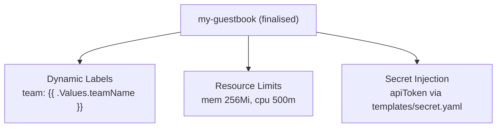

# Day 56: Weekly Challenge — The Production-Ready Chart

> **Goal**: Finalise `my-guestbook` into a "Universal Web Chart": dynamic labels, resource limits, secret injection, ready for any team.
> **Prereqs**: Every Day in Week 8.

## 1. Scenario

Your company is launching a new API platform. The Frontend team and the Backend team both want to ship Kubernetes apps with *the same operational guarantees* — common labels, resource limits, secret injection, rollback safety. Instead of each team inventing their own chart, you will finalise `my-guestbook` as the company's golden chart.

## 2. Requirements



1. **Dynamic labels**: `values.yaml` variable `teamName`. In the Deployment's `metadata.labels`, emit `team: {{ .Values.teamName }}`.
2. **Resource limits**: under `resources` in `values.yaml`, set `memory: 256Mi`, `cpu: 500m`. Map them into the container spec.
3. **Secret injection**: add `templates/secret.yaml` that creates a Kubernetes Secret holding `apiToken` (read from `values.yaml`).

## 3. Execution

**Step 1 — `values.yaml` additions**

```yaml
teamName: platform

apiToken: "change-me-in-prod"

resources:
  limits:
    memory: "256Mi"
    cpu: "500m"
  requests:
    memory: "128Mi"
    cpu: "100m"
```

**Step 2 — `templates/deployment.yaml` updates**

```yaml
apiVersion: apps/v1
kind: Deployment
metadata:
  name: {{ include "my-guestbook.fullname" . }}
  labels:
    {{- include "my-guestbook.labels" . | nindent 4 }}
    team: {{ .Values.teamName | quote }}
spec:
  replicas: {{ .Values.replicaCount }}
  selector:
    matchLabels:
      app.kubernetes.io/instance: {{ .Release.Name }}
  template:
    metadata:
      labels:
        app.kubernetes.io/instance: {{ .Release.Name }}
        team: {{ .Values.teamName | quote }}
    spec:
      containers:
        - name: app
          image: "{{ .Values.image.repository }}:{{ .Values.image.tag | default .Chart.AppVersion }}"
          ports:
            - containerPort: {{ .Values.service.port }}
          env:
            - name: API_TOKEN
              valueFrom:
                secretKeyRef:
                  name: {{ include "my-guestbook.fullname" . }}-api-token
                  key: apiToken
          {{- with .Values.resources }}
          resources:
            {{- toYaml . | nindent 12 }}
          {{- end }}
```

**Step 3 — `templates/secret.yaml` (new file)**

```yaml
apiVersion: v1
kind: Secret
metadata:
  name: {{ include "my-guestbook.fullname" . }}-api-token
  labels:
    {{- include "my-guestbook.labels" . | nindent 4 }}
    team: {{ .Values.teamName | quote }}
type: Opaque
data:
  apiToken: {{ required "apiToken is required" .Values.apiToken | b64enc | quote }}
```

**Step 4 — Lint, render, install**

```bash
helm lint ./my-guestbook
helm template ./my-guestbook \
  --set teamName=frontend \
  --set apiToken=dev-token-123 \
  | less

helm upgrade --install my-gb ./my-guestbook \
  --set teamName=frontend \
  --set apiToken=dev-token-123 \
  --atomic --wait
```

**Step 5 — Verify**

```bash
kubectl get deploy -o jsonpath='{.items[*].metadata.labels.team}'      # frontend
kubectl get deploy -o jsonpath='{.items[*].spec.template.spec.containers[0].resources}'
kubectl get secret my-gb-my-guestbook-api-token -o jsonpath='{.data.apiToken}' | base64 -d
```

## 4. Your Task — Answer

**Q:** Ship all three requirements. Verify by rendering with `teamName=backend` and confirm the secret decodes to the expected token.

**Sample answer** — key excerpts from the rendered YAML:

```yaml
# Deployment
metadata:
  labels:
    app.kubernetes.io/name: my-guestbook
    team: "backend"
# Container
resources:
  limits:
    memory: 256Mi
    cpu: 500m
  requests:
    memory: 128Mi
    cpu: 100m
---
# Secret
kind: Secret
metadata:
  name: my-gb-my-guestbook-api-token
  labels:
    team: "backend"
type: Opaque
data:
  apiToken: ZGV2LXRva2VuLTEyMw==      # base64("dev-token-123")
```

And `kubectl` confirms:

```
$ kubectl get secret my-gb-my-guestbook-api-token -o jsonpath='{.data.apiToken}' | base64 -d
dev-token-123
```

All three requirements are in place:

1. `team: "backend"` flows from `--set teamName=backend` all the way into the Deployment metadata AND pod labels — operators can filter by team in Prometheus, Grafana, and `kubectl`.
2. The `resources` block is sourced from values → the same chart produces different limits for dev (lower) or prod (higher) just by overriding values.
3. The API token is never in the repo; it's injected via `--set` (or a values file stored in Vault/Sealed Secrets), Base64-encoded automatically with `b64enc`, and mounted into the container as `API_TOKEN` env var via `secretKeyRef`.

## 5. Q&A (Concepts Check)

**Q: Why use `secretKeyRef` instead of baking the token into the image or the Deployment's `env`?**
A: Image baking is a security disaster (anyone pulling the image sees it). Plain `env` values are readable by anyone who can `kubectl get pod -o yaml`. A Secret is mounted lazily by the kubelet and — with RBAC — only allowed readers can see its contents. Plus you can rotate the token by updating the Secret without changing the Deployment manifest.

**Q: `apiToken` is still in `values.yaml` as plaintext. Isn't that also bad?**
A: Yes — `values.yaml` is committed to Git, and anyone reading the repo sees the token. For real prod, either: (a) override with `-f values-prod.yaml` that is NOT in Git; (b) use Sealed Secrets (see Week 7) so encrypted YAML is safe in Git; (c) fetch at install time from Vault / Secrets Manager and pass via `--set`.

**Q: Why `{{ required "apiToken is required" .Values.apiToken }}`?**
A: Forces the chart to fail loudly at render time if no token is supplied. Without `required`, an empty token would render as `data: { apiToken: "" }` — the app would silently start with no credentials.

**Q: `b64enc` and `| quote` — what order matters?**
A: `b64enc` first (convert raw → base64 string), then `| quote` to wrap in `"…"` to be YAML-safe. Reversing would base64-encode the literal quotes, corrupting the secret.

**Q: Why include `team` label on both the Deployment AND the Pod template?**
A: Deployment label lets you `kubectl get deploy -l team=frontend`. Pod template label propagates the same label to the Pods themselves, so `kubectl get pods -l team=frontend` also works and any ServiceMonitor / Prometheus scrape that selects by Pod labels picks it up.

**Q: My resources block renders as `resources: {}` when I omit the value. How to make it disappear entirely?**
A: Use `{{- with .Values.resources }} … {{- end }}` as shown — the whole block is skipped if `resources` is nil/empty, producing a cleaner Deployment with no empty `resources: {}` key.

## 6. Further Reading

- `helm.sh/docs/chart_template_guide/functions_and_pipelines/`.
- Sealed Secrets: [Week 7 — Secrets & cert-manager](../Week7/04_config-and-secrets/bonus_secrets-and-cert.md).
- Next: (Week 9 preview) Observability — Prometheus, Grafana, Loki via Helm charts.
