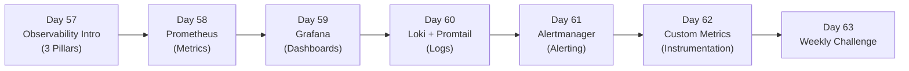

# Week 9 — Observability (Prometheus · Grafana · Loki · Alertmanager)

> If Week 8 taught you how to package and deploy Kubernetes workloads with Helm, Week 9 teaches you how to *see* them. A system you cannot observe is a system you cannot trust in production.

## Roadmap



## Index

- [Day 57 — Observability Intro: The Three Pillars](day57-observability_intro.md)
- [Day 58 — Prometheus: Metrics & PromQL](day58-prometheus.md)
- [Day 59 — Grafana: Dashboards & Visualization](day59-grafana.md)
- [Day 60 — Loki + Promtail: Log Aggregation](day60-loki_and_promtail.md)
- [Day 61 — Alertmanager: Alerting & Routing](day61-alertmanager.md)
- [Day 62 — Custom Metrics: Instrumenting Your App](day62-custom_metrics.md)
- [Day 63 — Weekly Challenge: Observable Guestbook](day63-weekly_challenge.md)

## Related Resources

- `Resources/Week9/weekly_challenge/` — your final dashboards, alert rules, and instrumented Guestbook chart.

## Cheat-sheet

```bash
# --- Helm repos ---
helm repo add prometheus-community https://prometheus-community.github.io/helm-charts
helm repo add grafana https://grafana.github.io/helm-charts
helm repo update

# --- Install kube-prometheus-stack (Prometheus + Grafana + Alertmanager) ---
helm upgrade --install kube-prom prometheus-community/kube-prometheus-stack \
  --namespace monitoring --create-namespace \
  --set grafana.adminPassword=admin \
  --wait

# --- Install Loki stack (Loki + Promtail) ---
helm upgrade --install loki grafana/loki-stack \
  --namespace monitoring \
  --set grafana.enabled=false \
  --wait

# --- Access UIs (minikube) ---
kubectl -n monitoring port-forward svc/kube-prom-grafana 3000:80
kubectl -n monitoring port-forward svc/kube-prom-kube-prometheus-stack-prometheus 9090:9090
kubectl -n monitoring port-forward svc/kube-prom-kube-prometheus-stack-alertmanager 9093:9093

# --- PromQL essentials ---
# Request rate over last 5m
rate(http_requests_total[5m])
# Error ratio
rate(http_requests_total{status=~"5.."}[5m]) / rate(http_requests_total[5m])
# p99 latency (histogram)
histogram_quantile(0.99, rate(http_request_duration_seconds_bucket[5m]))
# CPU usage by pod
rate(container_cpu_usage_seconds_total{namespace="default"}[5m])
# Memory usage
container_memory_working_set_bytes{namespace="default"}

# --- LogQL essentials (Loki) ---
# All logs from a pod
{namespace="default", pod=~"guestbook.*"}
# Filter to errors
{namespace="default"} |= "error"
# Rate of error lines
rate({namespace="default"} |= "error" [5m])

# --- Alert / rule inspection ---
kubectl -n monitoring get prometheusrules
kubectl -n monitoring get alertmanagerconfig
amtool alert query   # inside the Alertmanager pod
```
