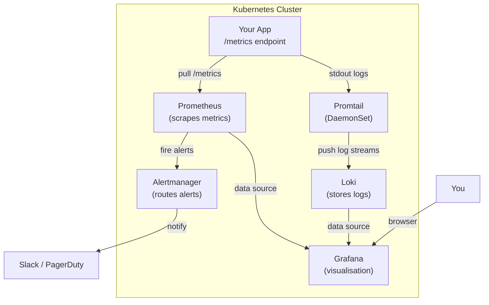
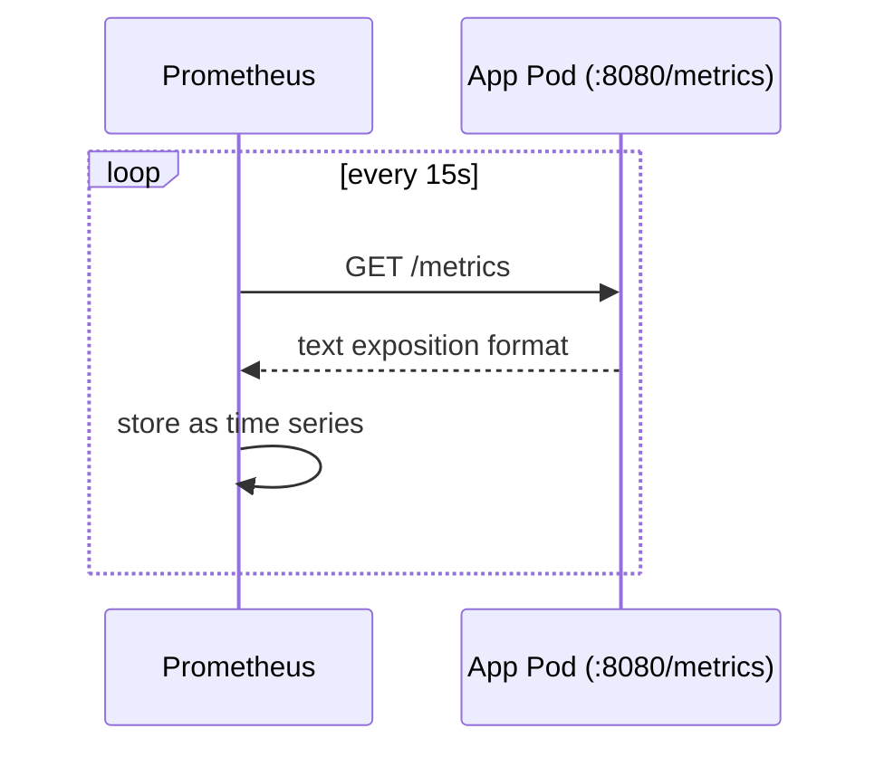

# Day 57: Observability — The Three Pillars

> **Goal**: Understand what observability is, why it matters more than simple monitoring, and how metrics, logs, and traces each answer a different question about your system.
> **Prereqs**: [Week 8 — Helm](../Week8/README.md). You'll install everything via Helm this week.

## 1. Scenario & Why It Matters

You pushed a deploy at 14:00. At 14:03 your on-call phone rings — error rate spiked from 0.1% to 12%. You ssh into a node, scroll through pod logs, see nothing obvious, check CPU — looks fine. Fifteen minutes later you find it: a database connection pool was exhausted because a new environment variable was missing. The app wasn't crashing; it was just slow — and the slowness cascaded.

**Monitoring** would have told you "something is wrong." **Observability** tells you *why* — without having to predict the failure mode in advance. The difference is whether your system emits enough structured data for you to ask arbitrary questions about its internal state.

## 2. Concept Deep-Dive

### The Three Pillars

| Pillar | Question answered | Tool (this week) |
|--------|------------------|-----------------|
| **Metrics** | *How much / how often / how fast?* | Prometheus |
| **Logs** | *What exactly happened, and when?* | Loki + Promtail |
| **Traces** | *Which service caused the latency?* | (OpenTelemetry / Jaeger — future week) |

Metrics are cheap to store and great for dashboards and alerts. Logs are verbose but give you the exact error message. Traces connect a single user request across 10 microservices. All three are needed in production.

### The Observability Stack (this week)



### RED Method (for services)

Proposed by Tom Wilkie for request-driven microservices:

- **R**ate — requests per second
- **E**rrors — error rate (5xx / total)
- **D**uration — latency distribution (p50, p95, p99)

These three metrics alone answer "is my service healthy?" for 90% of incidents.

### USE Method (for resources)

Proposed by Brendan Gregg for hardware/OS resources:

- **U**tilisation — how busy is the resource? (CPU %)
- **S**aturation — how much work is queued? (run queue depth)
- **E**rrors — hardware/driver errors

### Why Prometheus + Grafana + Loki?

- **Prometheus** is the CNCF-graduated standard. Every Kubernetes component exposes `/metrics` in Prometheus format. `kube-prometheus-stack` auto-discovers everything.
- **Grafana** is the de-facto dashboard layer. It speaks Prometheus, Loki, Tempo, Elasticsearch — one UI for everything.
- **Loki** is "Prometheus for logs" — stores only labels + compressed chunks (not a full-text search index), making it cheap at scale. Promtail ships logs from every node automatically.

### Push vs Pull: Prometheus' model

Prometheus **pulls** (scrapes) metrics from targets at a configured interval (default 15s). This is the opposite of most logging systems that push. Pull has a key advantage: if a target disappears, Prometheus knows — it can't receive a heartbeat that was never sent.



## 3. Hands-On Mission

No cluster changes today — just orientation and tooling prep.

```bash
# Verify Helm is installed (needed all week)
helm version

# Add the repos you'll use all week
helm repo add prometheus-community https://prometheus-community.github.io/helm-charts
helm repo add grafana https://grafana.github.io/helm-charts
helm repo update

# Browse what's available
helm search repo prometheus-community
helm search repo grafana/loki
```

Read through the `kube-prometheus-stack` default values — it shows you exactly what the chart installs:

```bash
helm show values prometheus-community/kube-prometheus-stack | less
```

## 4. Your Task — Answer

**Q:** What is the difference between *monitoring* and *observability*, and why does the distinction matter for on-call engineers?

**Sample answer:**

**Monitoring** is checking known failure modes — you define thresholds in advance (`CPU > 80% → alert`). It answers questions you predicted. **Observability** is the property of a system that lets you ask *any* question about its internal state from the outside, including questions you didn't think to ask when you wrote the code.

The practical difference for on-call: with monitoring alone you get alerted but may spend hours manually tracing cause. With observability (structured metrics, indexed logs, distributed traces) you can form a hypothesis, query the data, confirm or refute it, and iterate — even for failure modes you've never seen before.

## 5. Q&A (Concepts Check)

**Q: Why does Prometheus use a pull model instead of push?**
A: Pull makes target health implicit — if Prometheus can't scrape a target, that's a signal. Push-based systems can hide failures (a crashed app simply stops sending). Pull also centralises scrape config in one place (Prometheus) rather than in every app.

**Q: What is the Prometheus exposition format?**
A: Plain text, one metric per line: `metric_name{label="value"} numeric_value [timestamp]`. Libraries exist for every language to emit this format from a `/metrics` HTTP endpoint.

**Q: Can I use Prometheus without Kubernetes?**
A: Yes. Prometheus is a standalone binary. You can scrape Linux hosts (via `node_exporter`), databases, any HTTP endpoint. Kubernetes just adds the ServiceMonitor CRD (from the Prometheus Operator) to auto-discover scrape targets.

**Q: What does Loki *not* do that Elasticsearch does?**
A: Loki does not index the full log content. It indexes only the labels (namespace, pod, container). This makes it 10-50x cheaper to store but means you can't do arbitrary full-text search efficiently — you stream-filter with `|=` patterns. If you need full-text search on log content, Elasticsearch/OpenSearch is a better fit.

**Q: What are SLOs and how do they relate to RED metrics?**
A: An SLO (Service Level Objective) is a target for a user-facing reliability metric, e.g. "99.9% of requests complete in < 200ms over a 30-day window." RED metrics (rate, errors, duration) are the raw ingredients for SLOs — you define the SLO in terms of them and then alert when the error budget is burning too fast.

**Q: Where does distributed tracing fit relative to metrics and logs?**
A: Metrics tell you *something* is slow; logs tell you *what* happened on one service; traces tell you *which service* in a call chain introduced the latency. Traces assign a `trace_id` to a request that propagates across service boundaries, so you can visualise the full path. OpenTelemetry is the standard instrumentation layer; Jaeger or Tempo store and query the traces.

## 6. Further Reading

- [Charity Majors — "Observability — the Hard Parts"](https://charity.wtf)
- [Brendan Gregg — USE Method](https://www.brendangregg.com/usemethod.html)
- [Prometheus docs — Data Model](https://prometheus.io/docs/concepts/data_model/)
- Next: [Day 58 — Prometheus: Metrics & PromQL](day58-prometheus.md)
