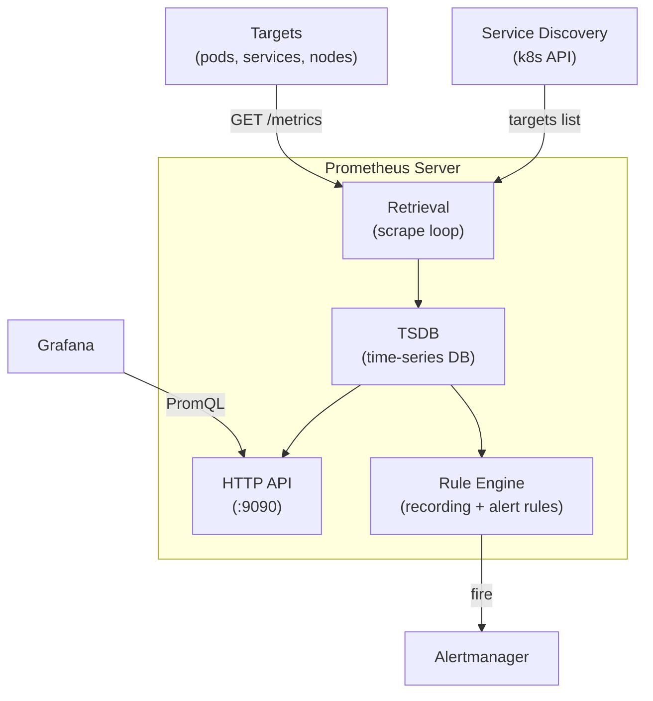

# Day 58: Prometheus — Metrics & PromQL

> **Goal**: Install `kube-prometheus-stack` via Helm, understand how Prometheus discovers scrape targets, and write basic PromQL queries.
> **Prereqs**: Minikube running, Helm repos added (Day 57).

## 1. Scenario & Why It Matters

Your Guestbook from Week 7 is running but you have no idea how much CPU it's using, how many requests it's handling, or whether the Redis backend is responding fast enough. You need a metrics store that auto-discovers every pod in the cluster and lets you query across all of them with a unified query language.

`kube-prometheus-stack` is one Helm install that gives you Prometheus, the Prometheus Operator, Alertmanager, and Grafana — with pre-built dashboards for Kubernetes node and control-plane metrics. It's the industry standard starting point.

## 2. Concept Deep-Dive

### Prometheus Architecture



### The Prometheus Operator & ServiceMonitor CRD

Raw Prometheus uses a static `scrape_configs` in `prometheus.yml`. That doesn't scale in Kubernetes — pods come and go. The **Prometheus Operator** introduces two CRDs:

| CRD | Purpose |
|-----|---------|
| `ServiceMonitor` | Tells Prometheus which Services (and ports) to scrape |
| `PrometheusRule` | Defines recording rules and alerting rules |

`kube-prometheus-stack` ships ServiceMonitors for node-exporter, kubelet, kube-apiserver, kube-scheduler, and more — all auto-wired.

```yaml
# Example ServiceMonitor for a custom app
apiVersion: monitoring.coreos.com/v1
kind: ServiceMonitor
metadata:
  name: guestbook
  namespace: monitoring
  labels:
    release: kube-prom          # must match Prometheus' serviceMonitorSelector
spec:
  namespaceSelector:
    matchNames: [default]
  selector:
    matchLabels:
      app: guestbook
  endpoints:
    - port: metrics             # named port in the Service
      interval: 15s
      path: /metrics
```

### Prometheus Data Model

Every metric is a **time series** identified by:
- a metric name (e.g. `http_requests_total`)
- a set of key-value **labels** (e.g. `{method="GET", status="200", pod="guestbook-abc"}`)

Four metric types:

| Type | Description | Example |
|------|-------------|---------|
| **Counter** | Monotonically increasing integer | `http_requests_total` |
| **Gauge** | Value that can go up or down | `memory_usage_bytes` |
| **Histogram** | Bucketed observations + sum + count | `http_request_duration_seconds` |
| **Summary** | Pre-computed quantiles client-side | (rarely used; prefer Histogram) |

### PromQL Fundamentals

PromQL operates on time series. Core concepts:

```
# Instant vector — current value of all series matching the selector
http_requests_total{namespace="default"}

# Range vector — values over a time window (used with functions)
http_requests_total{namespace="default"}[5m]

# rate() — per-second average increase of a counter over a range
rate(http_requests_total[5m])

# Label filtering
rate(http_requests_total{status=~"5.."}[5m])   # regex match
rate(http_requests_total{status!="200"}[5m])    # negation

# Aggregation — sum across labels, keeping namespace
sum by (namespace) (rate(http_requests_total[5m]))

# Error ratio (two rates divided)
rate(http_requests_total{status=~"5.."}[5m])
  /
rate(http_requests_total[5m])

# p99 latency from a Histogram
histogram_quantile(
  0.99,
  rate(http_request_duration_seconds_bucket[5m])
)
```

### Recording Rules (pre-computed queries)

Expensive PromQL is evaluated at scrape time and stored as a new metric — fast for dashboards:

```yaml
groups:
  - name: guestbook.rules
    interval: 30s
    rules:
      - record: job:http_requests:rate5m
        expr: rate(http_requests_total[5m])
      - record: job:http_errors:ratio5m
        expr: |
          rate(http_requests_total{status=~"5.."}[5m])
            / rate(http_requests_total[5m])
```

## 3. Hands-On Mission

```bash
# 1. Install kube-prometheus-stack
helm upgrade --install kube-prom prometheus-community/kube-prometheus-stack \
  --namespace monitoring --create-namespace \
  --set grafana.adminPassword=admin \
  --wait --timeout 10m

# 2. Verify everything is running
kubectl -n monitoring get pods

# 3. Port-forward Prometheus
kubectl -n monitoring port-forward \
  svc/kube-prom-kube-prometheus-stack-prometheus 9090:9090

# 4. Open http://localhost:9090 and run these queries:
#    a) All scrape targets:   up
#    b) CPU usage per node:   rate(node_cpu_seconds_total{mode="idle"}[5m])
#    c) Memory per pod:       container_memory_working_set_bytes{namespace="default"}

# 5. Inspect what ServiceMonitors were created
kubectl -n monitoring get servicemonitors
```

## 4. Your Task — Answer

**Q:** What is the difference between a `Counter` and a `Gauge`, and why do you almost always use `rate()` on a Counter?

**Sample answer:**

A **Counter** only ever increases (or resets to 0 on process restart). It's used for things that accumulate: requests, errors, bytes sent. A **Gauge** can go up and down freely — CPU usage, queue depth, memory.

You use `rate()` on Counters because the raw counter value is meaningless for dashboards — it just keeps climbing. `rate()` computes the per-second increase over a time window, which is the actual throughput. Using `rate()` also handles counter resets (process restarts) gracefully by detecting and ignoring the reset. Never use `rate()` on a Gauge; use it directly.

## 5. Q&A (Concepts Check)

**Q: What happens if Prometheus can't scrape a target?**
A: The `up` metric for that target becomes `0`. You can write an alert on `up == 0`. The target stays in the "Targets" list in the Prometheus UI marked as DOWN with the last error. No data is stored for the scrape interval that failed.

**Q: What is a ServiceMonitor and why is it better than static `scrape_configs`?**
A: A ServiceMonitor is a Kubernetes CRD that the Prometheus Operator watches. When you create one, the Operator updates Prometheus' config automatically — no manual YAML editing or Prometheus restart. Static `scrape_configs` require you to know pod IPs in advance, which is impossible in a dynamic cluster.

**Q: Why does `kube-prometheus-stack` label matter for ServiceMonitors?**
A: The `Prometheus` CR has a `serviceMonitorSelector` that filters which ServiceMonitors it picks up (usually `release: kube-prom`). If your ServiceMonitor doesn't carry that label, Prometheus ignores it. Always check this label when adding custom scrape targets.

**Q: What is the difference between `rate()` and `irate()`?**
A: `rate()` computes the average rate over the entire range window — smooth, good for dashboards and alerts. `irate()` uses only the last two data points — more responsive to spikes, but noisy. Prefer `rate()` for alerting to avoid false positives from momentary spikes.

**Q: How does Prometheus handle high cardinality?**
A: Poorly — it stores one time series per unique label combination. A label like `user_id` with millions of values creates millions of series, crushing performance. The rule: labels must have **bounded, low cardinality** (status codes, methods, namespaces — not user IDs or request IDs).

**Q: What is a recording rule and when should you use one?**
A: A recording rule pre-computes an expensive PromQL expression on every evaluation interval and stores the result as a new metric. Use them when a query is used in multiple dashboards/alerts (avoids redundant computation) or when a query is slow to execute at dashboard load time.

## 6. Further Reading

- [Prometheus docs — Querying Basics](https://prometheus.io/docs/prometheus/latest/querying/basics/)
- [Prometheus Operator — Getting Started](https://prometheus-operator.dev/docs/getting-started/introduction/)
- [Robust Perception — PromQL for Beginners](https://www.robustperception.io/blog/)
- Next: [Day 59 — Grafana: Dashboards & Visualization](day59-grafana.md)
