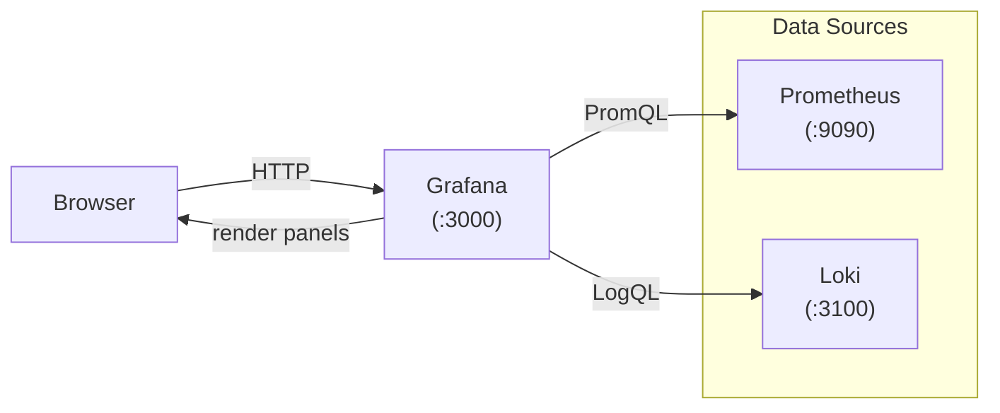

# Day 59: Grafana — Dashboards & Visualization

> **Goal**: Connect Grafana to Prometheus and Loki, import community dashboards, and build a custom panel from scratch.
> **Prereqs**: Day 58 complete — `kube-prometheus-stack` installed in the `monitoring` namespace.

## 1. Scenario & Why It Matters

Prometheus stores your metrics, but its UI is designed for ad-hoc queries — not for sharing a live view of system health with your team or management. You need a dashboard layer: something that can show RPS, error rate, p99 latency, and node memory side-by-side, auto-refresh every 30 seconds, and be shareable via a URL.

Grafana is that layer. It speaks Prometheus, Loki, Tempo, Elasticsearch, Cloudwatch, and dozens more — one UI for all your observability data. `kube-prometheus-stack` already installed it alongside Prometheus.

## 2. Concept Deep-Dive

### Grafana's Core Concepts

| Concept | Description |
|---------|-------------|
| **Data Source** | A backend Grafana queries (Prometheus, Loki, etc.) |
| **Panel** | A single visualization (time series, gauge, table, heatmap) |
| **Dashboard** | A grid of panels, with shared time range and variables |
| **Variable** | A dropdown that filters all panels (e.g. `$namespace`, `$pod`) |
| **Alert** | A threshold rule evaluated against a panel's query |

### Architecture: How Grafana Queries Data



Grafana executes queries **server-side** on your behalf — it never exposes Prometheus or Loki directly to the browser.

### Dashboard Variables

Variables make dashboards reusable. A `$namespace` variable backed by a Prometheus label query (`label_values(kube_pod_info, namespace)`) populates a dropdown. Every panel that uses `{namespace="$namespace"}` in its PromQL then filters dynamically.

```
# Variable query (in Grafana variable editor)
label_values(kube_pod_info, namespace)

# Panel query using the variable
rate(http_requests_total{namespace="$namespace", pod="$pod"}[5m])
```

### Panel Types

| Type | Best for |
|------|---------|
| **Time series** | Metrics over time (RPS, CPU, latency) |
| **Stat** | Single current value (uptime, error count) |
| **Gauge** | Single value with min/max context |
| **Bar chart** | Comparing values across labels |
| **Table** | Multi-column data, sortable |
| **Heatmap** | Histogram distributions over time (great for latency) |
| **Logs** | Loki log streams inline in a dashboard |

### Provisioning (GitOps-friendly)

Rather than clicking in the UI, dashboards and data sources can be provisioned as YAML/JSON mounted into the Grafana pod — so they survive upgrades and can be committed to Git:

```yaml
# values.yaml for kube-prometheus-stack
grafana:
  additionalDataSources:
    - name: Loki
      type: loki
      url: http://loki:3100
  dashboardProviders:
    dashboardproviders.yaml:
      apiVersion: 1
      providers:
        - name: custom
          folder: Custom
          type: file
          options:
            path: /var/lib/grafana/dashboards/custom
  dashboardsConfigMaps:
    custom: "my-grafana-dashboards"   # ConfigMap with dashboard JSON
```

## 3. Hands-On Mission

```bash
# 1. Port-forward Grafana
kubectl -n monitoring port-forward svc/kube-prom-grafana 3000:80
# Open http://localhost:3000  (admin / admin)

# 2. Import community dashboards (by Grafana dashboard ID):
#    - Node Exporter Full:          1860
#    - Kubernetes Cluster Overview: 7249
#    - Kubernetes Pod Resources:    6417
# In Grafana: Dashboards → Import → enter ID → Load → select Prometheus data source → Import

# 3. Build a custom panel:
#    a) Create a new dashboard
#    b) Add Panel → Time series
#    c) Query: rate(http_requests_total[5m])   (or any metric you have)
#    d) Legend: {{pod}}
#    e) Set title "Request Rate", unit "req/s"
#    f) Save dashboard as "My App — RED"

# 4. Add a variable:
#    Dashboard Settings → Variables → Add variable
#    Name: namespace
#    Type: Query
#    Query: label_values(kube_pod_info, namespace)
#    Refresh: On time range change
#    Apply, then use $namespace in panel queries

# 5. Add Loki data source (if Loki is installed):
#    Configuration → Data Sources → Add → Loki
#    URL: http://loki:3100
#    Save & Test
```

## 4. Your Task — Answer

**Q:** You have a dashboard that shows `rate(http_requests_total[5m])`. A teammate complains it always shows the same flat line. What are the three most likely causes?

**Sample answer:**

1. **The app doesn't expose a `/metrics` endpoint** — Prometheus has no data to show. Check `up{job="your-app"} == 0` in Prometheus.
2. **The metric name is wrong** — the counter might be called something else. Check `{__name__=~"http.*"}` in Prometheus to list all HTTP-related metrics actually present.
3. **The time range is too short** — if the rate window `[5m]` is longer than the selected dashboard time range, the result is `no data`. Expand the time range to at least 15 minutes, or shrink the rate window to `[1m]`.

## 5. Q&A (Concepts Check)

**Q: What is the difference between a Grafana Alert and a Prometheus Alert?**
A: **Prometheus Alertmanager alerts** are evaluated by Prometheus' rule engine — they work even if Grafana is down, and they integrate with the full Alertmanager routing (silences, inhibition, multi-receiver). **Grafana alerts** (Grafana Alerting, formerly "panel alerts") are evaluated by Grafana itself — easier to set up in the UI but less powerful for routing. In production, prefer Prometheus/Alertmanager for critical alerts.

**Q: What does the `Legend` field in a Grafana panel do?**
A: It controls the label shown per time series in the chart legend. `{{pod}}` extracts the `pod` label from the Prometheus series, giving each pod its own colour and label. Without it, all series would be labelled by their full label set — unreadable with many pods.

**Q: How do Grafana variables affect performance?**
A: Each variable with "refresh: on time range change" fires an extra query to the data source. With many variables or high-cardinality label values, this can make dashboards slow. Mitigate by using static options where possible, limiting variable query scope (`label_values(metric{namespace="default"}, pod)`), and caching.

**Q: What is dashboard provisioning and why should you use it?**
A: Provisioning means loading dashboards from files (JSON/YAML) on disk instead of the database. This means dashboards survive Grafana pod restarts, can be stored in Git, reviewed in PRs, and deployed as part of your Helm release. The alternative (saving in the UI) is lost on pod restart unless you use persistent storage.

**Q: What's the difference between `sum()` and `avg()` in a Grafana panel context?**
A: `sum by (pod)(rate(...))` gives you the total rate broken down per pod. `avg by (pod)(rate(...))` gives you the mean rate across the time range for each pod. Usually `sum` is more meaningful for counters (total throughput); `avg` is meaningful for gauges (average CPU across instances).

## 6. Further Reading

- [Grafana docs — Dashboards](https://grafana.com/docs/grafana/latest/dashboards/)
- [Grafana community dashboards](https://grafana.com/grafana/dashboards/)
- [Grafana provisioning docs](https://grafana.com/docs/grafana/latest/administration/provisioning/)
- Next: [Day 60 — Loki + Promtail: Log Aggregation](day60-loki_and_promtail.md)
