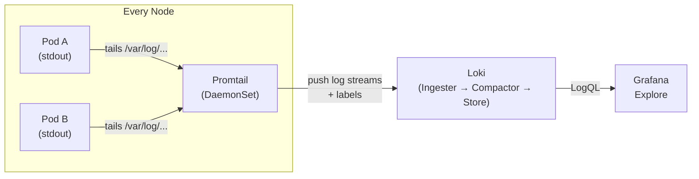

# Day 60: Loki + Promtail — Log Aggregation

> **Goal**: Install Loki and Promtail via Helm, understand how logs flow from pod stdout to Grafana Explore, and write basic LogQL queries.
> **Prereqs**: Day 59 complete — Grafana is running and accessible.

## 1. Scenario & Why It Matters

You see a spike in error rate on your Grafana dashboard (from the Prometheus data). But metrics don't tell you *what* the error message is — only that errors exist. You need to jump from the metric to the log line that caused it, in one click.

Without a centralised log aggregator, you'd have to `kubectl logs <pod>` one pod at a time, and the logs are gone forever when the pod restarts. Loki aggregates logs from every pod via a Promtail DaemonSet, stores them efficiently, and lets you query them with LogQL — a syntax intentionally similar to PromQL.

## 2. Concept Deep-Dive

### Loki's Architecture

Loki is deliberately **not** Elasticsearch. It does not index log content — only the **labels** attached to each log stream. This makes storage 10-50x cheaper at the cost of full-text search performance.



### Promtail: The Log Shipper

Promtail is a Kubernetes DaemonSet — one per node — that:
1. Discovers pods via the Kubernetes API
2. Tails their log files from `/var/log/pods/...`
3. Attaches Kubernetes labels (`namespace`, `pod`, `container`, `node`)
4. Pushes log streams to Loki

The label attachment is the key step — it's what makes LogQL queries like `{namespace="default", pod=~"guestbook.*"}` work.

### Loki's Storage Model

Loki splits each log stream into **chunks** (compressed, time-ordered blocks). The index stores only: `stream labels → chunk locations`. The actual log text lives in the chunks (local disk or S3/GCS).

When you query `{namespace="default"} |= "error"`, Loki:
1. Looks up the index to find chunks for the label selector
2. Downloads and decompresses those chunks
3. Streams them through the `|= "error"` filter
4. Returns matching lines

### LogQL

LogQL has two parts: a **log stream selector** (mandatory, uses labels) and optional **pipeline stages** (filter, parse, format):

```
# Basic: all logs from a namespace
{namespace="default"}

# Filter lines containing "error" (case-sensitive)
{namespace="default"} |= "error"

# Filter lines NOT containing "health"
{namespace="default"} != "health"

# Regex filter
{namespace="default"} |~ "timeout|refused"

# Parse JSON logs and filter on a field
{namespace="default"} | json | level="error"

# Extract a field from structured logs and use it
{namespace="default"} | logfmt | duration > 1s

# Metric query: rate of error log lines per pod
rate({namespace="default"} |= "error" [5m])

# Top 5 pods by log volume
topk(5, sum by (pod) (rate({namespace="default"}[5m])))
```

### Loki vs Elasticsearch comparison

| Feature | Loki | Elasticsearch |
|---------|------|---------------|
| Index | Labels only | Full text |
| Storage cost | Low | High |
| Arbitrary text search | Slow (stream scan) | Fast |
| PromQL-like syntax | Yes (LogQL) | No |
| Kubernetes-native | Yes (label model matches K8s) | Needs configuration |
| Best for | Cloud-native apps with structured logs | Legacy apps, compliance, rich search |

## 3. Hands-On Mission

```bash
# 1. Install Loki stack (Loki + Promtail, reuse existing Grafana)
helm upgrade --install loki grafana/loki-stack \
  --namespace monitoring \
  --set grafana.enabled=false \
  --set loki.persistence.enabled=false \
  --wait --timeout 5m

# 2. Verify Promtail DaemonSet is running on all nodes
kubectl -n monitoring get daemonset loki-promtail
kubectl -n monitoring get pods -l app=promtail

# 3. Verify Loki is up
kubectl -n monitoring get pods -l app=loki

# 4. Add Loki as a Grafana data source (via port-forwarded Grafana)
#    Configuration → Data Sources → Add data source → Loki
#    URL: http://loki:3100
#    Save & Test → should show "Data source connected and labels found"

# 5. Explore logs
#    Grafana → Explore → Select Loki data source
#    a) Run: {namespace="kube-system"}
#    b) Filter: {namespace="kube-system"} |= "error"
#    c) Add "default" namespace logs for guestbook if it's running

# 6. Correlate metrics and logs:
#    In a Grafana time series panel (Prometheus), click a spike
#    → "View in Explore" → switch to Loki → same time window
```

## 4. Your Task — Answer

**Q:** Explain how Promtail knows which pod's logs to tail and what labels to attach to each stream.

**Sample answer:**

Promtail runs as a DaemonSet, so one Promtail pod runs on each node. It does two things simultaneously:

1. **File discovery**: It watches `/var/log/pods/` on the node — Kubernetes writes each container's stdout/stderr there as a log file with a path structure of `<namespace>_<pod>_<uid>/<container>/N.log`.

2. **Label enrichment**: For each discovered log file, Promtail calls the Kubernetes API to retrieve the pod's metadata (namespace, pod name, container name, labels, node). It attaches this metadata as Loki stream labels.

This means every log line in Loki automatically has `{namespace, pod, container, node}` labels — mirroring the same label model you use in PromQL. You can cross-reference a Prometheus alert (`pod="guestbook-abc"`) directly with a Loki query (`{pod="guestbook-abc"}`).

## 5. Q&A (Concepts Check)

**Q: Why can't I do `SELECT * FROM logs WHERE message LIKE '%error%'` in Loki?**
A: Loki doesn't have a SQL engine or a full-text index. Queries must always start with a label selector (`{...}`) to narrow the stream, then optionally filter line content. Without the label selector, Loki would have to scan every stored chunk — there's no index to use. The label selector is the mandatory "partition key."

**Q: What happens to logs when a pod is deleted?**
A: Without Loki, they're gone — `kubectl logs` only works on running pods. With Loki/Promtail, logs are already pushed to Loki before the pod terminates. The retention period (configurable, default varies) determines how far back you can query.

**Q: How do you handle multi-line logs (e.g. Java stack traces) in Loki?**
A: Promtail has a `multiline` stage in its pipeline config. You define a regex for the "start of a new log entry" (e.g. a timestamp pattern) and Promtail groups subsequent lines into a single log event. Without it, each line of the stack trace appears as a separate log entry.

**Q: What is a log stream in Loki?**
A: A log stream is a unique combination of labels, e.g. `{namespace="default", pod="guestbook-abc", container="frontend"}`. Each stream has its own chunk storage. High cardinality in labels (e.g. using request IDs as labels) creates too many streams and degrades Loki performance — same lesson as Prometheus label cardinality.

**Q: How do you query logs from the last 5 minutes of a specific pod in LogQL?**
A: `{pod="guestbook-abc"}` — the time range is controlled by the dashboard/Explore time picker, not the query itself. For metric queries, you specify the range in `rate({...}[5m])`, but for log stream queries the time window comes from the UI or the API call.

## 6. Further Reading

- [Loki docs — LogQL](https://grafana.com/docs/loki/latest/query/)
- [Promtail docs — Pipeline Stages](https://grafana.com/docs/loki/latest/send-data/promtail/stages/)
- [Loki best practices](https://grafana.com/docs/loki/latest/best-practices/)
- Next: [Day 61 — Alertmanager: Alerting & Routing](day61-alertmanager.md)
