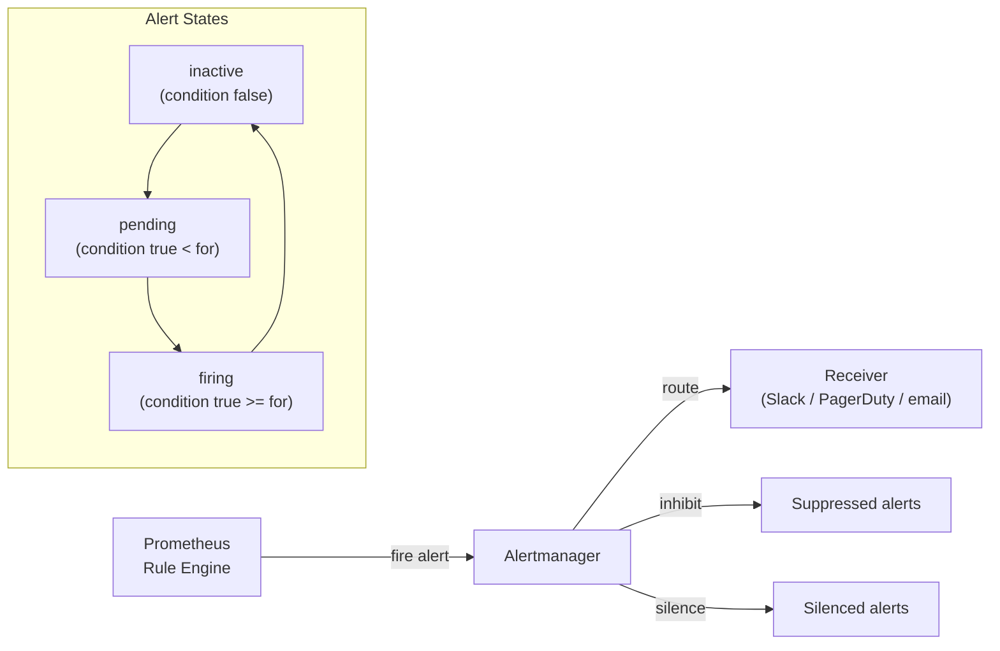
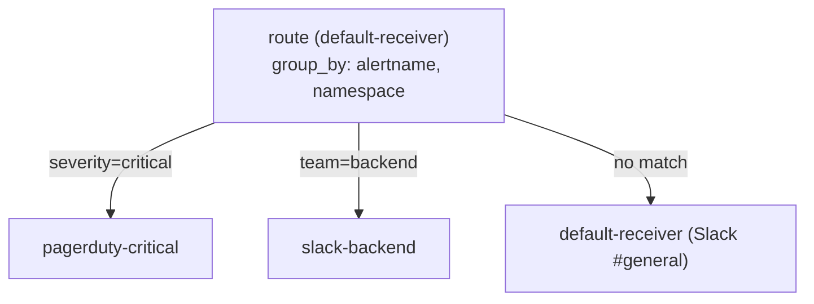

# Day 61: Alertmanager — Alerting & Routing

> **Goal**: Define alert rules with `PrometheusRule`, understand Alertmanager's routing tree, configure a Slack receiver, and work with silences and inhibitions.
> **Prereqs**: Day 58 complete — Prometheus is running and you understand PromQL.

## 1. Scenario & Why It Matters

Your dashboard shows a 5xx spike — but you were asleep. Without alerting, you find out from a user tweet. With alerting, you get a Slack message the moment the error ratio crosses a threshold, with enough context (which service, which namespace, severity) to know whether to page on-call immediately or wait until morning.

The challenge is alert fatigue: badly configured alerts that fire constantly train engineers to ignore them. Alertmanager's routing tree, grouping, inhibition, and silence system exists to send the right alert to the right person at the right time — and suppress noise.

## 2. Concept Deep-Dive

### The Alert Pipeline



The `for` duration in a rule prevents flapping: a condition must be true for the entire `for` window before the alert transitions from `pending` to `firing`.

### PrometheusRule CRD

Rules are defined as Kubernetes resources (not config files):

```yaml
apiVersion: monitoring.coreos.com/v1
kind: PrometheusRule
metadata:
  name: guestbook-alerts
  namespace: monitoring
  labels:
    release: kube-prom               # must match Prometheus' ruleSelector
spec:
  groups:
    - name: guestbook.availability
      interval: 30s
      rules:
        # Recording rule — pre-compute error ratio
        - record: job:http_error_ratio:rate5m
          expr: |
            rate(http_requests_total{status=~"5.."}[5m])
              / rate(http_requests_total[5m])

        # Alert rule
        - alert: GuestbookHighErrorRate
          expr: job:http_error_ratio:rate5m > 0.05
          for: 2m
          labels:
            severity: critical
            team: backend
          annotations:
            summary: "High error rate on {{ $labels.pod }}"
            description: >
              Error ratio is {{ $value | humanizePercentage }}
              (threshold 5%) for the last 2 minutes.
            runbook_url: "https://wiki.example.com/runbooks/high-error-rate"

    - name: guestbook.latency
      rules:
        - alert: GuestbookSlowRequests
          expr: |
            histogram_quantile(0.99,
              rate(http_request_duration_seconds_bucket[5m])
            ) > 1.0
          for: 5m
          labels:
            severity: warning
          annotations:
            summary: "p99 latency above 1s"
```

### Alertmanager Configuration

Alertmanager decides **where** to send an alert via a routing tree:

```yaml
# alertmanager.yaml (simplified)
global:
  slack_api_url: "https://hooks.slack.com/services/..."

route:
  receiver: default-receiver
  group_by: [alertname, namespace]
  group_wait: 30s          # wait before sending first notification (group)
  group_interval: 5m       # how often to send if group has new alerts
  repeat_interval: 4h      # how often to re-notify if still firing

  routes:
    - matchers:
        - severity = critical
      receiver: pagerduty-critical
      continue: false

    - matchers:
        - team = backend
      receiver: slack-backend

receivers:
  - name: default-receiver
    slack_configs:
      - channel: "#alerts-general"
        title: "{{ .GroupLabels.alertname }}"
        text: "{{ range .Alerts }}{{ .Annotations.description }}\n{{ end }}"

  - name: pagerduty-critical
    pagerduty_configs:
      - service_key: "<pagerduty-key>"

  - name: slack-backend
    slack_configs:
      - channel: "#alerts-backend"
```

### Grouping, Inhibition, Silences

| Feature | Purpose |
|---------|---------|
| **Grouping** | Bundle multiple alerts into one notification (avoids 100 Slack messages for a cluster-wide failure) |
| **Inhibition** | Suppress lower-priority alerts when a higher-priority one is firing (e.g. silence `GuestbookSlowRequests` while `NodeDown` is active) |
| **Silence** | Manually mute alerts for a time window (e.g. during a planned maintenance) |

```yaml
# Inhibition rule: suppress warnings if a critical is firing for the same namespace
inhibit_rules:
  - source_matchers:
      - severity = critical
    target_matchers:
      - severity = warning
    equal: [namespace, alertname]
```

### Routing Tree Visual



Routes are evaluated **top-to-bottom**. First match wins unless `continue: true` is set.

## 3. Hands-On Mission

```bash
# 1. Apply a PrometheusRule (save the YAML above as guestbook-alerts.yaml)
kubectl apply -f guestbook-alerts.yaml

# 2. Verify Prometheus picked it up
kubectl -n monitoring port-forward \
  svc/kube-prom-kube-prometheus-stack-prometheus 9090:9090
# In UI: Status → Rules  — look for guestbook.availability

# 3. Port-forward Alertmanager
kubectl -n monitoring port-forward \
  svc/kube-prom-kube-prometheus-stack-alertmanager 9093:9093
# Open http://localhost:9093 — see active alerts and silences

# 4. Trigger a test alert (fire a PromQL expression that's always true)
# Edit the rule temporarily:
#   expr: vector(1) > 0   # always fires
# Apply, wait 2m, check Alertmanager UI

# 5. Create a silence in the Alertmanager UI:
#    Alertmanager → Silences → New Silence
#    Matcher: alertname="GuestbookHighErrorRate"
#    Duration: 1h
#    Creator + comment required

# 6. Inspect rule state with amtool (inside the Alertmanager pod):
kubectl -n monitoring exec -it \
  $(kubectl -n monitoring get pod -l app.kubernetes.io/name=alertmanager -o name | head -1) \
  -- amtool alert query
```

## 4. Your Task — Answer

**Q:** What is the purpose of `group_wait`, `group_interval`, and `repeat_interval` in Alertmanager, and how do they work together to prevent alert storms?

**Sample answer:**

- **`group_wait`** (default 30s): When a new alert fires, Alertmanager waits this long before sending the first notification. This allows multiple alerts that fire at almost the same time (e.g. 20 pods going down in a cascade) to be batched into one notification.

- **`group_interval`** (default 5m): After the first notification, if new alerts are added to an existing group, Alertmanager waits this long before sending an update. Prevents rapid-fire updates as a cascade unfolds.

- **`repeat_interval`** (default 4h): If an alert remains firing without any new additions to its group, Alertmanager re-sends the notification after this interval. Ensures on-call knows the issue is still active without flooding them.

Together: a cluster-wide event fires 50 alerts → `group_wait` batches them into 1 message → `group_interval` controls update cadence → `repeat_interval` keeps on-call informed if nothing changes.

## 5. Q&A (Concepts Check)

**Q: What is the difference between a `pending` and `firing` alert?**
A: `pending` means the PromQL condition is true, but the `for` duration hasn't elapsed yet. `firing` means the condition has been continuously true for at least the `for` duration and Alertmanager has been notified. A flapping condition (true for 30s, then false) never reaches `firing` if `for: 2m` — this prevents noisy transient alerts.

**Q: How do you update Alertmanager's config in `kube-prometheus-stack`?**
A: Via Helm values: `alertmanager.config: {...}`. The Prometheus Operator watches the `AlertmanagerConfig` CRD and the `Alertmanager` CR, generates the `alertmanager.yaml` Secret, and hot-reloads Alertmanager — no pod restart needed. You can also use an `AlertmanagerConfig` CRD for namespace-scoped routing rules.

**Q: What happens if Alertmanager is down when an alert fires?**
A: Prometheus keeps the alert in `firing` state and retries delivery to Alertmanager. Once Alertmanager recovers, it receives the pending alerts. To handle HA, you can run Alertmanager in a cluster (3 replicas with mesh gossip) so alerts are always delivered. `kube-prometheus-stack` supports this via `alertmanager.alertmanagerSpec.replicas: 3`.

**Q: How is inhibition different from silencing?**
A: **Inhibition** is automatic and conditional — it suppresses alert B while alert A is firing (e.g. suppress pod alerts while the node is down). **Silencing** is manual and time-bounded — an engineer explicitly mutes an alert for a window (maintenance, known issue). Silences expire; inhibitions fire whenever the source condition is met.

**Q: Why is a `runbook_url` annotation considered a best practice?**
A: When an alert fires at 3am, the on-call engineer has seconds to understand what it means. A `runbook_url` points to a documented procedure: what the alert means, how to confirm it, and remediation steps. Without it, the engineer must hunt through dashboards and Slack history while the incident clock ticks.

## 6. Further Reading

- [Alertmanager docs — Configuration](https://prometheus.io/docs/alerting/latest/configuration/)
- [Awesome Prometheus Alerts — community alert rules](https://awesome-prometheus-alerts.grep.to/)
- [Google SRE Book — Alerting on SLOs (Chapter 5)](https://sre.google/workbook/alerting-on-slos/)
- Next: [Day 62 — Custom Metrics: Instrumenting Your App](day62-custom_metrics.md)
