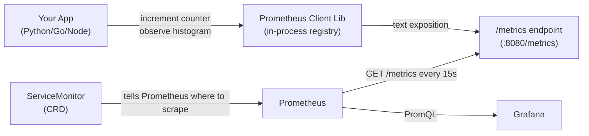

# Day 62: Custom Metrics — Instrumenting Your App

> **Goal**: Add Prometheus instrumentation to an application using the official client library, expose `/metrics`, wire it into Prometheus with a ServiceMonitor, and understand SLO basics.
> **Prereqs**: Days 58-61 — Prometheus running, ServiceMonitor concept understood.

## 1. Scenario & Why It Matters

`kube-prometheus-stack` gives you free infrastructure metrics: CPU, memory, network, pod restarts. But it can't tell you:

- How many users checked out in the last hour
- What percentage of password-reset emails were sent successfully
- How long your database queries are taking at p99

These are **business metrics** and **application-level RED metrics** — and they require you to instrument your code. Adding 10-15 lines to your app's startup code unlocks dashboards and alerts on the things that actually matter to your users.

## 2. Concept Deep-Dive

### The Four Metric Types (revisited for instrumentation)

| Type | When to use | Example |
|------|-------------|---------|
| `Counter` | Something accumulates monotonically | `http_requests_total`, `errors_total` |
| `Gauge` | A snapshot value that can go up/down | `active_connections`, `queue_depth` |
| `Histogram` | Measure distribution of a value (latency, size) | `http_request_duration_seconds` |
| `Summary` | Pre-computed quantiles — avoid in new code; prefer Histogram | legacy apps only |

Use **Histogram** for latency. It lets you compute any quantile at query time and aggregate across instances. Summary quantiles are computed per-instance and cannot be aggregated.

### Instrumentation Flow



### Python Example (Flask + prometheus_client)

```python
from flask import Flask, request, jsonify
from prometheus_client import (
    Counter, Histogram, Gauge,
    make_wsgi_app, REGISTRY
)
from werkzeug.middleware.dispatcher import DispatcherMiddleware
import time

app = Flask(__name__)

# --- Metric definitions ---
REQUEST_COUNT = Counter(
    "http_requests_total",
    "Total HTTP requests",
    ["method", "endpoint", "status"]
)

REQUEST_LATENCY = Histogram(
    "http_request_duration_seconds",
    "HTTP request latency",
    ["method", "endpoint"],
    buckets=[0.005, 0.01, 0.025, 0.05, 0.1, 0.25, 0.5, 1, 2.5, 5]
)

ACTIVE_REQUESTS = Gauge(
    "http_requests_in_flight",
    "Current number of requests being processed"
)

# --- Middleware to auto-instrument all routes ---
@app.before_request
def before():
    request._start_time = time.time()
    ACTIVE_REQUESTS.inc()

@app.after_request
def after(response):
    duration = time.time() - request._start_time
    REQUEST_COUNT.labels(
        method=request.method,
        endpoint=request.path,
        status=response.status_code
    ).inc()
    REQUEST_LATENCY.labels(
        method=request.method,
        endpoint=request.path
    ).observe(duration)
    ACTIVE_REQUESTS.dec()
    return response

# --- Business metric example ---
CHECKOUT_TOTAL = Counter("checkouts_total", "Completed checkouts", ["status"])

@app.route("/checkout", methods=["POST"])
def checkout():
    try:
        # ... business logic ...
        CHECKOUT_TOTAL.labels(status="success").inc()
        return jsonify({"ok": True})
    except Exception as e:
        CHECKOUT_TOTAL.labels(status="error").inc()
        raise

# --- Mount /metrics endpoint ---
app.wsgi_app = DispatcherMiddleware(app.wsgi_app, {
    "/metrics": make_wsgi_app()
})
```

### Go Example (net/http + promhttp)

```go
package main

import (
    "net/http"
    "time"
    "github.com/prometheus/client_golang/prometheus"
    "github.com/prometheus/client_golang/prometheus/promhttp"
)

var (
    requestsTotal = prometheus.NewCounterVec(
        prometheus.CounterOpts{
            Name: "http_requests_total",
            Help: "Total HTTP requests",
        },
        []string{"method", "path", "status"},
    )
    requestDuration = prometheus.NewHistogramVec(
        prometheus.HistogramOpts{
            Name:    "http_request_duration_seconds",
            Help:    "HTTP request latency",
            Buckets: prometheus.DefBuckets,
        },
        []string{"method", "path"},
    )
)

func init() {
    prometheus.MustRegister(requestsTotal, requestDuration)
}

func instrument(next http.HandlerFunc) http.HandlerFunc {
    return func(w http.ResponseWriter, r *http.Request) {
        start := time.Now()
        rw := &responseWriter{w, 200}
        next(rw, r)
        requestDuration.WithLabelValues(r.Method, r.URL.Path).
            Observe(time.Since(start).Seconds())
        requestsTotal.WithLabelValues(r.Method, r.URL.Path,
            http.StatusText(rw.status)).Inc()
    }
}

func main() {
    http.Handle("/metrics", promhttp.Handler())
    http.HandleFunc("/", instrument(func(w http.ResponseWriter, r *http.Request) {
        w.Write([]byte("hello"))
    }))
    http.ListenAndServe(":8080", nil)
}
```

### Wiring to Prometheus: ServiceMonitor + Service

Your app needs:
1. A named port in its Kubernetes Service (`metrics: 8080`)
2. A ServiceMonitor that references that port

```yaml
# Service
apiVersion: v1
kind: Service
metadata:
  name: guestbook-frontend
  labels:
    app: guestbook
spec:
  selector:
    app: guestbook-frontend
  ports:
    - name: http
      port: 80
    - name: metrics          # named port — required for ServiceMonitor
      port: 8080
---
# ServiceMonitor
apiVersion: monitoring.coreos.com/v1
kind: ServiceMonitor
metadata:
  name: guestbook
  namespace: monitoring
  labels:
    release: kube-prom
spec:
  namespaceSelector:
    matchNames: [default]
  selector:
    matchLabels:
      app: guestbook
  endpoints:
    - port: metrics
      interval: 15s
```

### SLO Basics

An **SLO** (Service Level Objective) is a reliability target expressed in terms of your metrics:

| SLO | PromQL expression |
|-----|------------------|
| 99.9% of requests succeed | `1 - rate(http_requests_total{status=~"5.."}[30d]) / rate(http_requests_total[30d])` |
| p99 latency < 500ms | `histogram_quantile(0.99, rate(http_request_duration_seconds_bucket[5m])) < 0.5` |

**Error budget**: if your SLO is 99.9% over 30 days, you have 0.1% × 30d × 24h = 43.2 minutes of allowed downtime. Alerts should fire when you're burning the budget too fast — not just when you've already breached the SLO.

## 3. Hands-On Mission

```bash
# 1. Install prometheus_client in a local Python project
pip install prometheus_client flask

# 2. Save the Flask example above as app.py and run it
python app.py

# 3. Hit the /metrics endpoint manually
curl http://localhost:8080/metrics

# 4. Send some traffic and watch counters increment
curl http://localhost:5000/
curl http://localhost:5000/checkout -X POST

# 5. Apply the ServiceMonitor to your cluster (requires Prometheus running)
kubectl apply -f servicemonitor.yaml

# 6. Verify Prometheus sees the new target:
#    Prometheus UI → Status → Targets → look for "guestbook"

# 7. Query your custom metrics in Prometheus:
#    rate(http_requests_total[5m])
#    histogram_quantile(0.99, rate(http_request_duration_seconds_bucket[5m]))
```

## 4. Your Task — Answer

**Q:** Why should you use a `Histogram` instead of a `Summary` for measuring request latency in a Kubernetes microservices environment?

**Sample answer:**

`Summary` computes quantiles (p50, p95, p99) **inside the application process** and exposes them as pre-aggregated values. This means:
1. You cannot aggregate across multiple instances — if you have 3 replicas, you can't compute the overall p99 from three per-instance p99s (it's mathematically invalid).
2. The quantiles are fixed at instrumentation time; you can't compute p99.9 later without re-deploying.

`Histogram` stores raw bucket counts (how many requests fell into each latency bucket). These counts **can be summed** across instances with `sum()`, then `histogram_quantile()` computes the quantile from the aggregated buckets at query time. This gives you accurate fleet-wide latencies and lets you compute any quantile without changing the code.

## 5. Q&A (Concepts Check)

**Q: What is label cardinality and why does it matter for custom metrics?**
A: Cardinality = the number of unique label value combinations. Each unique combination creates a separate time series. `user_id` as a label with 1M users = 1M series → Prometheus OOM. Labels must be low cardinality: HTTP method (5 values), status code (10 values), endpoint path (50 values) — not request IDs or user IDs.

**Q: How do you instrument a background job (not HTTP) with Prometheus?**
A: Use a `Gauge` for job state (`job_running 1/0`), a `Counter` for `jobs_processed_total{status="success|error"}`, and a `Histogram` for `job_duration_seconds`. For batch jobs that run and exit (not long-running), use the **Pushgateway** — the job pushes metrics to the Gateway before exiting, and Prometheus scrapes the Gateway.

**Q: What is the Pushgateway and when should you NOT use it?**
A: The Pushgateway is an intermediary for short-lived jobs that can't be scraped (batch jobs, cron). However, it is not a general-purpose metrics aggregator — it stores the last pushed value, not a time series. Don't use it for long-running services (use a regular `/metrics` endpoint) or as a workaround to avoid adding a `/metrics` endpoint to every service.

**Q: How do you add custom labels to all metrics from a service without touching every metric definition?**
A: In the ServiceMonitor, use `relabelings` to add static labels from pod/service metadata. In the app, use a `prometheus.Labels` wrapper or middleware that injects a label onto every request metric. Labels common to all metrics (like `service="guestbook"`, `version="1.2.3"`) are often best added at the scrape level via ServiceMonitor relabeling to keep the app code clean.

**Q: What is an error budget and how does it change how you alert?**
A: An error budget is the allowed unreliability implied by your SLO. 99.9% availability over 30 days = 43.2 minutes error budget. Instead of alerting when errors exceed 5% for 5 minutes (reactive), alert when you are burning the error budget too fast to survive the month (proactive). This is called "multi-window, multi-burn-rate alerting" and is covered in the Google SRE Workbook.

## 6. Further Reading

- [Prometheus Python client](https://github.com/prometheus/client_python)
- [Prometheus Go client](https://github.com/prometheus/client_golang)
- [Google SRE Workbook — Implementing SLOs](https://sre.google/workbook/implementing-slos/)
- [Prometheus best practices — Instrumentation](https://prometheus.io/docs/practices/instrumentation/)
- Next: [Day 63 — Weekly Challenge: Observable Guestbook](day63-weekly_challenge.md)
