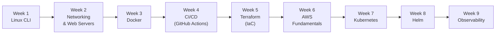

# Learn Basic DevOps — 9 Weeks, 63 Days

A fast, hands-on path from "can use the terminal" to "can run a production stack on Kubernetes". Every day: a scenario, a concept deep-dive with diagrams, a hands-on mission, a model answer to the task, and an interview-style Q&A.

## Course Overview



The skills stack on each other. Week 7's Kubernetes troubleshooting is easy because you know Linux namespaces (Week 1) and DNS (Week 2). Week 8's Helm charts assume you can read YAML (Week 3) and think in pipelines (Week 4).

## Repository Layout

```
Learn_basic_devops/
├── Notes/          Daily conceptual notes (this is where you study)
│   ├── Week1/ ... Week9/
│   └── Week7/      (thematic subfolders: 00_foundations, 01_getting-started, ...)
├── Resources/      Code, configs, manifests, scripts for hands-on work
│   └── WeekN/
│       └── weekly_challenge/   Code for that week's challenge
└── README.md       (this file)
```

Notes and Resources are kept separate so the conceptual material stays readable and code stays runnable. Each day's note follows the same template:

1. Scenario & Why It Matters
2. Concept Deep-Dive (with at least one Mermaid diagram)
3. Hands-On Mission
4. Your Task — Answer (the question + a model answer)
5. Q&A (Concepts Check) — 4-6 interview-style questions
6. Further Reading

## Per-Week Index

### [Week 1 — Linux Command Line](Notes/Week1/README.md)

Shell efficiency, permissions, processes, systemd, networking CLI, bash scripting, backup script challenge. Code: [`Resources/Week1/`](Resources/Week1/).

### [Week 2 — Networking & Web Servers](Notes/Week2/README.md)

DNS/HTTP codes, Nginx, reverse proxy, SSL/TLS, SSH, log management, production mini-stack challenge. Code: [`Resources/Week2/`](Resources/Week2/).

### [Week 3 — Docker](Notes/Week3/README.md)

Dockerfiles, multi-stage builds, networking, volumes, Compose, Compose in production, dockerising a legacy app. Code: [`Resources/Week3/`](Resources/Week3/).

### [Week 4 — CI/CD with GitHub Actions](Notes/Week4/README.md)

CI/CD concepts, CI, artifacts, container registry, CD, secrets, full pipeline challenge. Code: [`Resources/Week4/`](Resources/Week4/).

### [Week 5 — Terraform (IaC)](Notes/Week5/README.md)

Providers, plan/apply, state management, variables, outputs, modules, end-to-end stack challenge. Code: [`Resources/Week5/`](Resources/Week5/).

### [Week 6 — AWS Fundamentals](Notes/Week6/README.md)

IAM, AWS CLI, EC2, Security Groups, user-data, S3, mini cloud stack challenge. Code: [`Resources/Week6/`](Resources/Week6/).

### [Week 7 — Kubernetes](Notes/Week7/README.md)

Low-level foundations (Linux namespaces, cgroups, CRI, CNI, CoreDNS, architecture) → Minikube → Pods & Deployments → Services (all 5 types) + Gateway API → ConfigMaps & Secrets → Storage (PV/PVC) → Namespaces → Guestbook challenge. Organised into thematic subfolders:

- `00_foundations/` — the Linux primitives that make Kubernetes possible
- `01_getting-started/` — Minikube
- `02_workloads/` — Pods, Deployments, probes, resources, HPA, StatefulSets
- `03_networking/` — Services (ClusterIP, NodePort, LoadBalancer, ExternalName, Headless), Gateway API, NetworkPolicies
- `04_config-and-secrets/` — ConfigMaps, Secrets, RBAC, Pod Identities, Sealed Secrets, KMS
- `05_storage/` — PV, PVC, StorageClass
- `06_production-and-challenge/` — Namespaces, Weekly Challenge

Code: [`Resources/Week7/`](Resources/Week7/).

### [Week 8 — Helm](Notes/Week8/README.md)

Why Helm → installing community charts → `helm create` → sub-charts & `Chart.lock` → upgrade/rollback → templates & logic → production-ready chart challenge. Code: [`Resources/Week8/`](Resources/Week8/).

### [Week 9 — Observability](Notes/Week9/README.md)

Prometheus metrics (kube-prometheus-stack Helm install, PromQL, ServiceMonitors) → Grafana dashboards (importing community dashboards, variables, custom panels) → Loki + Promtail log aggregation (LogQL, DaemonSet shipping) → Alertmanager (PrometheusRule CRD, routing tree, Slack/PagerDuty receivers, inhibition, silences) → custom app instrumentation (Counter/Gauge/Histogram, SLO basics) → capstone: instrument the Guestbook, build a RED dashboard, alert on 5xx spikes. Code: [`Resources/Week9/`](Resources/Week9/).

## How to Use This Repo

1. **Follow in order.** Skipping Week 1-2 makes Week 7 much harder than it needs to be.
2. **Do the hands-on mission every day.** Notes without reps don't stick.
3. **Attempt the "Your Task" before reading the sample answer.** Understanding the gap between your answer and the sample is where learning happens.
4. **Use the Q&A as interview prep.** Every question is something a mid-level DevOps engineer should be able to answer on the fly.
5. **Ship the weekly challenge.** Every Week's challenge is a small but complete artifact — commit the code under `Resources/WeekN/weekly_challenge/`.

## Prerequisites

- A Unix-like machine (macOS or Linux). Windows users: use WSL2.
- Git, Docker Desktop, and a text editor (VS Code recommended).
- An AWS account with billing alerts set (Weeks 5-6). Almost everything stays in free tier; `terraform destroy` every evening.
- GitHub account for Week 4 onwards.
- `kubectl`, `minikube`, `helm` for Weeks 7-9 (installed on the day you need them).
- Week 9: add the Prometheus Community and Grafana Helm repos (`helm repo add prometheus-community https://prometheus-community.github.io/helm-charts && helm repo add grafana https://grafana.github.io/helm-charts`).
